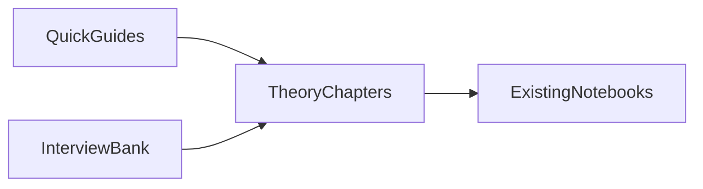

# Theory companion

These pages explain how LangChain, LangGraph, and LangSmith work. The notebooks are where you run code. Use these docs when you want the idea in plain words first.

*Picture: start with a short guide, go deeper in a theory chapter, then open the matching notebook.*

| How you want to learn | About how long | Open this |
|---|---|---|
| Fast overview | about 3 hours | [LangChain](quick/langchain.md), [LangGraph](quick/langgraph.md), [LangSmith](quick/langsmith.md) |
| Full study | many days | every chapter in the lists below, in order |
| Interview practice | as needed | [LangChain Interview Q&A](interview/langchain-qa.md), [LangGraph Interview Q&A](interview/langgraph-qa.md), [LangChain chapter bank](interview/langchain.md), [LangGraph chapter bank](interview/langgraph.md), [LangSmith and production](interview/langsmith-production.md), [system design](interview/system-design.md) |

**How to read a deep chapter**

1. Read the **30-second answer** and the **Tiny example**.
2. If that is enough, stop and open the lab notebook.
3. If you need more, keep reading Runtime, Failures, and Keywords.

Progress checklist: [CHECKLIST.md](../CHECKLIST.md). Notebook order: [LEARNING_PATH.md](../LEARNING_PATH.md).

## Setup and foundations

| Id | Chapter | Lab |
|---|---|---|
| 00 | [Environment, providers, keys](theory/00-environment.md) | `00-setup/00_environment_providers_and_keys` |
| 01 | [Models and messages](theory/01-models-messages.md) | `01_models_messages` |
| 02 | [Prompt templates](theory/02-prompt-templates.md) | `02_prompt_templates` |
| 03 | [Chat prompts and history](theory/03-chat-prompts.md) | `03_chat_prompt_templates` |
| 04 | [Few-shot and selectors](theory/04-few-shot.md) | `04_few_shot_and_example_selectors` |
| 05 | [Output parsers](theory/05-output-parsers.md) | `05_output_parsers` |
| 06 | [Memory](theory/06-memory.md) | `06_memory` |
| 07 | [LCEL](theory/07-lcel.md) | `07_lcel` |
| 08 | [Chains](theory/08-chains.md) | `08_chains_sequential_and_custom` |

## RAG (chat with your documents)

| Id | Chapter |
|---|---|
| 09 | [Document loaders](theory/09-document-loaders.md) |
| 10 | [Text splitters](theory/10-text-splitters.md) |
| 11 | [Embeddings and caches](theory/11-embeddings.md) |
| 12 | [Vector stores](theory/12-vector-stores.md) |
| 13 | [Retrievers](theory/13-retrievers.md) |
| 14 | [Retrieval chains](theory/14-retrieval-chains.md) |
| 15 | [Advanced RAG](theory/15-advanced-rag.md) |

## Agents (model + tools)

| Id | Chapter |
|---|---|
| 16 | [Tools](theory/16-tools.md) |
| 16a | [Code execution and sandboxing](theory/16a-code-execution.md) |
| 16b | [MCP](theory/16b-mcp.md) |
| 17 | [Agents and middleware](theory/17-agents.md) |
| 17a | [The agent loop from scratch](theory/17a-agent-loop.md) |
| 18 | [What a graph adds](theory/18-graphs-over-agents.md) |

## Production LangChain and LangSmith

| Id | Chapter |
|---|---|
| 19 | [LangSmith](theory/19-langsmith.md) |
| 20 | [Callbacks](theory/20-callbacks.md) |
| 20a | [Guardrails and PII](theory/20a-guardrails.md) |
| 21 | [Streaming](theory/21-streaming.md) |
| 22 | [Multimodal](theory/22-multimodal.md) |
| 23 | [Caching](theory/23-caching.md) |
| 24 | [Structured outputs](theory/24-structured-outputs.md) |
| 25 | [Routing](theory/25-routing.md) |
| 26 | [Evaluation](theory/26-evaluation.md) |
| 26a | [Unit testing](theory/26a-unit-testing.md) |
| 27 | [Usage and cost](theory/27-usage-tracking.md) |
| 27a | [LLM gateways](theory/27a-gateways.md) |
| 28 | [Prompt hub](theory/28-hub.md) |

## LangGraph (graphs, memory, multi-agent)

| Id | Chapter |
|---|---|
| 29 | [Graphs vs agents](theory/29-graphs-vs-agents.md) |
| 30 | [State and reducers](theory/30-state-schemas.md) |
| 31 | [StateGraph](theory/31-stategraph.md) |
| 32 | [Conditional routing and Command](theory/32-conditional-routing.md) |
| 33 | [Compile, invoke, stream](theory/33-compile-invoke-stream.md) |
| 34 | [Checkpointing and thread ids](theory/34-checkpointing.md) |
| 35 | [SQLite and Postgres savers](theory/35-sqlite-postgres.md) |
| 36 | [Human in the loop](theory/36-human-in-the-loop.md) |
| 37 | [Message history](theory/37-message-history.md) |
| 38 | [Fan-out and fan-in](theory/38-fanout-fanin.md) |
| 39 | [Time travel](theory/39-time-travel.md) |
| 40 | [Subgraphs](theory/40-subgraphs.md) |
| 41 | [Multi-agent handoffs](theory/41-multi-agent.md) |
| 42 | [Custom streams](theory/42-custom-streams.md) |
| 43 | [Hybrid deterministic and LLM](theory/43-hybrid.md) |
| 43a | [Five workflow patterns](theory/43a-workflows.md) |
| 44 | [Retries and tool failures](theory/44-retries.md) |
| 45 | [LangSmith on graphs and Studio](theory/45-langsmith-studio.md) |
| 46 | [Deployment and versioning](theory/46-deployment.md) |
| 47 | [Context and summarisation](theory/47-context.md) |
| 48 | [Self-reflective RAG](theory/48-self-reflective-rag.md) |
| 48a | [Reflection and Reflexion](theory/48a-reflection.md) |
| 49 | [Long-term memory store](theory/49-memory-store.md) |
| 50 | [Deep agents](theory/50-deep-agents.md) |
| 50a | [Backends, skills, AGENTS.md](theory/50a-backends-skills.md) |

## Capstones (design stories)

| Id | Chapter |
|---|---|
| 51 | [Policy RAG chatbot](theory/51-policy-rag.md) |
| 52 | [Multi-agent research desk](theory/52-research-desk.md) |
| 53 | [FastAPI service](theory/53-fastapi.md) |
