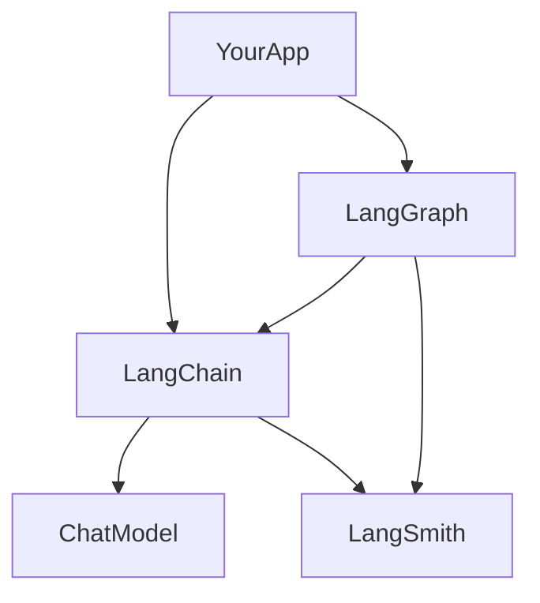
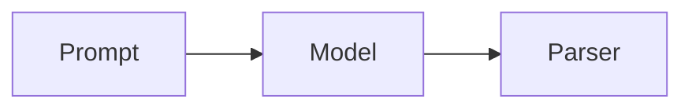
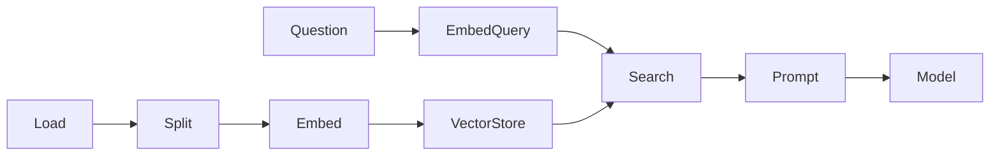

# LangChain in one sitting

Read this for the big picture. Open a deep chapter when a sentence is not enough. Run the matching notebook to practice.

## The three layers

*Picture: your app uses LangChain pieces; LangGraph controls the flow; LangSmith records what happened.*

- **LangChain** = building blocks (models, prompts, tools, retrievers).
- **LangGraph** = when the path must branch, loop, pause, or remember.
- **LangSmith** = a camera on every call so you can debug.

More: [00](../theory/00-environment.md), [18](../theory/18-graphs-over-agents.md), [19](../theory/19-langsmith.md).

## Models and messages

Talk to the model with a **list of messages**, not one giant string. The model does not remember the last turn by itself. For a follow-up, send the old messages again plus the new question.

Example: turn 1 is “What is our leave policy?”. Turn 2 “What about contractors?” only works if you also send turn 1 and the first answer.

In code those messages are `SystemMessage`, `HumanMessage`, and `AIMessage`. Check `finish_reason` (`stop` vs `length`) so you know if the answer was cut off.

**Use when** you chat with a model. **Skip** raw strings once you have tools or history.

Deep: [01](../theory/01-models-messages.md).

## Prompts

A prompt template fills blanks like `{ticket}` into a ready message. If a blank is missing, it fails early. That is better than sending `None` to the model.

`MessagesPlaceholder` is a slot where past chat messages drop in. Few-shot means “show a few good examples” so the model copies the format.

Deep: [02](../theory/02-prompt-templates.md), [03](../theory/03-chat-prompts.md), [04](../theory/04-few-shot.md).

## LCEL (pipe chains)

*Picture: each step’s output becomes the next step’s input.*

The `|` operator connects steps: prompt → model → parser. `batch` runs many inputs. Retry and fallback wrap a step when it fails.

**Use when** the path is a straight pipeline. **Skip** when you need loops or human approval — that is a graph.

Deep: [07](../theory/07-lcel.md), [08](../theory/08-chains.md).

## RAG (answer from your docs)

*Picture: documents go into a searchable store; the question finds nearby chunks; the model answers from those chunks.*

1. Load files into `Document` pieces (text + metadata).
2. Split into chunks.
3. Turn chunks into vectors (embeddings) and save them.
4. Embed the question, find close chunks, put them in the prompt, ask the model.

Follow-ups like “what about contractors?” must be rewritten into a full question first, or search will miss.

Advanced tricks (HyDE, multi-query, rerank) add extra model calls. CRAG / Adaptive / Self-RAG are those ideas wired as graphs later.

Deep: [09](../theory/09-document-loaders.md) through [15](../theory/15-advanced-rag.md).

## Tools and agents

A **tool** is a function with a clear schema (name, args, description). The model asks to call it; your code runs it; you send the result back as a `ToolMessage`. The id on that message must match the model’s tool-call id.

An **agent** repeats: think → maybe call tools → think again, until it answers. `create_agent` is that loop with safety hooks (middleware).

**Use an agent** when the next step depends on tool results you cannot list in advance. **Use a chain or graph** when you can draw the flowchart.

Deep: [16](../theory/16-tools.md), [16a](../theory/16a-code-execution.md), [16b](../theory/16b-mcp.md), [17](../theory/17-agents.md), [17a](../theory/17a-agent-loop.md).

## Production habits (short)

| Need | What you do | Chapter |
|---|---|---|
| See the real prompt | Open the LangSmith run | [19](../theory/19-langsmith.md) |
| Count tokens yourself | Callbacks | [20](../theory/20-callbacks.md) |
| Hide emails / block attacks | Guardrail middleware | [20a](../theory/20a-guardrails.md) |
| Show tokens as they arrive | Stream, do not buffer | [21](../theory/21-streaming.md) |
| Get typed JSON | Structured output / schema | [24](../theory/24-structured-outputs.md) |
| Prove a prompt change helped | Dataset + score | [26](../theory/26-evaluation.md) |

Old names you may still hear: `ConversationBufferMemory` (use message lists + checkpoints), `AgentExecutor` (use `create_agent` or a graph), LangServe (use FastAPI or LangGraph Platform).
