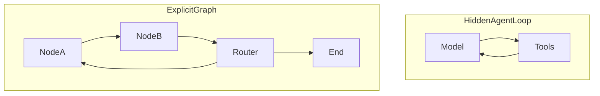
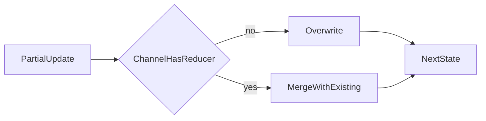
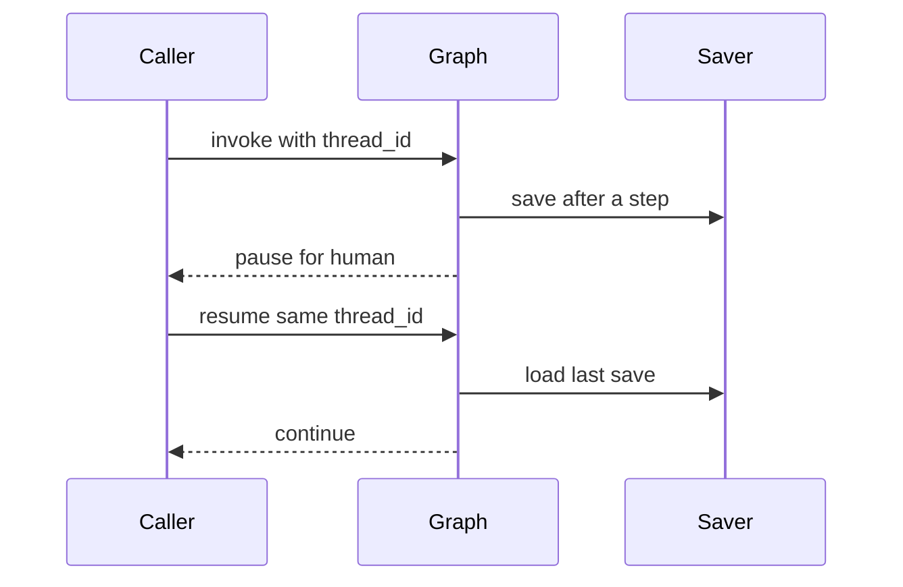
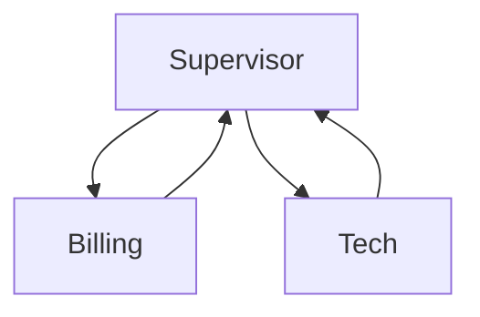

# LangGraph in one sitting

A **graph** is a flowchart you control. Each box (node) reads shared data (state) and returns only the fields it changed. Arrows (edges) pick the next box. A **checkpointer** saves progress so you can pause, resume, or go back.

## Agent loop vs graph

*Picture: left = the model keeps looping with tools; right = you drew every branch yourself.*

Use a graph when you need save/resume, a human click, a clear router, or a path you must explain to a client.

Deep: [18](../theory/18-graphs-over-agents.md), [29](../theory/29-graphs-vs-agents.md).

## State and reducers

*Picture: a node sends a small update; without a merge rule the new value replaces the old one.*

Example: two researchers each return `notes`. Without a reducer, the second wipe outs the first. With `operator.add`, both notes stay.

Keys you never declared on the schema are dropped quietly. Spelling mistakes look like “my write vanished.”

Deep: [30](../theory/30-state-schemas.md), [31](../theory/31-stategraph.md).

## Routing, loops, parallel work

A **conditional edge** is a function that returns the next node name. `Command` lets a node update state and choose the next node in one return. Loops need a counter or `recursion_limit` or they never stop. `Send` starts many copies of a node when you only know the count at runtime; their results must merge with a reducer.

Deep: [32](../theory/32-conditional-routing.md), [38](../theory/38-fanout-fanin.md), [43a](../theory/43a-workflows.md).

## Save, pause, resume

*Picture: each step can be saved under a conversation id; later you continue from that save.*

`thread_id` is the conversation key. No checkpointer means nothing survives a restart. SQLite is fine for one process; Postgres for many servers. Renaming a node breaks chats that were paused on the old name.

Deep: [34](../theory/34-checkpointing.md), [35](../theory/35-sqlite-postgres.md), [36](../theory/36-human-in-the-loop.md), [39](../theory/39-time-travel.md), [46](../theory/46-deployment.md).

## Messages, subgraphs, multi-agent

Do not delete an AI tool-call message without its matching tool result messages. A **subgraph** is a small graph used as one node. A **supervisor** picks the next specialist; a **network** lets specialists hand off. Only the child’s final answer should return to the parent.

*Picture: a manager node routes to specialists and gets the answer back.*

Deep: [37](../theory/37-message-history.md), [40](../theory/40-subgraphs.md), [41](../theory/41-multi-agent.md).

## Advanced track (one line each)

| Idea | Plain words | Chapter |
|---|---|---|
| Stream modes | Watch each node’s update, or full state, or your own events | [33](../theory/33-compile-invoke-stream.md), [42](../theory/42-custom-streams.md) |
| Hybrid | Model suggests; your code decides | [43](../theory/43-hybrid.md) |
| Retries | Retry flaky steps; tool errors can be messages | [44](../theory/44-retries.md) |
| Context | Stuff all text, or map-reduce, or summarise | [47](../theory/47-context.md) |
| Reflective RAG | Grade docs and the answer; rewrite or refuse | [48](../theory/48-self-reflective-rag.md) |
| Reflection | Critique a draft; Reflexion turns critique into new searches | [48a](../theory/48a-reflection.md) |
| Store | Memory across conversations (not the same as a checkpoint) | [49](../theory/49-memory-store.md) |
| Deep agent | Plan + files + subagents with a call limit | [50](../theory/50-deep-agents.md), [50a](../theory/50a-backends-skills.md) |

Capstones: [51](../theory/51-policy-rag.md), [52](../theory/52-research-desk.md), [53](../theory/53-fastapi.md).
