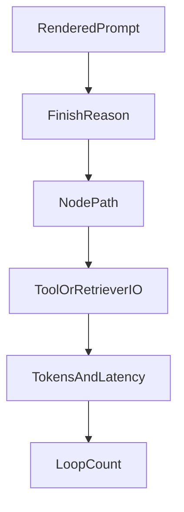

# LangSmith in one sitting

LangSmith does **not** run your app. It records what your app did. Each run is a tree: the big job on top, and every prompt, model call, tool, and graph node underneath.

## Turn it on

Set `LANGSMITH_TRACING=true`, add `LANGSMITH_API_KEY`, and pick a `LANGSMITH_PROJECT` name. LangChain pieces are traced automatically.

Give the run a clear name (`run_name`), tags for filters, and metadata like `user_id` and `prompt_version`. Put `thread_id` in config so one user’s chat stays grouped. Never put passwords or API keys in tags or metadata.

Deep: [19](../theory/19-langsmith.md), [45](../theory/45-langsmith-studio.md).

## How to debug (in this order)

*Picture: check the prompt first, then why the model stopped, then which path ran, then tools, cost, and loops.*

1. **Rendered prompt** — Did a variable become empty? Was context cut off?
2. **`finish_reason`** — `length` means the answer was truncated.
3. **Node path** — Did the graph take the branch you expected?
4. **Tool / search I/O** — Bad inputs in → bad results out.
5. **Tokens and time** — Usually one step owns most of the cost.
6. **Loop count** — “Revise until good” often runs more times than you think.

Your own Python helpers are invisible until you mark them with `@traceable`.

## Common situations

| Situation | What you do |
|---|---|
| User says “bad answer” | Filter by that user or thread and open the run |
| “New prompt is better” | Score both prompts on the same fixed examples |
| Bug found in production | Add that example to your test set |
| Need a thumbs-down | Attach feedback to that run id |
| Graph is hard to print | Use Studio (`langgraph dev`) to step and edit state |
| Too much traffic | Trace everything in dev; sample in production |

Studio reads `langgraph.json` (names → compiled graphs). Offline fallback: stream with `stream_mode="updates"` to print each node’s change. That will not show the full rendered prompt — LangSmith will.

Deep: [45](../theory/45-langsmith-studio.md).
