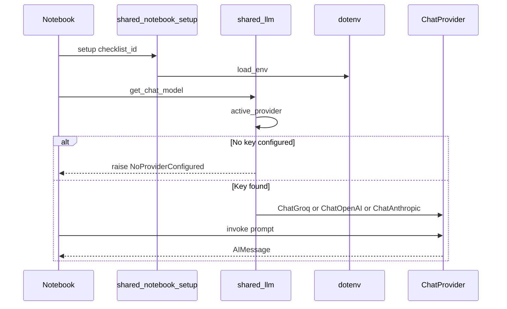

# Environment, Providers, and Keys

## 30-second answer

Every notebook finds the repo root, loads `.env`, then builds a chat model with `get_chat_model()`. Provider pick is key-driven: Groq → OpenRouter → OpenAI → Anthropic, unless `LLM_PROVIDER` pins one. Embeddings pick separately through `get_embeddings()`. `invoke()` returns an `AIMessage` with `.content`, `.response_metadata`, and `.usage_metadata` — never a bare string.

## Tiny example

Leave desk opens a ticket bot notebook. The first cell walks up folders until it sees `shared/`, then calls `setup`. Sam has only `GROQ_API_KEY` in `.env`. The bot asks “What is sick leave?” once. The reply is an `AIMessage`, not text alone. Sam prints token usage before trusting the answer. Rule: no key → stop; with a key → one typed reply you can cost and debug.

## Why it exists

Most “LangChain is broken” reports are setup bugs: wrong Python, key in the wrong file, or a 0.x tutorial against a 1.x install. This chapter is the shared door so later lessons talk to Groq, OpenRouter, or OpenAI with the same two lines — without locking the course to one vendor.

## Runtime

1. **Find the repo.** From `Path.cwd()`, walk parents until `(_root / "shared").is_dir()`. Put `_root` on `sys.path`.
2. **`setup(checklist_id)`.** Loads `.env`, prints providers, returns a `NotebookContext` with paths into sample data.
3. **`get_chat_model()`.** Loads env, then `active_provider(provider)`.
   - If `LLM_PROVIDER` (or `provider=`) is set: that key must exist or raise `NoProviderConfigured`.
   - Else: first provider in order with a non-empty API key.
   - If none: raise `NoProviderConfigured` and point at `.env.example`.
4. **Build the chat class.** Groq → `ChatGroq`; OpenAI → `ChatOpenAI`; Anthropic → `ChatAnthropic`; OpenRouter → `ChatOpenAI(base_url=..., api_key=OPENROUTER_API_KEY)` (not a native `init_chat_model` provider).
5. **`model.invoke(prompt)`.** Network call. Returns `AIMessage`.
6. **Optional embeddings.** `get_embeddings()` resolves on its own (default `auto`). Chat pin does not force embeddings.
7. **Optional LangSmith.** If `LANGSMITH_TRACING=true` and `LANGSMITH_API_KEY` are set, the same invoke is traced under `LANGSMITH_PROJECT`.

**First paid call.** After bootstrap shows a real provider (not `NONE CONFIGURED`), `get_chat_model()` may build `ChatGroq` with `GROQ_MODEL` (example default `llama-3.3-70b-versatile`). `model.invoke("In one sentence, what problem does LangChain solve?")` returns `AIMessage`. Check type, then `.response_metadata` and `.usage_metadata` before you parse `.content`.



*Picture: notebook loads env, picks a provider with a key, then one invoke returns an AIMessage — or fails early with NoProviderConfigured.*

## Objects, fields, and merge rules

| Plain role | Type / symbol |
|---|---|
| Notebook bag of paths | `NotebookContext` (`ctx`) from `setup`; `ctx.data(...)` for sample files |
| Chat factory | `get_chat_model(model=None, *, provider=None, temperature=0.0, **kwargs)` → `BaseChatModel` |
| Who wins among keys | `active_provider(preferred=None)` |
| Keys that work today | `available_providers()` |
| Model id for a vendor | `model_name_for(provider)` from `GROQ_MODEL` / peers |
| Hard stop, no chat key | `NoProviderConfigured` (`RuntimeError` subclass) |
| Docs-style factory | `init_chat_model("provider:model", temperature=0)` — not OpenRouter |
| Typed reply | `AIMessage` with `.content`, `.response_metadata`, `.usage_metadata` |
| Vector factory | `get_embeddings()` / `embedding_provider()` (separate path) |
| Optional feature gate | `require("LANGSMITH_API_KEY", feature=...)` skips cleanly |
| Sample corpus builder | `ensure_all()` / `list_files()` (Northwind data on disk) |

**Merge / identity rules**

- First matching key wins unless `LLM_PROVIDER` is set.
- Chat and embeddings do not share a pin.
- Per-call override (`get_chat_model(provider="groq")`) does not rewrite other notebooks’ defaults.
- Keys live only in repo-root `.env` (gitignored). Never paste secrets in cells.

**Embedding sanity:** dim count alone is not proof — the fake embedder also returns 384 floats. Related text must score higher than unrelated by a margin (lab: `related_score > unrelated_score + 0.05`).

## Control surface

| Knob | Where | What it changes |
|---|---|---|
| `GROQ_API_KEY` / `OPENROUTER_API_KEY` / `OPENAI_API_KEY` / Anthropic | `.env` | Whether that vendor appears in `available_providers()` |
| `LLM_PROVIDER` | `.env` | Pins chat; empty → auto order |
| `GROQ_MODEL` (and peer `*_MODEL`) | `.env` | Default model id |
| `get_chat_model(provider=..., model=..., temperature=..., max_tokens=...)` | call site | Per-call override |
| `EMBEDDING_PROVIDER` / `auto` | `.env` | Embedding backend: `groq` (768), `huggingface` (384), `openai` (1536), `fake` (384) |
| `LANGSMITH_TRACING`, `LANGSMITH_API_KEY`, `LANGSMITH_PROJECT` | `.env` | Tracing on/off and project name |
| Kernel / venv | IDE | Wrong kernel → `ModuleNotFoundError` after install |
| `python -m pip` vs bare `pip` | shell | On Windows, bare `pip` may hit another Python |

### Data shape in and out

- **In (chat):** string, or later a message list / `PromptValue`.
- **Out (chat):** `AIMessage`. Text in `.content`; tokens in `.usage_metadata`; `finish_reason` and model name in `.response_metadata`.
- **In (embeddings):** `embed_query(str)` / `embed_documents(list[str])`.
- **Out (embeddings):** fixed-width float vectors (768 / 384 / 1536). Fake is also 384.

### Cost and latency shape

The only billable hop in the first model cell is `model.invoke(...)`. Groq is first in the course for fast, free learning loops. Looping `available_providers()` multiplies cost by N. Embeddings are a second meter. LangSmith adds a small outbound flush, not model tokens. `ensure_all` is local disk work.

### `get_chat_model` vs `init_chat_model`

| Aspect | `get_chat_model` | `init_chat_model("provider:model")` |
|---|---|---|
| Owner | Course wrapper in `shared.llm` | LangChain core / docs |
| OpenRouter | First-class via `ChatOpenAI(base_url=...)` | Not native — do not force the string form |
| Defaults | `temperature=0.0`, env model ids | You pass them |
| When | Every notebook in this repo | Reading docs; non-OpenRouter experiments |

Production note: inject the model from config and pull secrets from a secret manager. The *pattern* stays; only where the strings come from changes.

## Failure anatomy

| Symptom | Cause | Fix |
|---|---|---|
| `Chat provider : NONE CONFIGURED` | No usable chat key in `.env` | Copy `.env.example` → `.env`; set at least `GROQ_API_KEY`. Example: stop before any model cell. |
| `NoProviderConfigured` | Wrong env name (`GROQ_KEY`) or pin with empty key | Use exact names; clear or fix `LLM_PROVIDER`. |
| `ModuleNotFoundError` after install | Package landed in another Python | `python -m pip install -r requirements.txt`; pick **GenAI Mastery** kernel. |
| Embeddings report `fake` | No real embedding provider | Set `GROQ_API_KEY` (or HF/OpenAI). Do not start Track 02 RAG on fake vectors. |
| Related cosine ≤ unrelated + 0.05 | Fake or broken embeddings | Same fix; re-run the related/unrelated probe. |
| OpenRouter via `init_chat_model` confusion | OpenRouter is not native there | Use `get_chat_model()` / `base_url` path in `shared/llm.py`. |
| Key in chat / screenshot / commit | Secret treated as public | Rotate now; keep secrets only in `.env`. |

## Keywords

- In plain words: build me a ready chat model from env — `get_chat_model`
- In plain words: which vendor string wins given keys and pin — `active_provider`
- In plain words: hard stop when chat cannot start — `NoProviderConfigured`
- In plain words: typed model reply with text plus metadata — `AIMessage`
- In plain words: token counts and finish reason bags — `usage_metadata` / `response_metadata`
- In plain words: separate factory for vectors — `get_embeddings`
- In plain words: skip a cell when an optional key is missing — `require`
- In plain words: LangChain `"provider:model"` factory — `init_chat_model`
- In plain words: list usable vendors and their model ids — `available_providers` / `model_name_for`
- In plain words: generate Northwind sample files locally — `ensure_all`

### Health-check layering

When something breaks mid-course, the import matrix (langchain, langchain_core, langgraph, provider SDKs, chroma, faiss, pypdf, …) shows *which* layer failed. Missing `langchain_groq` with a present `GROQ_API_KEY` is packaging, not keys — opposite of `NoProviderConfigured`.

## Minimal fragment

```python
from pathlib import Path
import sys

_root = Path.cwd()
while not (_root / "shared").is_dir() and _root != _root.parent:
    _root = _root.parent
sys.path.insert(0, str(_root))

from shared.notebook_setup import setup
from shared.llm import get_chat_model

ctx = setup("00_environment_providers_and_keys")
model = get_chat_model()
# Watch: reply type is AIMessage, not str
response = model.invoke("In one sentence, what problem does LangChain solve?")
# Watch: cost lives here, not in .content
print(type(response).__name__, response.usage_metadata)
```

## Interview traps

**Shallow answer.** Just set `OPENAI_API_KEY` and call `ChatOpenAI`.

**Better answer.** This course resolves chat through `get_chat_model()` with a fixed key order and optional `LLM_PROVIDER`. OpenRouter is OpenAI-protocol via `base_url`. Embeddings resolve separately; a working chat key does not imply real embeddings.

**Shallow answer.** `invoke` returns a string.

**Better answer.** Chat models return an `AIMessage`. Cost and truncation live on `.usage_metadata` and `.response_metadata["finish_reason"]`.

**Shallow answer.** If `len(vector) == 384`, embeddings are fine.

**Better answer.** The fake embedder also returns 384 dims. Prove related > unrelated cosine before trusting RAG notebooks.

**Shallow answer.** Environment setup is optional if the import works.

**Better answer.** Import success does not mean the right provider, real embeddings, or LangSmith. The health-check cell isolates which layer failed.

### What the lab deliberately breaks

Rename `GROQ_API_KEY` → `GROQ_KEY` and restart → `NoProviderConfigured`. Force `LLM_PROVIDER=openai` without a key → pin path fails. Compare small vs large Groq models with `%%time` → model id is a latency/quality knob, not the wrapper API.

## Lab

[00_environment_providers_and_keys.ipynb](../../00-setup/00_environment_providers_and_keys.ipynb)
