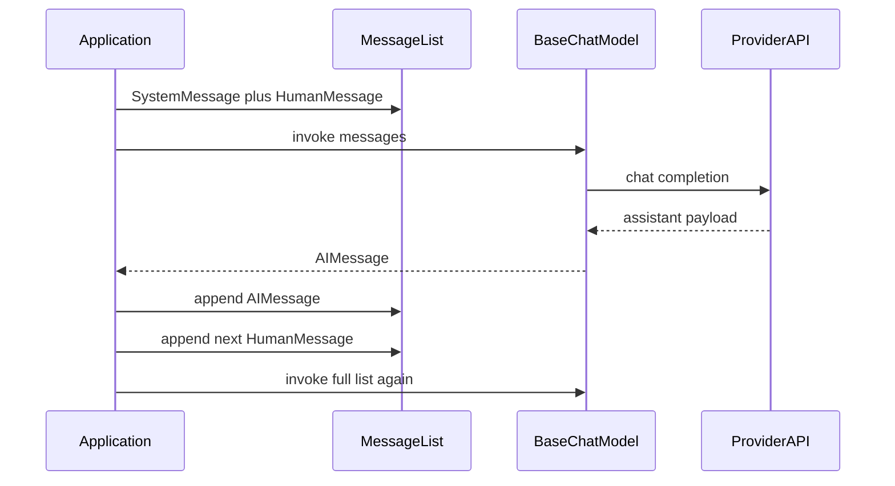

# Models and Messages

## 30-second answer

Talk to the model with a **list of messages**, not one long string. Use a chat model (`BaseChatModel`), not the old text-only `BaseLLM`. Roles are `SystemMessage`, `HumanMessage`, `AIMessage` (and later `ToolMessage`). The model does **not** remember the last turn by itself — you must send the full list again. `invoke` / `batch` / `stream` return an `AIMessage` (or chunks). Show `.content` to the user; check `.usage_metadata` and `.response_metadata["finish_reason"]` for cost and cut-off.

## Tiny example

Sam opens a leave-policy ticket: “I’m on Growth — what’s my sick-leave wait?” System line says: Northwind support, be short. First `invoke` answers. Sam asks “And if I exceed the wait?” without sending the first reply back. The model has no plan context and invents nonsense. Rule: append the prior `AIMessage`, then the new human line, then call again with the whole list.

## Why it exists

Before RAG, agents, or graphs, a support assistant needs three things: separate “who you are” from “what the user asked”, keep multi-turn chat coherent, and know what a call cost and why it stopped. All three are message-list habits. Agents, memory, and LangGraph checkpointers are structured ways to build and replay those lists.

## Runtime

1. Build a Python `list` of message objects (or tuples/dicts — see merge rules).
2. Put `SystemMessage` first: identity, tone, output rules.
3. Append `HumanMessage` for the current user turn.
4. Call `model.invoke(messages)` → network → `AIMessage`.
5. For turn N+1: **append** the prior `AIMessage`, append the new `HumanMessage`, `invoke` the entire list again.
6. Inspect `reply.usage_metadata`, `reply.response_metadata["finish_reason"]`, and optionally `reply.id` before parsing or showing UI.
7. Other entry points: `model.batch([...])` (concurrent) or `model.stream(...)` (token chunks with `.content`).

**Two-turn support call.** `[SystemMessage(Northwind rules), HumanMessage(rate limit)]` → `invoke` → `AIMessage`. Append that reply, append `HumanMessage("And what happens if I exceed it?")`, `invoke` again. Message count and input tokens both rise. Broken path: second question alone with a fresh system message — provider never saw turn 1. Separately, `get_chat_model(max_tokens=16)` on a long ask should show `finish_reason` of `length` and truncated `.content`.




*Picture: you own the list; each turn you append the model reply and the next user line, then resend everything.*

Proving statelessness: invoke only `[SystemMessage, HumanMessage("And what happens if I exceed it?")]` without prior turns → follow-up has no context.

## Objects, fields, and merge rules


| Plain role                                    | Type                                                              |
| --------------------------------------------- | ----------------------------------------------------------------- |
| Chat interface (messages in, `AIMessage` out) | `BaseChatModel` from `get_chat_model()`                           |
| Legacy string in / string out                 | `BaseLLM` (recognition only)                                      |
| Identity and rules at the front               | `SystemMessage`                                                   |
| User text                                     | `HumanMessage`                                                    |
| Prior model reply / return type of `invoke`   | `AIMessage`                                                       |
| Tool result later (agents)                    | `ToolMessage`                                                     |
| User-visible text                             | `AIMessage.content`                                               |
| Token usage for cost                          | `AIMessage.usage_metadata`                                        |
| Provider bag (`finish_reason`, model name)    | `AIMessage.response_metadata`                                     |
| Provider/message id when present              | `AIMessage.id`                                                    |
| Why generation stopped                        | `finish_reason`: `stop`, `length`, `tool_calls`, `content_filter` |


**Input shape equivalence**

LangChain accepts these as the same call:

1. Message objects: `[SystemMessage(...), HumanMessage(...)]`
2. Role tuples: `[("system", "..."), ("human", "...")]`
3. OpenAI-style dicts: `[{"role": "system", "content": "..."}, {"role": "user", "content": "..."}]`

A bare string is silently wrapped as `[HumanMessage(string)]`.

**Conversation identity:** the conversation *is* the list you pass. Omitting prior `AIMessage`s is deletion, not compression. Token cost grows roughly with list length every turn.

## Control surface


| Knob                            | Effect                                                                                                                    |
| ------------------------------- | ------------------------------------------------------------------------------------------------------------------------- |
| `SystemMessage` text            | Persona/policy without touching the user line (lab: terse engineer vs support vs compliance)                              |
| `temperature` (0.0–2.0)         | Randomness. `0` for extraction/routing; `0.7+` for creative copy. Course default `0`. Near-deterministic, not guaranteed. |
| `max_tokens`                    | Caps **output** only. Hit cap → `finish_reason == "length"` and truncated `.content`.                                     |
| `timeout`, `max_retries`        | Reliability; set timeout so one slow call cannot pin a worker.                                                            |
| `model_kwargs` / `seed`         | Provider-specific extras                                                                                                  |
| `invoke` vs `batch` vs `stream` | One-shot, concurrent many, or UI tokens. Same Runnable contract.                                                          |
| `get_chat_model(provider=...)`  | Swap vendors without rewriting message code                                                                               |


### Data shape in and out


| Call               | Input                               | Output                         |
| ------------------ | ----------------------------------- | ------------------------------ |
| `invoke(messages)` | message list / tuples / dicts / str | `AIMessage`                    |
| `batch([..])`      | list of the above                   | `list[AIMessage]`              |
| `stream(...)`      | same as invoke                      | iterator of `AIMessage` chunks |


Three layers on an `AIMessage`: `.content` (user), `.usage_metadata` (cost), `.response_metadata` (diagnostics). Truncation is invisible in `.content` alone — half a sentence still looks like prose.

### Cost and latency shape

Every `invoke` is one provider round-trip. **Input tokens include the entire resent conversation.** Turn 1 is cheap; turn 10 resends system + nine exchanges — why notebook 06 exists. `batch` overlaps wall-clock; token cost per item is unchanged. `stream` does not cut cost; it only changes when bytes arrive. Lower `max_tokens` caps output spend but risks `finish_reason=length`.

### Chat model vs legacy LLM


|              | `BaseChatModel`      | `BaseLLM` (legacy) |
| ------------ | -------------------- | ------------------ |
| Input        | message list (roles) | single string      |
| Output       | `AIMessage`          | `str`              |
| Tool calling | yes                  | no                 |
| Status       | default in 2026      | recognition only   |


If you see `OpenAI(...)` (not `ChatOpenAI`), `HuggingFaceHub(...)`, or `Cohere(...)` as a text completer, rewrite to a chat model before building agents.

## Failure anatomy


| Symptom                              | Cause                                          | Fix                                                                                                         |
| ------------------------------------ | ---------------------------------------------- | ----------------------------------------------------------------------------------------------------------- |
| Turn 2 ignores turn 1                | Forgot to append prior `AIMessage`             | Always `conversation.append(first)` before the next human. Example: “And if I exceed it?” alone → nonsense. |
| Follow-up incoherent                 | Stateless call without history                 | Resend full list including system + prior turns.                                                            |
| `json.loads` fails on “obvious” JSON | Silent truncation: `finish_reason == "length"` | Check `finish_reason` **before** parsing; raise `max_tokens` or shorten input.                              |
| Tests flake on exact model text      | Temperature 0 is not guaranteed-identical      | Assert structure/categories, not exact strings.                                                             |
| Using `OpenAI(...)` as text LLM      | Legacy completion API                          | Rewrite to chat model (`ChatOpenAI`, `get_chat_model()`).                                                   |
| Truncated answer looks fine in UI    | Only looked at `.content`                      | Log `finish_reason` and `usage_metadata` on every production path.                                          |


## Keywords

- In plain words: message-list chat interface with tools — `BaseChatModel`
- In plain words: front-of-list identity and rules — `SystemMessage`
- In plain words: user and assistant turns you must replay — `HumanMessage` / `AIMessage`
- In plain words: provider does not remember; your list does — Statelessness
- In plain words: why generation stopped (truncation, tools, filter) — `finish_reason`
- In plain words: token counts on the reply — `usage_metadata`
- In plain words: concurrent multi-input call — `batch`
- In plain words: incremental tokens for UI — `stream`
- In plain words: objects, tuples, and dicts all count as the same payload — Input shorthands
- In plain words: output-only length cap — `max_tokens`


### Persona as a control experiment

Same `HumanMessage` about emailing customer data to personal Gmail under three system prompts (terse engineer, support agent, compliance officer). One line of system text, zero retrieval, big behaviour change — highest-leverage edit before tools or RAG.

## Minimal fragment

```python
from langchain.messages import AIMessage, HumanMessage, SystemMessage
from shared.llm import get_chat_model

model = get_chat_model()
conversation = [
    SystemMessage("You are the Northwind support assistant. Be concise."),
    HumanMessage("I'm on the Growth plan. What is my API rate limit?"),
]
first = model.invoke(conversation)
# Watch: without append, turn 2 has no memory
conversation.append(first)
conversation.append(HumanMessage("And what happens if I exceed it?"))
second = model.invoke(conversation)
# Watch: finish_reason before you trust content
print(second.content, second.response_metadata.get("finish_reason"))
```


## Interview traps

**Shallow answer.** The model remembers the conversation.

**Better answer.** The model is stateless. Memory is resending the message list (or a LangGraph checkpointer keyed by `thread_id`).

**Shallow answer.** If parsing fails, the prompt was wrong.

**Better answer.** First check `finish_reason`. Truncation (`length`) produces half-JSON and a misleading parse error far from the real cause.

**Shallow answer.** `temperature=0` makes output identical every time.

**Better answer.** Near-deterministic only. Never assert exact model strings in tests.

**Shallow answer.** `batch` is just a for-loop helper.

**Better answer.** `batch` runs concurrently on the Runnable interface. Wall-clock drops; token cost per ticket does not.

### `finish_reason` decision table


| Value            | Meaning                             | Action                                               |
| ---------------- | ----------------------------------- | ---------------------------------------------------- |
| `stop`           | finished naturally                  | proceed                                              |
| `length`         | hit `max_tokens`; content truncated | raise budget or shorten input; do not parse JSON yet |
| `tool_calls`     | model wants a tool                  | execute and return `ToolMessage` (later labs)        |
| `content_filter` | provider blocked output             | treat as refusal / rephrase                          |


## Lab

[01_models_messages.ipynb](../../01-langchain-foundations/01_models_messages.ipynb)