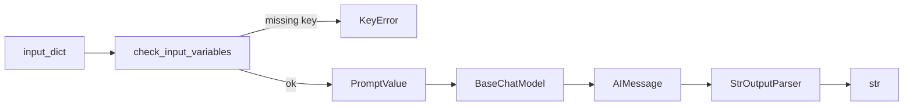

# Prompt Templates

## 30-second answer

`PromptTemplate` names its inputs (`input_variables`) and refuses to render when any are missing. Prefer `.invoke({...})` → `PromptValue` (chain-ready) over `.format(**kwargs)` → string (eyeballing). Use `.partial(...)` to freeze wiring-time values; pass a **callable** for values that must stay fresh (e.g. today’s date). Escape literal braces as `{{` / `}}`. Compose with `template + template`, then pipe `prompt | model | StrOutputParser()`.

## Tiny example

Support ticket: Harlow Energy, Enterprise, “Scheduled reports sent twice.” An f-string with a typo silently drops the summary. A template declares `{customer}`, `{plan}`, `{summary}` and raises `KeyError` before any paid call if `summary` is missing. Rule: declare inputs, fail loud, then send the filled prompt to the model.

## Why it exists

f-strings fail silently or late: empty names, ticket bodies with `{`, typos that become `None`. Templates fix four production problems: missing-variable detection, reuse, composability, and traceability (LangSmith can show template vs bound values separately).

## Runtime

1. Build with `PromptTemplate.from_template("... {customer} ...")`. Placeholders become `template.input_variables`.
2. Optionally `.partial(tier="Enterprise", today=today_iso)` → new template whose required keys shrink.
3. At request time, `.invoke({"customer": ..., "plan": ..., "summary": ...})` checks coverage and returns a `PromptValue`.
4. `PromptValue.to_messages()` for chat shape, or pass the value straight to `model.invoke(value)`.
5. In LCEL: `summarise = template | model | StrOutputParser()` then `.invoke(dict)` / `.batch([dicts])`.
6. Literal JSON in the template text must use doubled braces so it is not parsed as variables.

**Northwind standup summary.** Input dict enters `template.invoke`. Missing `summary` → `KeyError` before network I/O. On success, `PromptValue` feeds the model (only paid hop). `StrOutputParser` unwraps `AIMessage` to a sentence. `.batch` over tickets reuses the same pipe concurrently — still one model call per ticket.



*Picture: dict hits the template first; missing keys explode before you spend money on the model.*

## Objects, fields, and merge rules

| Plain role | Type / behaviour |
|---|---|
| String prompt with named holes | `PromptTemplate` — `input_variables`; `.format` → `str`; `.invoke` → `PromptValue`; `.partial` → new template |
| Chain-native rendered prompt | `PromptValue` — `.to_messages()` for chat |
| Strip `AIMessage` to text in a chain | `StrOutputParser` |
| Glue small prompts into one | `identity + "\n\n" + rules + "\n\n" + task` (union of `input_variables`) |
| Live value each render | Partial callable, e.g. `.partial(today=today_iso)` |

**Merge / identity rules**

- Declared variables are a set: `set(input_variables) - set(provided)` is the missing list.
- `.partial` removes keys from the required set for callers; it does not mutate the original unless you reassign.
- `format` is for humans; `PromptValue` belongs in Runnable graphs.
- Version prompts as named assets (`PROMPTS["ticket_summary_v1"]`).

## Control surface

| Knob | Effect |
|---|---|
| Template placeholders | Contract; typos become loud `KeyError`s |
| `.partial(static...)` | Bake tenant/tier/SLA known at service start |
| `.partial(fn)` | Live values (date, request id) per render |
| `{{` / `}}` | Literal braces for JSON examples |
| `prompt \| model \| parser` | Canonical LCEL chain; `.batch` for free |
| Named prompt registry | Versionable assets for review/A-B later |

### Data shape in and out

| Stage | Shape |
|---|---|
| Authoring | template string with `{var}` → `PromptTemplate` |
| `.format(**kwargs)` | `str` (eyeballing) |
| `.invoke(dict)` | `PromptValue` |
| `PromptValue.to_messages()` | message list for a chat model |
| After `prompt \| model \| StrOutputParser` | `str` |

Lab helper: `sorted(set(prompt_template.input_variables) - set(provided))` returns missing names **before** a model call.

### Cost and latency shape

Rendering is pure CPU — essentially free. The billable hop is still the model. Templates change **input token count**: standing instructions, JSON examples, and partials are paid every request. Composition does not dedupe tokens. `.batch` overlaps wall-clock; each payload is still a full prompt+completion.

### f-string vs `PromptTemplate` vs chat templates

| Approach | Missing var | Roles | History slot | Traceability |
|---|---|---|---|---|
| f-string | silent / `None` / `NameError` | fake with text | hand-splice | one blob |
| `PromptTemplate` | loud `KeyError` | none (single string) | n/a | template vs values separable |
| `ChatPromptTemplate` (next lab) | loud | system/human/ai | `MessagesPlaceholder` | same, message-structured |

Use `PromptTemplate` while the prompt is one string with variables. Need roles or chat history → notebook 03.

### Partial lifetimes

Wiring-time (`tier="Enterprise"`, SLA text) → `.partial` once. Request-time (`opened_on`, `summary`) → `invoke`. Live values (`today`) must be callables: freezing `date(...).isoformat()` in a partial is a demo bug; `partial(today=today_iso)` is the production pattern.

## Failure anatomy

| Symptom | Cause | Fix |
|---|---|---|
| `KeyError` on `invoke` / `format` | Missing declared variable | Supply all `input_variables`, or validate with set difference first. Example: forgot `summary`. |
| `KeyError` / `ValueError` when authoring JSON | Single `{` `}` parsed as variables | Double braces: `{{"answer": "..."}}`. |
| Date stuck on yesterday after deploy | Passed `date.today().isoformat()` into `.partial` at import | Pass the callable `today_iso` instead. |
| Silent bad output with f-strings | Typo / `None` interpolated | Move to `PromptTemplate` so missing keys fail loudly. |
| Colleague cannot reuse prompt | Buried f-string in one service | Extract named `PromptTemplate` modules / Hub later. |

## Keywords

- In plain words: names the template will refuse to render without — `input_variables`
- In plain words: chain-native rendered prompt, not a bare string — `PromptValue`
- In plain words: freeze wiring-time values; callables stay fresh — `.partial`
- In plain words: literal braces so JSON examples are not variables — Brace escaping (`{{` / `}}`)
- In plain words: build large prompts from small named pieces — Template composition (`+`)
- In plain words: last mile from `AIMessage` to `str` — `StrOutputParser`
- In plain words: named, reviewable versions — Prompt as asset
- In plain words: set difference of declared vs provided before any model call — `validate_inputs` pattern
- In plain words: parse `{placeholders}` at construction — `from_template`

### Why LangSmith cares

With tracing on, template+values show as separate concerns. A missing `summary` fails as a template error instead of a mysterious half-empty model answer — and Hub/versioning (notebook 28) can treat prompts like code.

## Minimal fragment

```python
from langchain_core.prompts import PromptTemplate
from langchain_core.output_parsers import StrOutputParser
from shared.llm import get_chat_model

template = PromptTemplate.from_template(
    "Summarise for standup.\nCustomer: {customer}\nPlan: {plan}\nTicket: {summary}"
)
# Watch: missing keys raise KeyError before the model
summarise = template | get_chat_model() | StrOutputParser()
print(summarise.invoke({
    "customer": "Harlow Energy",
    "plan": "Enterprise",
    # Watch: all three declared inputs must be present
    "summary": "Scheduled reports sent twice",
}))
```

## Interview traps

**Shallow answer.** Templates are just f-strings with nicer syntax.

**Better answer.** Templates declare `input_variables` and fail on missing keys; they produce `PromptValue` for LCEL; LangSmith can separate template from values; partials and brace escaping are first-class.

**Shallow answer.** Always `.format()` then `model.invoke(string)`.

**Better answer.** `.format` is for eyeballing. Production chains use `.invoke` / pipe so types stay `PromptValue` → model → parser and `batch` works.

**Shallow answer.** Partial with `date.today()` is fine.

**Better answer.** That freezes the date at partial-bind time. Pass a zero-arg callable so each render re-evaluates.

**Shallow answer.** One giant prompt string is easier to maintain.

**Better answer.** Compose `identity + rules + task` so each piece version-controls. Named `PROMPTS["ticket_summary_v1"|"v2"]` enables A/B later.

### Escaping walkthrough

Intent: teach the model to emit `{"status": "ok"}`.

- Wrong: `'Reply as {"status": "ok"} for {question}'` → braces parsed as variables.
- Right: `'Reply as {{"status": "ok"}} for {question}'` → literal braces; `{question}` still substituted.

### Escalation partial example

`escalation.partial(tier="Enterprise", sla="...", today=...)` shrinks required inputs to `{opened_on, summary}`. That split is the point: service-boot knowledge vs per-ticket knowledge.

### First LCEL sighting

`summarise = template | model | StrOutputParser()` is the canonical three-stage chain; notebook 07 digs into composition laws.

## Lab

[02_prompt_templates.ipynb](../../01-langchain-foundations/02_prompt_templates.ipynb)
