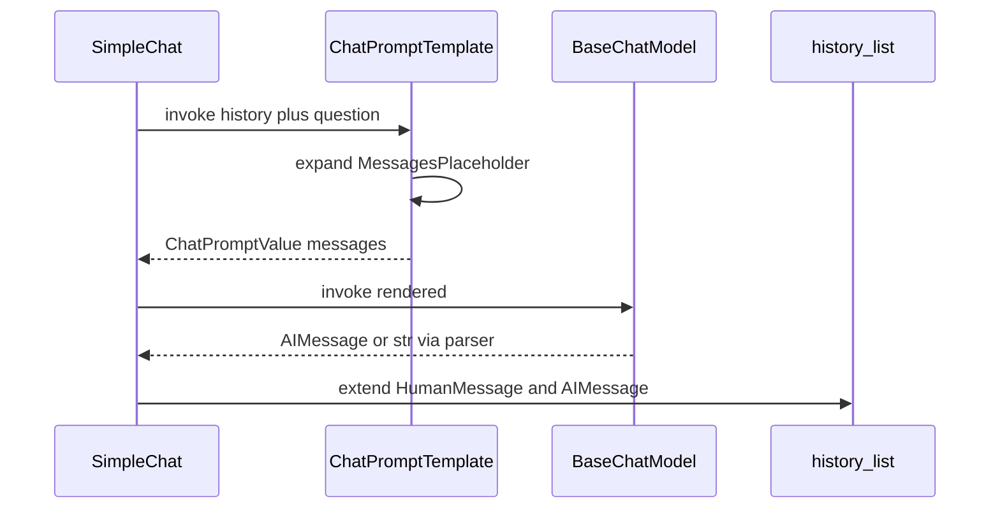

# Chat Prompt Templates and MessagesPlaceholder

## 30-second answer

`ChatPromptTemplate.from_messages([...])` builds role-aware message templates (`system` / `human` / `ai`). `MessagesPlaceholder("history")` is a slot that expands to a variable-length list of real messages at invoke time. Optional placeholders (`optional=True`) may be omitted. Use `trim_messages` to keep history token-bounded and structurally valid. Hand-rolled `self.history` is fine in a notebook; production persistence belongs to a LangGraph checkpointer.

## Tiny example

Leave-policy chat: system says “never invent policy.” History holds “I’m on Growth” and the bot’s reply about refresh rates. New question: “How often can I refresh if I upgrade?” The placeholder splices those two prior messages between system and the new human line. Empty history on turn 1 is fine — same template, zero extra messages. Rule: fixed roles + one slot for whatever length the transcript is.

## Why it exists

Manually splicing fixed instructions with variable chat history breaks as soon as both must coexist. Agents, RAG chains, and LangGraph nodes all use the same pattern: fixed system text, a placeholder for dynamic messages, then the current human turn.

## Runtime

1. Declare `ChatPromptTemplate.from_messages([("system", "...{tone}..."), MessagesPlaceholder("history"), ("human", "{question}")])`.
2. `invoke({"tone": ..., "history": [...], "question": ...})` → `ChatPromptValue`.
3. `.to_messages()` expands variables and splices the history list in placeholder order.
4. Pass to `model.invoke` (or pipe `chat_prompt | model | StrOutputParser()`).
5. Multi-turn loop: invoke → append `HumanMessage(question)` and `AIMessage(answer)` to history → repeat.
6. When history grows: `trim_messages(history, max_tokens=..., token_counter=model, strategy="last", start_on="human", include_system=True)` before the next model call.
7. Same placeholder can carry few-shot example messages or retrieved context messages, not only chat history.

**One `SimpleChat.ask` turn.** `chain.invoke({"history": self.history, "question": question})` renders system + history + human. Model call is the paid hop. Then `self.history.extend([HumanMessage(question), AIMessage(answer)])` — both sides must be stored or the next turn cannot see what the bot said.



*Picture: template expands the history slot, model answers, then both human and AI lines are stored for the next turn.*

## Objects, fields, and merge rules

| Plain role | Type |
|---|---|
| Ordered list of role templates | `ChatPromptTemplate` — `.input_variables` aggregates placeholders and `{vars}` |
| Variable-length message list slot | `MessagesPlaceholder(variable_name, optional=False)` |
| Verbose role builders | `SystemMessagePromptTemplate` / `HumanMessagePromptTemplate` / `AIMessagePromptTemplate` |
| Rendered chat prompt | `ChatPromptValue` — `.to_messages()` → concrete `BaseMessage` list |
| Token-aware, validity-preserving trim | `trim_messages` |
| Lab in-process history holder | `SimpleChat` — `self.history: list` (not durable) |

**Order / merge rules**

- Rendered order matches `from_messages` order. Two placeholders → system, then examples, then history, then question if you author it that way.
- Empty history (`[]`) is valid: zero messages from the slot.
- `optional=True`: key may be absent entirely (not only empty list).
- An `("ai", ...)` turn in the template steers format (“put words in its mouth”).
- Each turn typically adds two messages; all are resent next call → cost scales with transcript length.

**`trim_messages` rules (as in the lab)**

- `strategy="last"` keeps recent turns; `"first"` keeps earliest.
- `start_on="human"` starts the window on a valid human turn.
- `include_system=True` retains system content when present.
- `token_counter=model` uses provider-accurate counting.

## Control surface

| Knob | Effect |
|---|---|
| Role slots in `from_messages` | Fixes system/human/ai structure and variable sites |
| `MessagesPlaceholder("history")` | Dynamic multi-turn (or context/examples) injection |
| `optional=True` | First-turn invokes without a history key |
| Template `{tone}`, `{max_sentences}`, `{question}` | Per-request behaviour without rebuilding the object |
| `trim_messages(max_tokens, strategy, start_on, include_system)` | Bounds cost while keeping a valid window |
| Programmatic `build_prompt(rules, include_history)` | Rules from config → message list construction |

### Data shape in and out

| Stage | Shape |
|---|---|
| Invoke input | `dict` with string vars plus `history: list[BaseMessage]` (or omitted if optional) |
| After `ChatPromptTemplate.invoke` | `ChatPromptValue` |
| `.to_messages()` | `[SystemMessage, ...history..., HumanMessage]` |
| After `chat_prompt \| model \| StrOutputParser` | `str` answer |
| `SimpleChat` state | `self.history` grows by two messages per `ask` |

Empty history is first-class: turn 1 and turn N share one template.

### Cost and latency shape

Tokens billed ≈ system text + **all** placeholder messages + current question + completion. After three exchanges the lab holds six messages and grows every turn. Ten turns means paying for the whole transcript until you trim or summarise. Putting retrieved policy text into `MessagesPlaceholder("context_messages")` puts RAG context in the same cost bucket as chat history.

### Manual list vs placeholder vs checkpointer

| Approach | Fixed instructions | Variable history | Survives restart | Used where |
|---|---|---|---|---|
| Manual `messages = [sys, ...]` append | hand-coded | you splice lists | no | notebook 01 |
| `ChatPromptTemplate` + `MessagesPlaceholder` | templated | slot expands | no (unless you persist the list) | agents/RAG prompts |
| LangGraph checkpointer + `thread_id` | graph/agent prompt | reloaded state | yes (with durable saver) | notebook 34+ |

`("ai", ...)` priming is a format steerer, not memory: present every call whether or not the user has spoken.

### Trimming strategies

- `strategy="last"` — support bots: keep recent troubleshooting.
- `strategy="first"` — keep the original brief/spec at the front.
- Always pair with `start_on="human"` so the window is a valid dialogue prefix.

## Failure anatomy

| Symptom | Cause | Fix |
|---|---|---|
| Fragile list splicing / wrong order | Hand-building system + history + question | Use `ChatPromptTemplate` + `MessagesPlaceholder`. |
| `KeyError` for `history` on first turn | Required placeholder, key omitted | Pass `history=[]` or set `optional=True`. Example: cold start with only `{question}`. |
| Token bill explodes after ~10 turns | Full transcript resent every call | Trim (`trim_messages`) and/or summarise (notebooks 06 / 47). |
| Broken tool conversations after trim | Naive slice orphans tool calls | Use `trim_messages`, not raw `list[-k:]`. |
| History lost after process restart | `SimpleChat.self.history` is in-process only | Move to LangGraph checkpointer + `thread_id` (notebook 34). |
| Model invents policy | Weak system / no grounding | Strengthen system; for RAG, put context in a placeholder and instruct strict grounding. |

## Keywords

- In plain words: role-structured prompt that renders to a message list — `ChatPromptTemplate`
- In plain words: variable-length message list slot — `MessagesPlaceholder`
- In plain words: allow omitting the history key on cold starts — `optional` placeholder
- In plain words: template-level assistant turn that shows answer shape — `("ai", ...)` priming
- In plain words: token-aware, validity-preserving history cut — `trim_messages`
- In plain words: each exchange adds messages fully resent next time — History growth
- In plain words: same slot for history, few-shot, or retrieved context — Placeholder reuse
- In plain words: verbose builders identical to role tuples — `SystemMessagePromptTemplate` / peers
- In plain words: minimal in-process history before checkpointers — `SimpleChat`

### Hand-built summary buffer (foreshadow)

Extending the system message with `{running_summary}`, regenerating every four turns, and trimming raw history is the hand-rolled form of summary+buffer memory. Notebook 06 replaces that with `SummarizationMiddleware` on a checkpointer-backed agent.

## Minimal fragment

```python
from langchain_core.prompts import ChatPromptTemplate, MessagesPlaceholder
from langchain.messages import AIMessage, HumanMessage
from langchain_core.output_parsers import StrOutputParser
from shared.llm import get_chat_model

chat_prompt = ChatPromptTemplate.from_messages([
    ("system", "You are the Northwind support assistant. Be concise."),
    MessagesPlaceholder("history"),
    ("human", "{question}"),
])
# Watch: history can be [] on turn 1
chain = chat_prompt | get_chat_model() | StrOutputParser()
history = [HumanMessage("I'm on the Growth plan."), AIMessage("Understood.")]
# Watch: placeholder expands to those two messages between system and question
print(chain.invoke({"history": history, "question": "How often can I refresh if I upgrade?"}))
```

## Interview traps

**Shallow answer.** ChatPromptTemplate is PromptTemplate with chat in the name.

**Better answer.** It renders a **list of role-tagged messages**, supports `MessagesPlaceholder` for dynamic lists, and is the structure agents/RAG use internally.

**Shallow answer.** Just keep the last k strings.

**Better answer.** Trimming must keep a valid message window (`start_on`, tool-call pairing). Prefer `trim_messages` with a real `token_counter`.

**Shallow answer.** In-memory `self.history` is production memory.

**Better answer.** It dies with the process. Checkpointers + `thread_id` are the modern persistence primitive.

**Shallow answer.** Placeholders are only for chat history.

**Better answer.** The lab feeds `MessagesPlaceholder("context_messages")` with a leave-policy excerpt — same slot as history, few-shot, or tool results.

### Multi-placeholder ordering

Author `[system, MessagesPlaceholder("examples"), MessagesPlaceholder("history"), human]` → render order is fixed. Swapping placeholder order swaps what sits closer to the question — deliberate steering, not dict key order.

### RAG-style grounding in the same template

Lab loads `leave_policy.txt`, slices sick-leave into `context_messages`, asks an answerable question (medical certificate) and an unanswerable one (paternity leave). System rule forces “Not covered…” when context lacks the answer — same `MessagesPlaceholder` machinery, different payload.

## Lab

[03_chat_prompt_templates.ipynb](../../01-langchain-foundations/03_chat_prompt_templates.ipynb)
