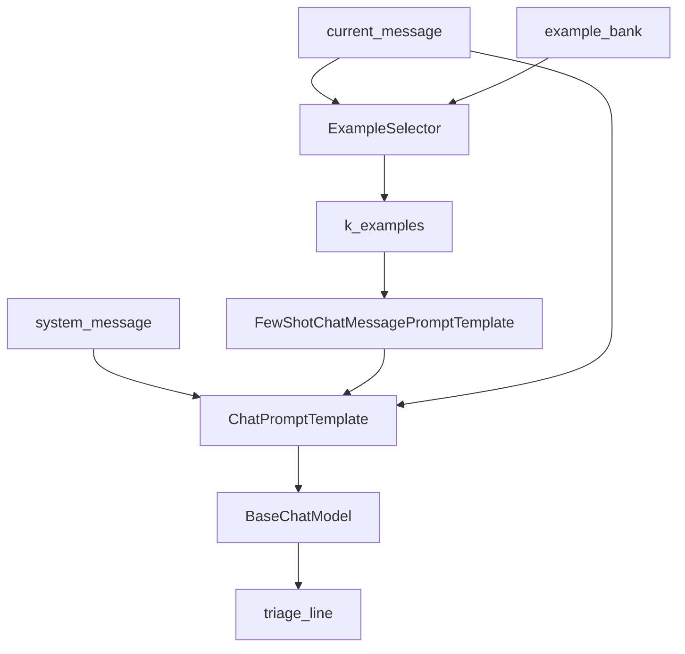

# Few-Shot Prompting and Example Selectors

## 30-second answer

Few-shot prompting puts worked input/output examples in the prompt so the model copies format and category choices. `FewShotPromptTemplate` builds one text block (prefix + examples + suffix); `FewShotChatMessagePromptTemplate` inserts alternating human/ai turns into a `ChatPromptTemplate`. Example selectors (`LengthBasedExampleSelector`, `SemanticSimilarityExampleSelector`, …) choose a subset per request so you do not pay for every example on every call. Showing beats long instructions; more than ~3–5 examples usually wastes tokens unless selection is semantic.

## Tiny example

Support triage without examples: “charged twice” becomes free-form prose every time. Add four lines like `category=billing | priority=high | summary=...`. The next “billed twice last month” copies that exact shape. Ship all 48 bank examples every request and cost spikes. Rule: show a few good examples; use a selector when the bank grows.

## Why it exists

A careful zero-shot triage instruction often yields inconsistent formats (~70% usable). Three consistent worked examples can jump accuracy with no fine-tuning. The catch: every example is tokens on every request. Selectors retrieve only relevant or budget-fitting examples.

## Runtime

**Static few-shot (text):**

1. Define `examples: list[dict]` with keys matching the example template (`message`, `triage`).
2. `example_prompt = PromptTemplate.from_template("Message: {message}\nTriage: {triage}")`.
3. Build `FewShotPromptTemplate(examples=..., example_prompt=..., prefix=..., suffix="Message: {message}\nTriage:", input_variables=["message"])`.
4. `.format(message=...)` or pipe into a model. All listed examples are embedded every time.

**Chat few-shot:**

1. `chat_example_prompt = ChatPromptTemplate.from_messages([("human", "{message}"), ("ai", "{triage}")])`.
2. `FewShotChatMessagePromptTemplate(example_prompt=..., examples=...)` becomes a block inside `ChatPromptTemplate.from_messages([system, few_shot_block, human])`.
3. Invoke → `to_messages()` shows system, then N human/ai pairs, then the real question.

**Semantic selection:**

1. `SemanticSimilarityExampleSelector.from_examples(examples, embeddings, InMemoryVectorStore, k=3)` embeds the bank once.
2. At request time, `select_examples({"message": probe})` returns the k nearest dicts.
3. Wire the selector into `FewShotChatMessagePromptTemplate(example_selector=..., input_variables=["message"])`.
4. Optional: `semantic_selector.add_example({...})` after a human correction — next similar query retrieves it.



*Picture: the selector picks a few neighbours from the bank, those examples land in the prompt, then the model writes one triage line.*

## Objects, fields, and merge rules

| Plain role | Type |
|---|---|
| Text: prefix + examples + suffix | `FewShotPromptTemplate` |
| Chat: alternating example turns | `FewShotChatMessagePromptTemplate` |
| Pack examples until a size budget | `LengthBasedExampleSelector` |
| Retrieve k nearest by embedding | `SemanticSimilarityExampleSelector` |
| Lab vector backend for the selector | `InMemoryVectorStore` |
| Similarity plus diversity | `MaxMarginalRelevanceExampleSelector` |
| Lexical overlap without embeddings | `NGramOverlapExampleSelector` |

**Merge rules**

- Example dict keys must match `example_prompt` variables.
- With a selector, do not also ship a giant static `examples=` list for the same job — the selector supplies the set per call.
- Format consistency is training signal: the model copies trailing punctuation and category spelling.
- Class imbalance biases predictions (six billing / one security).

## Control surface

| Knob | Effect |
|---|---|
| Number / content of examples | Accuracy vs tokens; edge cases teach more than easy paths |
| `k` on semantic selector | How many neighbours enter the prompt |
| `max_length` on length selector | Hard budget; short inputs allow more examples |
| Embeddings quality (`get_embeddings()`) | Bad/fake embeddings → irrelevant “nearest” examples |
| `add_example` | Runtime feedback without fine-tuning |
| Zero-shot vs few-shot vs semantic-k | Measure lift on labeled tickets before scaling count |

### Data shape in and out

| Stage | Shape |
|---|---|
| Example bank | `list[dict]` with keys matching `example_prompt` |
| Text few-shot `.format` | one big `str` |
| Chat few-shot `.to_messages()` | `[SystemMessage, Human, AI, ..., Human(query)]` |
| Selector output | `list[dict]` subset |
| Chain output | usually `str` triage line via `StrOutputParser` |

Inspect failures by printing rendered messages: wrong triage usually means a bad neighbour, not “the model forgot instructions.”

### Cost and latency shape

Few-shot moves cost into **input tokens**. Lab measures ~4 examples vs 48 (`examples * 12`) — overhead paid on **every** request. Semantic selection: embed bank once at `from_examples`, cheap similarity query per request — almost always cheaper than shipping the whole bank. Length selector is CPU-only at select time but can still include many examples when the user message is short.

### Selector catalogue

| Selector | Picks by | Use when |
|---|---|---|
| *(none — all examples)* | n/a | ≤ ~5 examples, all relevant |
| `LengthBasedExampleSelector` | fits a size budget | inputs vary wildly; examples interchangeable |
| `SemanticSimilarityExampleSelector` | embedding similarity | **default** for large diverse banks |
| `MaxMarginalRelevanceExampleSelector` | similarity + diversity | near-duplicate examples cluster |
| `NGramOverlapExampleSelector` | word overlap | jargon matters; no embeddings |

Practical rules: 3–5 examples is usually enough; cover edge cases; keep output format perfectly consistent; balance classes.

### Text few-shot vs chat few-shot

`FewShotPromptTemplate` is one completion-style string — fine for eyeballing. For chat models, `FewShotChatMessagePromptTemplate` matches alternating turns so the live question looks like the next turn in a mini-conversation.

## Failure anatomy

| Symptom | Cause | Fix |
|---|---|---|
| Inconsistent triage lines zero-shot | Model invents format each time | Add few-shot examples with **exact** target format. |
| Latency/cost spike | Shipping 48 examples every request | Measure tokens; use a selector; keep 3–5. Example: `examples * 12` bank. |
| Wrong category after “poisoned” example | Model copies bad labels | Review example banks; one bad example propagates. |
| Misleading retrieval | Selector picked wrong neighbours | Print `to_messages()` / `select_examples` for the failing input. |
| Length selector starves examples on long tickets | `max_length` consumed by the input | Raise budget or switch to semantic `k`. |
| No lift from more examples | Redundant easy examples | Cover ambiguous edge cases; balance classes. |

## Keywords

- In plain words: teach by worked examples in-context — Few-shot
- In plain words: text assembly of prefix, examples, suffix — `FewShotPromptTemplate`
- In plain words: chat assembly of human/ai example turns — `FewShotChatMessagePromptTemplate`
- In plain words: per-request subset of the example bank — Example selector
- In plain words: embed examples and retrieve k nearest — `SemanticSimilarityExampleSelector`
- In plain words: pack examples until a length budget — `LengthBasedExampleSelector`
- In plain words: human corrections become future demonstrations — Runtime `add_example`
- In plain words: every included example is paid every request — Token overhead

## Minimal fragment

```python
from langchain_core.prompts import ChatPromptTemplate, FewShotChatMessagePromptTemplate
from langchain_core.example_selectors import SemanticSimilarityExampleSelector
from langchain_core.vectorstores import InMemoryVectorStore
from shared.llm import get_chat_model, get_embeddings

examples = [
    {"message": "charged twice", "triage": "category=billing | priority=high | summary=Duplicate charge"},
]
# Watch: bank is indexed once; only k neighbours enter each prompt
selector = SemanticSimilarityExampleSelector.from_examples(
    examples, get_embeddings(), InMemoryVectorStore, k=1,
)
block = FewShotChatMessagePromptTemplate(
    example_prompt=ChatPromptTemplate.from_messages([("human", "{message}"), ("ai", "{triage}")]),
    example_selector=selector,
    input_variables=["message"],
)
prompt = ChatPromptTemplate.from_messages([
    ("system", "Reply with one triage line."),
    block,
    ("human", "{message}"),
])
# Watch: format consistency in examples is the training signal
print((prompt | get_chat_model()).invoke({"message": "billed twice last month"}).content)
```

## Interview traps

**Shallow answer.** More examples always help.

**Better answer.** Gains flatten; every example costs tokens every request. Prefer 3–5 relevant examples via `SemanticSimilarityExampleSelector`.

**Shallow answer.** Few-shot guarantees the schema.

**Better answer.** Examples make a format *likely*. Enforced schemas need `.with_structured_output()` (or parsers). Best practice: combine both.

**Shallow answer.** Length-based and semantic selectors are interchangeable.

**Better answer.** Length-based only fits a budget; semantic picks *relevant* neighbours. For diverse banks, semantic is the default.

**Shallow answer.** Fine-tuning is required to teach a triage format.

**Better answer.** The lab jumps from inconsistent zero-shot to stable `category=... | priority=... | summary=...` with four static examples; `add_example` turns a human SSO correction into the next retrieval hit.

### Runtime feedback loop

1. Bot misfires on SSO certificate expiry.
2. `semantic_selector.add_example({message, triage})` indexes the correction.
3. A paraphrased question retrieves the new neighbour and follows the corrected category.

That loop only works if embeddings are real (chapter 00) and example outputs stay format-consistent.

## Lab

[04_few_shot_and_example_selectors.ipynb](../../01-langchain-foundations/04_few_shot_and_example_selectors.ipynb)
