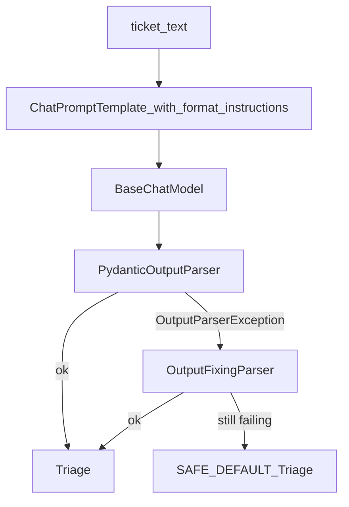

# Output Parsers and Error Recovery

## 30-second answer

Parsers turn model text into typed Python values and inject format instructions into the prompt. `PydanticOutputParser` validates into a Pydantic model; `JsonOutputParser` returns dicts and can **stream partial objects**; list/enum/XML parsers cover non-JSON shapes. On failure you get `OutputParserException`. Recover with `OutputFixingParser` (repair format from bad text + error) or `RetryOutputParser` (repair with original prompt). Prefer `.with_structured_output()` when the provider supports native structured output; keep parsers for repair, non-JSON, and unsupported models. Production: `strict_chain.with_fallbacks([forgiving, RunnableLambda(safe_default)])`.

## Tiny example

Ticket: “we were charged twice for January seats.” You need `category`, `priority`, `summary` for a database row. Raw prose arrives wrapped in ```json fences with `"Billing"` and `"urgent"`. A parser rejects bad literals and missing fields before anything hits the DB. Rule: tell the model the shape up front, validate on the way out, and plan a repair path when validation fails.

## Why it exists

Prose is not a database row. Models wrap JSON in fences, add preambles, change casing (`Billing` vs `billing`), or truncate mid-object. Parsers declare the expected shape *to* the model and validate *from* the model. At scale, parse failures are normal — recovery is part of the design.

## Runtime

**Happy path (`PydanticOutputParser`):**

1. Define a Pydantic model (`Triage` with `Literal` fields, `Field(description=...)`).
2. `parser = PydanticOutputParser(pydantic_object=Triage)`.
3. `parser.get_format_instructions()` → schema text.
4. Partial into the chat prompt: `.partial(format_instructions=...)`.
5. `chain = prompt | model | parser`.
6. `invoke` → validated `Triage` instance; attribute access is type-constrained.

**Failure path:**

1. `parser.parse(broken_text)` raises `OutputParserException` (wrong literals, missing fields, fences).
2. `OutputFixingParser.from_llm(parser=parser, llm=model, max_retries=2).parse(text)` → extra LLM call to rewrite into schema.
3. `RetryOutputParser.from_llm(...).parse_with_prompt(text, prompt_value)` → extra call that also sees the original prompt.
4. Or `with_fallbacks`: try strict → fixing → `SAFE_DEFAULT` `Triage(...)`.



*Picture: ticket goes through prompt and model; strict parse either yields a Triage object or falls through fixing and then a safe default.*

## Objects, fields, and merge rules

| Plain role | Type / notes |
|---|---|
| Validate into a Pydantic instance | `PydanticOutputParser` — `get_format_instructions` + `parse` |
| Dict output; streams partial objects | `JsonOutputParser` |
| Strip `AIMessage` to text | `StrOutputParser` |
| Tags / keywords as a list | `CommaSeparatedListOutputParser` → `list[str]` |
| Enum value | `EnumOutputParser` (from `langchain_classic.output_parsers` in v1) |
| Other built-ins | `DatetimeOutputParser` / `XMLOutputParser` / `MarkdownListOutputParser` |
| Second call to fix format | `OutputFixingParser` — may hallucinate missing fields |
| Second call that also sees the original prompt | `RetryOutputParser` — `.parse_with_prompt(text, prompt_value)` |
| Typed parse failure | `OutputParserException` |
| Ordered backup pipelines | `RunnableLambda` + `with_fallbacks` → `SAFE_DEFAULT` |

**Import identity (v1):** core parsers in `langchain_core.output_parsers`. Fixing/retry/enum/datetime in `langchain_classic.output_parsers`. `langchain.output_parsers` no longer exists.

**Fixing vs retry:** fixing normalises format (casing, fences) and may invent `summary`/`needs_human`. Retry can re-answer using the original ticket when the first completion was incomplete (`{"category": "bug"}` only).

## Control surface

| Knob | Effect |
|---|---|
| Pydantic field types / `Literal` / `Field(description=)` | Schema text to the model and validation surface |
| `max_retries` on fixing/retry parsers | How many repair LLM calls |
| `with_fallbacks([...])` order | Strict → forgiving → deterministic default |
| `temperature` | Higher → more `OutputParserException`s |
| `.with_structured_output(Triage)` | Native provider structured mode when available |
| Streaming via `JsonOutputParser` | Progressive UI field fill vs wait-for-full-object |

### Data shape in and out

| Stage | Shape |
|---|---|
| Prompt partial | `format_instructions: str` in system message |
| Model stage | `AIMessage` whose `.content` should match the schema |
| `PydanticOutputParser` | `Triage` instance |
| `JsonOutputParser` | `dict` (and partial dicts while streaming) |
| Failure | `OutputParserException` — message often names the field |

Broken lab fixture worth memorising:

```text
Sure! Here you go:
```json
{"category": "Billing", "priority": "urgent"}
```
```

Problems stacked: preamble + fences, `"Billing"` not in literals, `"urgent"` not a priority, missing `summary` / `needs_human`.

### Cost and latency shape

Happy path: **one** model call (format instructions paid every time). Fixing/retry: **+1** (or more, up to `max_retries`) on the failure path only. Retry prompts are larger because they include the original `PromptValue`. Worst case with fallbacks: two LLM attempts then a free deterministic object. Streaming `JsonOutputParser` does not cut token cost. `.with_structured_output` still one primary generation when it works.

### Parsers vs native structured output vs repair

| Situation | Use |
|---|---|
| Provider supports native structured output | `.with_structured_output(Triage)` (notebook 24) |
| Local/open model without tool calling | `PydanticOutputParser` |
| Non-JSON shapes | list / enum / datetime / XML parsers |
| Need streaming partial objects | `JsonOutputParser` |
| Occasional malformed format | `OutputFixingParser` |
| Model omitted content it should have had | `RetryOutputParser` |

| | `OutputFixingParser` | `RetryOutputParser` |
|---|---|---|
| Sees | broken output + error | broken output + error + **original prompt** |
| Good at | fences, quotes, casing | missing/wrong *content* |
| API | `.parse(text)` | `.parse_with_prompt(text, prompt_value)` |
| Risk | invents values to fill schema | lower, still an LLM guess |

## Failure anatomy

| Symptom | Cause | Fix |
|---|---|---|
| `json.loads(naive.content)` fails | Preamble, fences, or trailing prose | Use a parser / structured output — do not hand-roll cleanup. |
| `OutputParserException` on `"Billing"` / `"urgent"` | Value outside `Literal`; missing fields | Fix prompt/examples; or `OutputFixingParser` for format. Example: `"Billing"` vs `"billing"`. |
| Fixing parser invents `needs_human=True` wrongly | Repair LLM filling required fields | Use fixing for format; content gaps → `RetryOutputParser`; critical paths → safe default + human queue. |
| Incomplete JSON `{"category": "bug"}` | Early stop / truncation | Check `finish_reason`; use `RetryOutputParser.parse_with_prompt`. |
| ImportError for `EnumOutputParser` | Wrong package on LangChain v1 | Import from `langchain_classic.output_parsers`. |
| Provider lacks native structured output | `.with_structured_output` raises | Fall back to `PydanticOutputParser`. |

## Keywords

- In plain words: schema prose injected into the prompt — `get_format_instructions`
- In plain words: validate-and-construct a typed object — `PydanticOutputParser`
- In plain words: dict output with partial streaming — `JsonOutputParser`
- In plain words: typed failure from `parse` — `OutputParserException`
- In plain words: second LLM call that rewrites bad text toward the schema — `OutputFixingParser`
- In plain words: second LLM call that also gets the original prompt — `RetryOutputParser`
- In plain words: ordered alternative runnables until one succeeds — `with_fallbacks`
- In plain words: provider-native structured generation when available — `.with_structured_output`

## Minimal fragment

```python
from langchain_core.output_parsers import PydanticOutputParser
from langchain_core.prompts import ChatPromptTemplate
from pydantic import BaseModel, Field
from typing import Literal
from shared.llm import get_chat_model

class Triage(BaseModel):
    category: Literal["billing", "integration", "howto"] = Field(description="best category")
    priority: Literal["low", "medium", "high"] = Field(description="urgency")
    summary: str = Field(description="one-line summary")

parser = PydanticOutputParser(pydantic_object=Triage)
# Watch: format_instructions are paid tokens on every request
prompt = ChatPromptTemplate.from_messages([
    ("system", "Triage the ticket.\n{format_instructions}"),
    ("human", "{ticket}"),
]).partial(format_instructions=parser.get_format_instructions())
# Watch: invalid literals raise OutputParserException, not a bad dict
print((prompt | get_chat_model() | parser).invoke({"ticket": "charged twice"}))
```

## Interview traps

**Shallow answer.** Just `json.loads` the model output.

**Better answer.** Models wrap and preamble. Parsers supply format instructions and validation; raw loads are unreliable.

**Shallow answer.** `OutputFixingParser` always makes the answer correct.

**Better answer.** It repairs *format* and may hallucinate missing values. Prefer `RetryOutputParser` when content was omitted; never trust invented fields in high-cost decisions.

**Shallow answer.** Parsers are obsolete because of structured output.

**Better answer.** Native structured output is preferred when available, but parsers remain for unsupported models, non-JSON shapes, streaming partial JSON, and repair pipelines.

**Shallow answer.** Catch `Exception` and retry the same prompt.

**Better answer.** Catch `OutputParserException`, choose fixing vs retry by format vs missing content, and terminate in a `SAFE_DEFAULT` via `with_fallbacks` so one bad ticket cannot crash a queue worker.

### Production resilience pattern (lab §8)

```text
strict_chain  (prompt | model | parser)
    -> on fail -> forgiving_chain  (same + OutputFixingParser)
        -> on fail -> RunnableLambda(_ -> SAFE_DEFAULT Triage)
```

`SAFE_DEFAULT` sets `needs_human=True` so the failure mode is “queue for a person,” not “silent wrong category.”

## Lab

[05_output_parsers.ipynb](../../01-langchain-foundations/05_output_parsers.ipynb)
