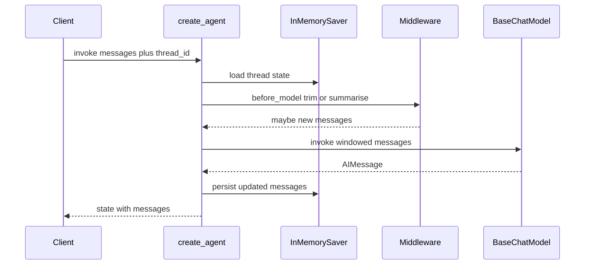

# Memory: Classic Strategies and Checkpointers

## 30-second answer

The model is still stateless. “Memory” means managing the message list under a length budget. Legacy `ConversationBufferMemory` / `ConversationChain` (now in `langchain-classic`) hid state inside the chain and died with the process. The modern primitive is **explicit graph/agent state + a checkpointer + `thread_id`**. Strategies remain: buffer, window, summary, token budget, summary+buffer, vector recall — implemented today with `InMemorySaver`, `trim_messages` middleware, `SummarizationMiddleware`, and vector stores.

## Tiny example

Leave desk: Sam says “I’m on the Growth plan.” Next turn: “What’s my sick-leave wait?” With the same `thread_id` and a checkpointer, the agent still knows the plan. New `thread_id` for Granite Foods → clean slate; no leaked Growth context. Rule: memory is stored state keyed by thread, not the model “remembering.”

## Why it exists

A support bot that answers turn 1 and forgets turn 2 is a memory problem. Online tutorials often still show deprecated memory classes. The trade-offs (what you drop when history is too long) are permanent; the APIs changed. This chapter maps each strategy to 2026 code.

## Runtime

**Modern baseline (checkpointer):**

1. `agent = create_agent(model=..., tools=[], system_prompt=..., checkpointer=InMemorySaver())`.
2. `config = {"configurable": {"thread_id": "customer-bluepeak"}}`.
3. `agent.invoke({"messages": [{"role": "user", "content": "..."}]}, config)` loads prior thread state, appends the new message, runs the model, persists updated `messages`.
4. Second invoke with the **same** `thread_id` sees prior turns; a different `thread_id` is an isolated session.
5. Inspect with `agent.get_state(config)` → `snapshot.values["messages"]`, `snapshot.next`.

**Window via middleware:**

1. `WindowMemory(AgentMiddleware)` implements `before_model`: if `len(messages) > k`, `trim_messages(..., max_tokens=k, token_counter=len, strategy="last", start_on="human", include_system=True)` and return `{"messages": kept}`.
2. Returning `None` means no state change.

**Summarisation:**

1. `SummarizationMiddleware(model=..., trigger=("tokens", 400), keep=("messages", 4))`.
2. When history crosses the trigger, old turns compress to a summary; last `keep` messages stay verbatim.
3. Trigger/keep accept `("tokens", n)`, `("messages", n)`, or `("fraction", 0.0–1.0)`. Older kwarg names `max_tokens_before_summary` / `messages_to_keep` are deprecated aliases.

**Vector memory (concept):**

1. `remember(speaker, text)` → `InMemoryVectorStore.add_documents([Document(...)])`.
2. `recall(query)` → `similarity_search(query, k=...)`.
3. Inject recalled facts into a prompt’s `{facts}` — chronological order is not preserved; relevance is.



*Picture: load thread state, optionally trim or summarise, call the model, then save the updated messages under the same thread_id.*

## Objects, fields, and merge rules

| Plain role | Type |
|---|---|
| In-process checkpointer (notebooks/tests) | `InMemorySaver` |
| Session key / isolation boundary | `thread_id` in `config["configurable"]` |
| Agent factory with persistence and hooks | `create_agent(..., checkpointer=..., middleware=[...])` |
| Pre-model rewrite of messages | `AgentMiddleware.before_model` → `{"messages": ...}` or `None` |
| Compress old turns on a trigger | `SummarizationMiddleware` |
| Shared window / token-budget primitive | `trim_messages` |
| Legacy in-chain memory (recognition only) | `ConversationBufferMemory` / `ConversationChain` from `langchain_classic.memory` |
| Readable stored messages | `agent.get_state(config)` |
| Durable persistence tiers | `SqliteSaver` / `PostgresSaver` (notebook 35) |
| Semantic long-term recall pattern | Vector store + `Document` + `InMemoryVectorStore` |

**Strategy trade-off table**

| Strategy | Keeps | Loses | Cost shape |
|---|---|---|---|
| Buffer | everything | nothing | grows forever |
| Window (last k) | last k | older turns | constant |
| Summary | LLM summary of old | exact old wording | constant + summarisation calls |
| Token buffer | recent under token ceiling | oldest | bounded |
| Summary + buffer | summary + recent verbatim | exact old wording | best general default |
| Vector-backed | semantically relevant past | chronological order | retrieval + prompt |

**Thread isolation:** state for `customer-bluepeak` never merges into `customer-granite`. Map `thread_id` to session id, conversation id, or `user_id:channel`.

## Control surface

| Knob | Effect |
|---|---|
| `thread_id` | Which conversation is loaded/saved |
| Checkpointer type | Whether memory survives restart / multi-node |
| `WindowMemory.k` / trim `max_tokens` | Bound messages sent to the model |
| `SummarizationMiddleware.trigger` / `keep` | When to compress and how much verbatim recent context remains |
| `token_counter=model` vs `len` | Token-accurate vs message-count windows |
| Vector `k` | How many recalled facts enter the prompt |
| `get_state` / edit state | Audit and correct memory |

### Data shape in and out

| Stage | Shape |
|---|---|
| Invoke input | `{"messages": [{"role": "user", "content": "..."}]}` plus `config` |
| Agent/graph state | `messages` list under the checkpointer |
| Middleware return | `None` or `{"messages": kept}` |
| `get_state(config)` | snapshot with `.values["messages"]` and `.next` |
| Vector recall | `list[str]` facts injected into `{facts}` |

### Cost and latency shape

The model call happens **after** middleware rewrites `messages`. Buffer: input tokens grow without bound. Window/token budget: roughly constant input size, lost facts. Summarisation: mostly constant prompt size **plus** occasional extra LLM calls when `trigger` fires. Vector memory: embedding write on `remember`, embedding query + small prompt on `recall`. `InMemorySaver` is free RAM; durable savers add disk/network but not tokens.

### Legacy memory vs checkpointer

| Legacy (`langchain-classic`) | Modern |
|---|---|
| `ConversationBufferMemory` inside `ConversationChain` | `InMemorySaver` / Sqlite / Postgres + `thread_id` |
| State invisible, hard to inspect | `agent.get_state(config)` |
| In-process only | Saver chooses durability tier |
| No branching / HITL / multi-step agents | Composes with tools and graphs |

| Persistence tier | Survives | Use |
|---|---|---|
| `InMemorySaver` | nothing | notebooks, tests |
| `SqliteSaver` | process restart | local / single-node |
| `PostgresSaver` | multi-node | production |

Choosing in practice: short chats → buffer; constant cost → window/token; long advisory → `SummarizationMiddleware` (default); months-long recall → vector/`Store` (notebook 49); regulated exact transcript → persist raw separately while still summarising for the prompt.

## Failure anatomy

| Symptom | Cause | Fix |
|---|---|---|
| Turn 2 amnesia with raw model calls | No checkpointer / no resent history | Use checkpointer + same `thread_id`, or resend messages. |
| Different user sees another user’s context | Reused `thread_id` | One thread id per session/user channel. Example: Bluepeak vs Granite. |
| “What is my name?” fails after several turns | Window middleware dropped early facts | Widen `k`, switch to summarisation, or add vector recall. |
| Restart loses all chats | `InMemorySaver` only | `SqliteSaver` / `PostgresSaver`. |
| Copy-pasting `ConversationBufferMemory` into v1 | Deprecated API | Reimplement with checkpointer + middleware. |
| Summary loses a critical detail | Trigger too aggressive / `keep` too small | Tune `trigger`/`keep`; persist raw transcript for regulated domains. |

## Keywords

- In plain words: store graph/agent state between turns — Checkpointer
- In plain words: which conversation to load — `thread_id`
- In plain words: what to drop when history is too long — Buffer / window / summary / token / vector
- In plain words: compress old turns when a trigger fires — `SummarizationMiddleware`
- In plain words: last chance to rewrite messages before the LLM — `before_model` middleware
- In plain words: memory you can audit with `get_state` — Inspectable state
- In plain words: deprecated in-chain memory classes — Legacy memory classes

## Minimal fragment

```python
from langchain.agents import create_agent
from langgraph.checkpoint.memory import InMemorySaver
from shared.llm import get_chat_model

agent = create_agent(
    model=get_chat_model(),
    tools=[],
    system_prompt="You are the Northwind support assistant. Be concise.",
    checkpointer=InMemorySaver(),
)
# Watch: same thread_id reloads prior messages
config = {"configurable": {"thread_id": "customer-bluepeak"}}
agent.invoke({"messages": [{"role": "user", "content": "I'm on the Growth plan."}]}, config)
out = agent.invoke({"messages": [{"role": "user", "content": "What's my API rate limit?"}]}, config)
# Watch: a different thread_id is a clean session
print(out["messages"][-1].content)
```

## Interview traps

**Shallow answer.** Use ConversationBufferMemory.

**Better answer.** Deprecated / moved to `langchain-classic`. Modern code uses checkpointer + `thread_id` with explicit state.

**Shallow answer.** Window memory keeps the last k facts forever.

**Better answer.** It **drops** older messages. Name/plan stated early vanish once outside the window — that is the deliberate cost trade-off.

**Shallow answer.** Summarisation is free compression.

**Better answer.** It costs an extra LLM call when triggered and loses exact wording. Keep recent turns verbatim (`keep=`) and persist raw history if compliance needs the transcript.

## Lab

[06_memory.ipynb](../../01-langchain-foundations/06_memory.ipynb)
