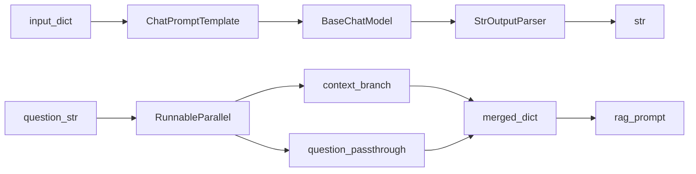

# LangChain Expression Language (LCEL)

## 30-second answer

LCEL composes anything that implements `Runnable` with the `|` operator. Prompts, chat models, parsers, retrievers, and your functions all share `invoke` / `batch` / `stream` (and async twins). Dict literals become `RunnableParallel`. `RunnablePassthrough` / `.assign` keep or enrich inputs. `RunnableLambda` and bare callables wrap Python. `RunnableBranch` routes. `.with_fallbacks` / `.with_retry` handle failure. LCEL graphs are DAGs — cycles, human pause, and durable step persistence belong in LangGraph.

## Tiny example

Support ask: explain “vector embeddings” in one sentence. Dict `{topic: ...}` enters a prompt, becomes messages, becomes an `AIMessage`, becomes a string via the parser. Same pipe handles a batch of ticket topics without rewriting each stage. Rule: every stage is a `Runnable`; wire them with `|` and keep types lined up.

## Why it exists

This is the composition layer under Track 01. Once every component is a `Runnable`, the framework stops looking like unrelated classes and starts looking like Lego: free batching, streaming, async, parallelism where the graph allows, and LangSmith spans per step.

## Runtime

**Linear pipe:**

1. `chain = prompt | model | parser`.
2. `chain.invoke({"topic": "..."})` feeds a dict into the prompt.
3. Intermediate types: `dict` → `ChatPromptValue` → `AIMessage` → `str`.
4. `batch` runs many inputs concurrently; `config={"max_concurrency": 2}` caps in-flight calls.
5. `stream` yields parser pieces as the model produces tokens.

**RAG-shaped dict fan-out:**

1. `{"context": RunnablePassthrough() | fetch_context, "question": RunnablePassthrough()}` is a `RunnableParallel`: both branches see the same input, run concurrently, merge keys.
2. Result dict feeds `rag_prompt | model | parser`.

**Assign:**

1. `RunnablePassthrough.assign(context=..., word_count=...)` adds keys without dropping existing ones (`user` survives).

**Branch / resilience:**

1. `RunnableBranch((pred1, chain1), (pred2, chain2), default_chain)` — first true predicate wins; default last.
2. `primary.with_fallbacks([alt, ...])` tries alternatives on failure.
3. `.with_retry(stop_after_attempt=4)` retries transient errors.

**One full explain-chain call.** `chain.invoke({"topic": "vector embeddings"})` enters as a dict, becomes `ChatPromptValue`, becomes `AIMessage`, becomes `str`. Wrong order (`model | prompt | parser`) fails at the type boundary. RAG-shaped chain takes a bare question string, fans out through `RunnableParallel` to `{context, question}`, then one model call. PII-safe chain runs `redact_pii` on CPU first so emails never enter the paid prompt.



*Picture: left path is a straight pipe; right path fans one question into context plus question, then merges before the RAG prompt.*

## Objects, fields, and merge rules

| Plain role | Type / behaviour |
|---|---|
| Shared run contract | `Runnable` — `invoke`, `batch`, `stream`, async twins, `astream_events` |
| Wire output of a into b | `\|` — result is another Runnable |
| Forward input unchanged | `RunnablePassthrough` |
| Add keys without dropping others | `RunnablePassthrough.assign(**kwargs)` |
| Fan-out same input; merge to one dict | `RunnableParallel` / `{...}` |
| Named Python step | `RunnableLambda(fn)` |
| Bare function in a pipe | Auto-wrapped as a runnable |
| Conditional routing | `RunnableBranch` — default last |
| Ordered alternatives on exception | `.with_fallbacks([...])` |
| Transient retry policy | `.with_retry(...)` |
| Trace naming | `.with_config(run_name=..., tags=[...])` |
| Per-call param overrides | `.configurable_fields(temperature=ConfigurableField(...))` |
| Inspect composed shape | `chain.input_schema` / `get_graph()` |

**Type-merge rule (the #1 LCEL bug):** each stage’s output type must match the next stage’s input. Models want messages/`PromptValue`/str — not an arbitrary business dict unless a prompt consumed it. Parsers want `AIMessage` (or str), not a dict. Debug by printing intermediate `type(...)`.

**Parallel merge rule:** keys in one `RunnableParallel` / one `.assign(category=..., severity=...)` run concurrently and must not assume each other’s outputs unless sequenced later.

## Control surface

| Knob | Effect |
|---|---|
| Pipe order | Determines data types between stages |
| `max_concurrency` in batch config | Rate-limit friendliness |
| `run_name` / `tags` | Readable LangSmith spans |
| `ConfigurableField` ids | Per-invoke overrides (e.g. temperature 0.0 vs 1.3) |
| Fallbacks list order | Which provider/logic runs after primary failure |
| `stop_after_attempt` | Retry budget for flaky networks |
| Dict vs sequential assigns | Concurrent vs dependent intermediate computation |

### Data shape in and out

Lab walkthrough for `prompt | model | parser` with `{"topic": "idempotency keys"}`:

1. `dict` → `prompt.invoke` → `ChatPromptValue`
2. `ChatPromptValue` → `model.invoke` → `AIMessage`
3. `AIMessage` → `parser.invoke` → `str`

RAG idiom input is often a **string question**. The dict literal

```python
{"context": RunnablePassthrough() | fetch_context, "question": RunnablePassthrough()}
```

turns that string into `{"context": str, "question": str}` via `RunnableParallel` before the prompt. `.assign` on `{"question": ..., "user": "E-102"}` keeps `user` while adding `context` and `word_count`.

### Cost and latency shape

Each model-bearing stage is a billable hop. Linear `prompt | model | parser` → one call. `RunnableParallel(summary=..., category=..., priority=...)` → three calls overlapped; wall-clock ≈ max(stage), cost ≈ sum(stages). `batch` multiplies that across inputs; clamp with `max_concurrency`. `RunnableLambda(redact_pii)` before the model: compliance on CPU so emails never enter the paid prompt. Fallbacks only charge when the primary raises; retries charge per attempt.

### LCEL primitives vs when to leave

| Need | Primitive |
|---|---|
| Linear transform | `\|` |
| Keep/enrich inputs | `RunnablePassthrough` / `.assign` |
| Fan-out independent work | `RunnableParallel` / dict |
| Custom Python | `RunnableLambda` / bare fn |
| Route by predicate | `RunnableBranch` |
| Provider/logic backup | `.with_fallbacks` |
| Transient errors | `.with_retry` |
| Cycles, HITL pause, durable step state | **LangGraph** (LCEL is a DAG) |

Retries handle blips; fallbacks handle persistent outages — use both. Named `.with_config(run_name=...)` does not change runtime cost; it changes whether you can find the span in LangSmith at 2 a.m.

## Failure anatomy

| Symptom | Cause | Fix |
|---|---|---|
| Cryptic type / validation error mid-chain | Wrong pipe order (e.g. `model \| prompt \| parser`) | Print intermediate types; restore `prompt \| model \| parser`. |
| Lost original question after retrieval | Only passed retriever output forward | Use `RunnablePassthrough` / dict parallel / `.assign`. Example: RAG fan-out keeps `question`. |
| Rate-limit storms on `batch` | Unlimited concurrency | `config={"max_concurrency": N}`. |
| One provider outage kills the request | No fallbacks | `with_fallbacks` across `available_providers()`. |
| Transient `ConnectionError` fails once | No retry | `with_retry(stop_after_attempt=...)`. |
| Cannot express a loop / human gate in LCEL | LCEL is a DAG | Move to LangGraph for cycles or durable pauses. |

## Keywords

- In plain words: shared `invoke`/`batch`/`stream` contract — `Runnable`
- In plain words: output-to-input wiring that yields another Runnable — `\|` composition
- In plain words: concurrent fan-out with dict merge — `RunnableParallel`
- In plain words: non-destructive enrichment of a flowing dict — `RunnablePassthrough.assign`
- In plain words: arbitrary Python inside the graph — `RunnableLambda`
- In plain words: predicate-ordered routing with a default — `RunnableBranch`
- In plain words: backups for persistent vs transient failure — `with_fallbacks` / `with_retry`
- In plain words: knobs callers set at invoke time — `configurable_fields`
- In plain words: step-level async event stream — `astream_events`
- In plain words: inspect composed chain shape — `input_schema` / `get_graph`

### Async note for services

Notebook 53’s FastAPI lessons should call `ainvoke` / `abatch` / `astream` so one slow model call does not block the event loop. The async twins are free once `invoke` exists.

## Minimal fragment

```python
from langchain_core.prompts import ChatPromptTemplate
from langchain_core.output_parsers import StrOutputParser
from langchain_core.runnables import RunnablePassthrough
from shared.llm import get_chat_model

prompt = ChatPromptTemplate.from_template("Explain {topic} in one sentence.")
# Watch: type flow is dict → PromptValue → AIMessage → str
chain = prompt | get_chat_model() | StrOutputParser()
print(chain.invoke({"topic": "vector embeddings"}))

# Watch: assign keeps existing keys while adding new ones
enrich = RunnablePassthrough.assign(word_count=lambda x: len(x["topic"].split()))
print(enrich.invoke({"topic": "idempotency keys"}))
```

## Interview traps

**Shallow answer.** LCEL is syntactic sugar for calling functions in order.

**Better answer.** Composition preserves the Runnable contract — batch, stream, async, parallelism, tracing, fallbacks — without rewriting each stage.

**Shallow answer.** Put the model first, then the prompt.

**Better answer.** Type flow is `dict → PromptValue → AIMessage → parsed`. `model | prompt` feeds the wrong type into the prompt stage.

**Shallow answer.** LCEL can replace LangGraph.

**Better answer.** LCEL is for DAGs. Agent loops, human-in-the-loop pauses, and durable between-step persistence need LangGraph.

## Lab

[07_lcel.ipynb](../../01-langchain-foundations/07_lcel.ipynb)
