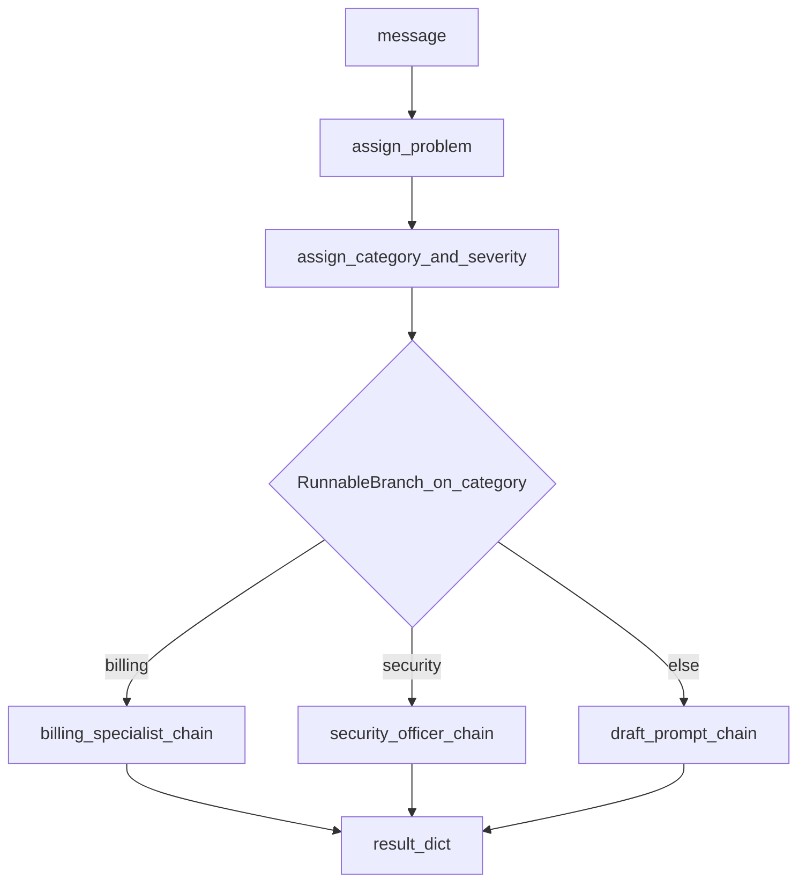

# Sequential and Custom Chains

## 30-second answer

Multi-step work is composed with LCEL: `extract_prompt | model | parser | reply_prompt | model | parser` for linear flows, and `RunnablePassthrough.assign(...)` for named intermediates (the modern `SequentialChain`). Keys inside one `.assign(...)` run concurrently. `@chain` turns a Python function into a first-class Runnable (tracing name = function name); `RunnableLambda` does the same inline. Draft→critique→rewrite loops work inside `@chain` but bury control flow — that opacity is the signal to move the pattern to LangGraph. Legacy `SimpleSequentialChain` / `SequentialChain` / `LLMChain` are recognition-only (`langchain-classic`).

## Tiny example

Customer email: CSV export drops the last filtered row. Step one extracts the problem in one sentence. Step two drafts a three-sentence support reply. Same pipe later adds category and severity in one `.assign` so those two model calls overlap. Rule: name intermediates you need later; put independent work in the same `.assign`.

## Why it exists

“Draft a customer reply” is rarely one call: classify, extract problem, draft, critique tone, maybe rewrite, maybe route by category. This chapter shows how to build those pipelines the LCEL way, how `@chain` embeds real control flow, and where LCEL’s DAG limits push you toward graphs.

## Runtime

**Two-step linear (string bridge):**

1. `extract_prompt | model | parser` → problem string.
2. Because `reply_prompt` has a **single** input variable, a bare string is accepted as its input.
3. Full pipe: `extract_prompt | model | parser | reply_prompt | model | parser`.

**Named intermediates (SequentialChain equivalent):**

1. Start from `{"message": customer_email}`.
2. `.assign(problem=extract_prompt | model | parser)` adds `problem`.
3. `.assign(category=..., severity=...)` — **same assign** ⇒ category and severity model calls run **concurrently**.
4. `.assign(draft=draft_prompt | model | parser)` uses prior keys.
5. Final dict retains all intermediates for logging/UI/eval.

**`@chain` custom step:**

1. Decorate a function; it gains `invoke`/`batch`/`stream`.
2. Short-circuit: if `len(text.split()) < 8`, return without an LLM call.
3. Otherwise call an inner chain and return a structured dict (`summary`, `method`).

**Quality gate loop (LCEL boundary):**

1. Draft once.
2. Up to 2 attempts: critique → if `PASS`, return; else rewrite with objection text.
3. Logic lives inside Python — not inspectable mid-flight as a graph loop.

**Category router:**

1. After triage assigns, `.assign(reply=category_router)` where `RunnableBranch` picks billing/security/default flows from `category`.

**One full triage+draft call.** `triage_pipeline.invoke({"message": customer_email})` returns a dict still holding `problem`, `category`, `severity`, and `draft`. Model hops: extract (1) + concurrent category/severity (2) + draft (1). Quality-gate variant adds critique/rewrite attempts — worst case burns the attempt budget. Legacy `SequentialChain` could name intermediates but could not run category and severity concurrently or stream the composite.



*Picture: extract the problem, fan out category and severity, then branch to a specialist reply chain and keep a result dict.*

## Objects, fields, and merge rules

| Plain role | Type |
|---|---|
| Legacy one-in / one-out steps | `SimpleSequentialChain` |
| Legacy named string-keyed steps | `SequentialChain` |
| Legacy single prompt+llm wrapper | `LLMChain` |
| Accumulate named values; concurrent in one call | `RunnablePassthrough.assign` |
| Function → named, batchable, traceable Runnable | `@chain` (`langchain_core.runnables.chain`) |
| Inline wrap; default trace name `RunnableLambda` | `RunnableLambda` |
| Custom streaming via yields | Generator `@chain` |
| Route to specialised sub-pipelines | `RunnableBranch` |
| Throughput control over whole multi-step graphs | `full_pipeline.batch(..., config={"max_concurrency": 3})` |

**String-bridge rule:** `parser | next_prompt` works only when `next_prompt` has exactly one input variable. Two or more variables require a dict (via `assign` or a lambda that builds keys).

**Assign concurrency rule:** `.assign(category=..., severity=...)` fans out; `.assign(problem=...).assign(draft=...)` sequences draft after problem exists.

**`@chain` vs `RunnableLambda`:** same kind of object; prefer `@chain` for reused steps so traces show the function name.

## Control surface

| Knob | Effect |
|---|---|
| Number of model stages in the pipe | Latency ≈ sum (or max, for parallel assigns) of stage times; cost ≈ sum of calls |
| Short-circuit thresholds in `@chain` | Skip LLM for tiny tickets — real cost lever at volume |
| Critique loop `range(1, 3)` | Max rewrite attempts; impossible rules burn the budget |
| `RunnableBranch` predicates | Which specialist prompt runs |
| `max_concurrency` on `batch` | Parallelism across tickets, not just inside one assign |
| Whether loop stays in `@chain` vs LangGraph | Debuggability, pause/resume, crash recovery |

### Data shape in and out

| Pipeline | Input | Output |
|---|---|---|
| Two-step string bridge | `{"message": email}` | final reply `str` |
| Triage `assign` pipeline | `{"message": email}` | `dict` with `problem`, `category`, `severity`, `draft` |
| `@chain summarise_ticket` | `{"message": ...}` | `{"summary", "method"}` |
| Quality gate | triage dict | `{"reply", "attempts", "verdict"}` |
| Category router pipeline | `{"message": ...}` | dict including specialised `reply` |

String-bridge detail: after `parser`, a bare `str` feeds `reply_prompt` only because that template declares a **single** variable (`{problem}`). The moment draft needs `category` and `severity` too, you must carry a dict — hence `.assign`.

### Cost and latency shape

Two-step extract→reply: **two** model calls in series. Triage pipeline: extract (1) + category & severity in one `.assign` (2 concurrent) + draft (1) ≈ four calls, wall-clock closer to three stages. Quality gate: those triage calls **plus** up to two critique and two rewrite calls in the worst case. `@chain` early return for `< 8` words: **zero** model calls — a cost line at 10k short tickets/day. `full_pipeline.batch(..., max_concurrency=3)` overlaps whole multi-step graphs across CSV rows.

### Legacy sequential vs LCEL vs graph boundary

| Problem with `SequentialChain` | LCEL answer |
|---|---|
| String-keyed wiring, errors at runtime | Real Python objects and types |
| No streaming | `stream` on every chain |
| No concurrency | `RunnableParallel` / multi-key `.assign` |
| Hard to insert plain Python | `RunnableLambda` / `@chain` |
| Opaque in traces | Each step a named span |

| `@chain` / `RunnableLambda` | Prefer when |
|---|---|
| `@chain` | Reusable named steps; traces show the function name |
| `RunnableLambda` | Small inline transforms at the use site |

Draft/critique/rewrite **inside** `@chain` is the LCEL boundary: you cannot inspect mid-loop, pause for human approval, resume after crash, or see the loop as a loop in traces. Notebook 18 rebuilds the same pipeline as a graph.

## Failure anatomy

| Symptom | Cause | Fix |
|---|---|---|
| Second prompt gets wrong/missing fields | Assumed string bridge but template has multiple variables | Build a dict with `.assign` / `RunnablePassthrough`. Example: draft needs `category` + `severity`. |
| Category/severity slower than necessary | Assigned in separate sequential steps | Put independent keys in the **same** `.assign`. |
| Legacy `SequentialChain` cannot stream/parallelise | Old string-wired API limits | Rewrite in LCEL. |
| Critique loop spins without visibility | Retry buried in Python | Accept for prototypes; rebuild as LangGraph for production HITL (notebook 18). |
| Impossible QA rule exhausts attempts | Verdict never `PASS` | Cap attempts; return `verdict: max attempts reached`; escalate. |
| Short tickets still billed | No passthrough branch | `@chain` early return when word count is below threshold. |

## Keywords

- In plain words: multi-stage `|` pipelines replacing `SequentialChain` — Sequential LCEL
- In plain words: named intermediates with optional concurrent fan-out — `.assign` accumulation
- In plain words: decorate a function into a full Runnable with a stable trace name — `@chain`
- In plain words: inline custom step without a named definition — `RunnableLambda`
- In plain words: single-variable prompt accepting a bare string from a prior parser — String bridge
- In plain words: reflection pattern; powerful but opaque inside a function — Draft/critique/rewrite
- In plain words: specialised subchains per category — `RunnableBranch` pipelines
- In plain words: when you need inspectable loops and durable pause, switch to LangGraph — LCEL boundary

## Minimal fragment

```python
from langchain_core.prompts import ChatPromptTemplate
from langchain_core.output_parsers import StrOutputParser
from langchain_core.runnables import RunnablePassthrough
from shared.llm import get_chat_model

model, parser = get_chat_model(), StrOutputParser()
extract = ChatPromptTemplate.from_template(
    "Extract the core problem in one sentence.\n\nMessage: {message}"
)
reply = ChatPromptTemplate.from_template(
    "Write a 3-sentence support reply for this problem:\n{problem}"
)
# Watch: string bridge works only because reply has one input variable
two_step = extract | model | parser | reply | model | parser
# Watch: for named intermediates + concurrent category/severity, use .assign instead
print(two_step.invoke({"message": "CSV export drops the last row when filtered"}))
```

## Interview traps

**Shallow answer.** SequentialChain is how you build multi-step LangChain apps.

**Better answer.** It is legacy. LCEL `|` and `.assign` give streaming, concurrency, typed objects, and clearer traces.

**Shallow answer.** Any Python loop inside `@chain` is as good as a graph.

**Better answer.** It works until you need mid-loop inspection, human approval, crash resume, or seeing the loop as a loop in traces — then use LangGraph.

**Shallow answer.** Always call the LLM; prompts are cheap.

**Better answer.** Deterministic short-circuits (e.g. tickets under 8 words) skip calls entirely; at 10k tickets/day that is a cost line, not a micro-optimisation.

## Lab

[08_chains_sequential_and_custom.ipynb](../../01-langchain-foundations/08_chains_sequential_and_custom.ipynb)
