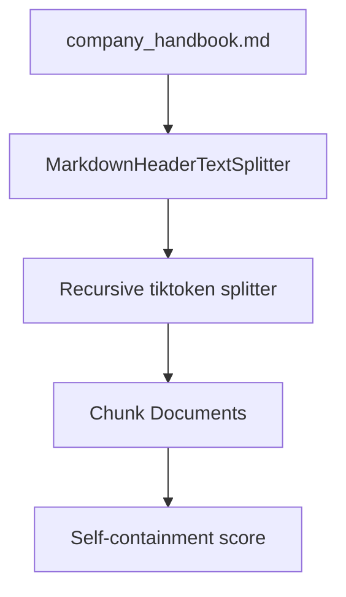

# Text Splitters and Chunking

## 30-second answer

Splitters cut long `Document`s into smaller chunks that fit embedding and context budgets. Prefer `RecursiveCharacterTextSplitter` with a separator ladder (`\n\n` → `\n` → `. ` → ` ` → `""`). Measure size in **tokens** when text is multilingual or dense. Overlap of about 10–20% of `chunk_size` keeps facts that sit on a cut intact. Prove quality with a **self-containment** test: can one chunk answer a real question alone?

## Tiny example

Alex chunks the company handbook leave section.

1. `MarkdownHeaderTextSplitter` cuts on `#` / `##` and keeps heading metadata.
2. `RecursiveCharacterTextSplitter.from_tiktoken_encoder` caps each piece at ~200 tokens with overlap 30.
3. He asks: "How many sick days, and do I need a certificate?"
4. If the day count and the certificate rule land in different chunks, self-containment fails.
5. He raises overlap and re-scores before embedding.



*Picture: structure first, size second, then score with real leave-policy questions.*

## Why it exists

Chunking is the highest-leverage RAG decision and the one people skip. Chunks too large mix topics into one vector. Chunks too small cut a fact from its condition. Northwind failure: "Reimbursements in 15 business days" lands in one chunk and "Claims after 60 days are rejected" in another—the bot promises a refund policy forbids.

## Runtime

1. Optional structure pass: `MarkdownHeaderTextSplitter(headers_to_split_on=..., strip_headers=False)`.
2. Size pass: `RecursiveCharacterTextSplitter` or `from_tiktoken_encoder` until pieces fit `chunk_size`.
3. Overlap: tail of chunk *n* repeats at the head of chunk *n+1*.
4. Metadata survival: `split_documents` copies parent metadata onto children (`section`, `page`, `source`).
5. Measure: tiny question→keyphrase set; score whether **one** chunk holds all keys.
6. Reject tiny noise: chunks under ~20 tokens (lone headings) embed as junk.

**Trap:** `CharacterTextSplitter` uses one separator and **will not break** a paragraph that lacks it. Chunks can **exceed** `chunk_size` and blow context budgets.

## Objects, fields, and merge rules

| Object / field | In plain words |
|---|---|
| `chunk_size` | Max length in units of `length_function` |
| `chunk_overlap` | Duplicated boundary length |
| `separators` | Coarse→fine ladder; recurse only when still too big |
| `length_function` | Defaults to `len`; token encoders change the unit |
| `headers_to_split_on` | Markdown marker → metadata key |
| `from_tiktoken_encoder` | Recursive cuts + token-accurate size |
| `from_language(Language.PYTHON)` | Code-aware separators |
| `SemanticChunker` | Split where sentence-embedding distance jumps |

**Two-pass rule:** structure first, size second. CSV rows usually should not be split. Code: prefer `from_language` with overlap 0. English is ~4 chars/token; Hindi and code are denser—character sizing silently overshoots the token budget.

## Control surface

| Content | Splitter | chunk_size | overlap |
|---|---|---|---|
| Policies, FAQs | `from_tiktoken_encoder` | 300–500 tokens | 10–15% |
| Markdown docs | Headers → recursive | section, then ~300 | ~10% |
| Source code | `from_language` | 500–1000 tokens | 0 |
| Tables / CSV | no splitter | n/a | n/a |

| Mechanism | Strength | Weakness |
|---|---|---|
| `CharacterTextSplitter` | Simple | Can exceed size |
| Recursive | Respects structure | Char sizing fails multilingual |
| Tiktoken hybrid | Matches billing units | Need encoder |
| `SemanticChunker` | Meaning-aware | Embed call per sentence |

## Failure anatomy

| Symptom | Cause | Fix |
|---|---|---|
| Chunks larger than `chunk_size` | Single-separator splitter | Switch to recursive |
| Confident wrong policy answer | Fact severed from condition | Raise overlap; re-run self-containment |
| Multilingual budget blowup | Char-sized chunks on dense scripts | `from_tiktoken_encoder` |
| Retrieval noise | Many tiny (&lt;20 token) chunks | Merge or raise size |
| Citations say "chunk 7" | No structure metadata | MarkdownHeader pass first |
| `page` metadata lost | Manual rebuild dropped fields | Use `split_documents` |

Cost: zero LLM calls. Semantic chunking costs one embedding call per sentence. Wrong chunking forces a full re-embed later.

## Keywords

In plain words:

- **Recursive splitter** — try coarse separators, then finer, until pieces fit.
- **Overlap** — shared boundary text so straddling sentences survive.
- **Self-containment** — one chunk holds every keyphrase needed to answer alone.
- **Two-pass chunking** — structure, then size; default for structured docs.
- **Token-accurate sizing** — measure with tiktoken (`cl100k_base` in the lab).
- **Semantic chunking** — optional upgrade when recursive fails your eval.

## Minimal fragment

```python
from langchain_text_splitters import (
    RecursiveCharacterTextSplitter,
    MarkdownHeaderTextSplitter,
)

md = MarkdownHeaderTextSplitter(
    headers_to_split_on=[("#", "document"), ("##", "section")],
    strip_headers=False,
).split_text(handbook_text)
final = RecursiveCharacterTextSplitter.from_tiktoken_encoder(
    encoding_name="cl100k_base",
    chunk_size=200,
    chunk_overlap=30,
).split_documents(md)
```

## Interview traps

**Shallow answer.** Just split every 500 characters with no overlap.

**Better answer.** Character splits ignore structure; `CharacterTextSplitter` can exceed the limit. Use recursive separators, token measurement, 10–20% overlap, and prove settings with self-containment on real questions.

**Shallow answer.** `SemanticChunker` should be the default because it understands meaning.

**Better answer.** It costs an embedding call per sentence. Use it when recursive splitting fails your eval—not first.

**Shallow answer.** Larger chunks are always safer.

**Better answer.** Huge chunks contain the answer but bury it; embeddings average mixed topics. Mid-size usually wins—and the lab score table proves it.

## Lab

[10_text_splitters.ipynb](../../02-langchain-rag/10_text_splitters.ipynb)
