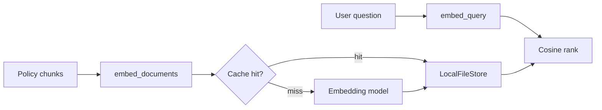

# Embeddings and Caching

## 30-second answer

An embedding maps text to a fixed-length float vector. Similar meaning lands near similar geometry (usually cosine). Index passages with `embed_documents`; encode questions with `embed_query`—some models train those paths differently. Never mix models in one index. `CacheBackedEmbeddings` with a model-scoped `namespace` stops re-paying for unchanged text. Omit the namespace and a model swap silently returns stale vectors.

## Tiny example

Sam indexes leave-policy chunks for Northwind search.

1. `get_embeddings()` builds the model; he wraps it in `CacheBackedEmbeddings` with `namespace="minilm-v1"`.
2. He calls `embed_documents` on handbook chunks once; the second run hits `LocalFileStore`.
3. A user asks "time off for a funeral?" — `embed_query` finds the bereavement section even with little word overlap.
4. He checks a trap pair: "may work remotely" vs "may not". Cosine is high anyway—topic, not logic.
5. Rule: similarity finds candidates; the LLM (or a reranker) must read the text for facts.



*Picture: documents and questions become vectors; the cache keys by text hash under a model namespace.*

## Why it exists

Keyword search misses "funeral leave" when the handbook says "bereavement". Embeddings make that match cheap. Re-embedding 10,000 unchanged docs every deploy is pure waste—caching removes it. Embeddings also fail on negation and numbers; knowing that separates a demo from a system.

## Runtime

1. `embeddings.embed_query(question)` → one `list[float]` (e.g. 384 MiniLM, 768 nomic, 1536 OpenAI small).
2. `embeddings.embed_documents(chunks)` → one vector per chunk, same dimension.
3. Rank with cosine (or hand off to a vector store). Calibrate bands on your data.
4. Cache docs: `CacheBackedEmbeddings.from_bytes_store(underlying, store, namespace="model-v1")`.
5. Prefer `LocalFileStore` so restarts stay cheap; `InMemoryByteStore` dies with the process.
6. Query cache (`query_embedding_cache=True`) is usually wrong for open chat—low hit rate, unbounded growth.

## Objects, fields, and merge rules

| Object / field | In plain words |
|---|---|
| Embedding vector | Fixed-length `list[float]`; dim is model-specific |
| `embed_query` / `embed_documents` | Query-side vs passage-side encoding |
| `CacheBackedEmbeddings` | Hash(text) → cached vector bytes |
| `namespace` | Cache key prefix; must include model identity |
| `InMemoryByteStore` / `LocalFileStore` | RAM vs disk cache |
| `query_embedding_cache` | Opt-in; off by default for chat |

**Merge rules:** same text → same vector for a given model (caching is safe). Changing models invalidates the whole index and needs a new namespace. Scores are not comparable across models. Chat and embeddings resolve separately (`EMBEDDING_PROVIDER`).

Indicative cosine bands (calibrate!): 0.85–1.00 paraphrase; 0.65–0.85 related; &lt;0.40 unrelated.

## Control surface

| Knob | Effect |
|---|---|
| Embedding model / provider | Dims, quality, rate limits, offline ability |
| `namespace="minilm-v1"` | Isolates cache per model |
| Document vs query cache | Docs almost always on; queries only for FAQ-like repeats |
| Local HuggingFace vs hosted | Bulk index without 429s |
| Hard-coded thresholds | Dangerous until calibrated |

## Failure anatomy

| Symptom | Cause | Fix |
|---|---|---|
| High cosine for opposite claims | Topic, not logic | Hybrid + rerank; LLM verifies |
| "May / may not work remotely" both high | Negation blindness | Never trust similarity alone for facts |
| Retrieval collapses after model upgrade | Shared cache namespace | Namespace by model; rebuild index |
| 429 while building index | Hosted free-tier limits | `EMBEDDING_PROVIDER=huggingface` for bulk |
| Mixed dims / nonsense neighbors | Two models in one index | Never mix; full re-embed |
| Memory grows forever | Query cache on open chat | Leave query cache off |

**Cost shape:** ≈ docs × chunks × tokens × $/M. Local embeds are $0. Re-embedding without a cache means paying again every deploy.

## Keywords

In plain words:

- **Embedding** — fixed-dim vector; similar meaning → similar vector.
- **Cosine similarity** — ranking signal within one model.
- **Asymmetric encode** — separate query/document paths; match the API to the role.
- **CacheBackedEmbeddings** — deterministic cache keyed by text hash under a namespace.
- **Namespace** — model identity in cache keys; omit it and swaps go stale silently.
- **Topic-not-logic** — high similarity despite opposite meaning.

## Minimal fragment

```python
from langchain_classic.embeddings import CacheBackedEmbeddings
from langchain_classic.storage import LocalFileStore
from shared.llm import get_embeddings

embeddings = get_embeddings()
cached = CacheBackedEmbeddings.from_bytes_store(
    underlying_embeddings=embeddings,
    document_embedding_cache=LocalFileStore("./embedding_cache"),
    namespace="minilm-v1",
)
q = cached.embed_query("How many sick days do I get?")
docs = cached.embed_documents(["Sick leave is 12 days per year."])
```

## Interview traps

**Shallow answer.** `embed_query` and `embed_documents` are interchangeable.

**Better answer.** Some models train asymmetrically. Wrong method shifts geometry and hurts recall. Match the API to the role of the text.

**Shallow answer.** Similarity above 0.8 means the answer is correct.

**Better answer.** Negations and numbers often score high. Similarity retrieves candidates; facts must be read from the chunk. Calibrate thresholds on your pairs.

**Shallow answer.** Caching embeddings risks wrong answers when text changes.

**Better answer.** Embedding is deterministic for unchanged text. New text → new hash → miss → recompute. The real footgun is reusing a namespace across models.

## Lab

[11_embeddings_and_caching.ipynb](../../02-langchain-rag/11_embeddings_and_caching.ipynb)
