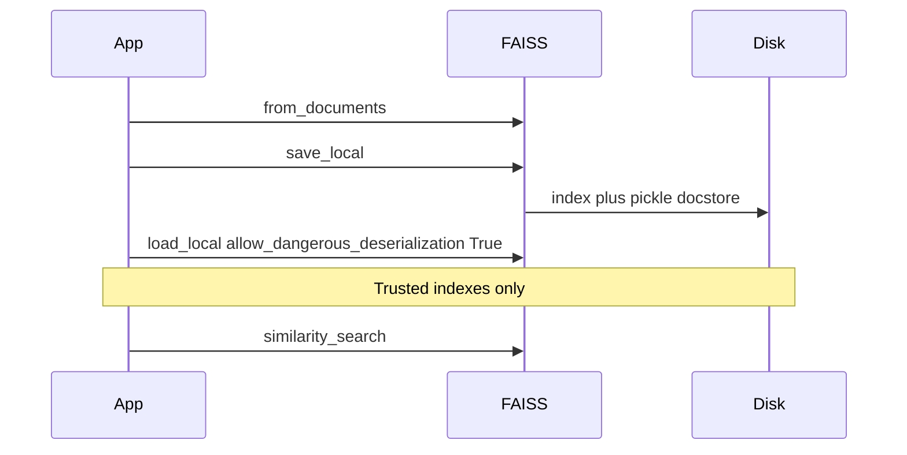

# Vector Stores

## 30-second answer

A vector store indexes embedding vectors for fast similarity search, keeps metadata for filters, and can persist so you do not re-embed on every restart. Local defaults: `InMemoryVectorStore` (tests), FAISS (file-backed in-process), Chroma (rich filters, incremental CRUD). FAISS uses `save_local` / `load_local`. Loading needs `allow_dangerous_deserialization=True` because the docstore is a **pickle**. Unpickling untrusted data can run code—only load indexes you built or trust.

## Tiny example

Ops builds a FAISS index of the handbook and leave policy.

1. `FAISS.from_documents(corpus, embeddings)` indexes chunks with `sensitivity` tags.
2. `save_local("faiss_index")` writes files to disk.
3. Next morning: `load_local(..., allow_dangerous_deserialization=True)`.
4. `similarity_search("expense claim deadline", k=3)` returns policy hits.
5. For a public-only user, Chroma (or a filtered path) drops `confidential` rows before generation.



*Picture: build once, save files, reload with the pickle consent flag, then search.*

## Why it exists

Notebook 11 compared every vector—O(n) per query. At millions of vectors that dies. A store adds an index, metadata filters (your real ACL), MMR diversification, CRUD, and a shared `VectorStore` interface so backends swap behind a factory.

## Runtime

1. Build corpus with loaders + two-pass splitters; stamp `source`, `domain`, `sensitivity`.
2. Index: `FAISS.from_documents` / `Chroma.from_documents` / `InMemoryVectorStore.from_documents`.
3. Search: `similarity_search`, `similarity_search_with_score`, relevance scores, or `max_marginal_relevance_search`.
4. Persist FAISS: `save_local` / `load_local(..., allow_dangerous_deserialization=True)`.
5. Filter (Chroma): `filter={"sensitivity": "public"}` or `$and` / `$in`.
6. Update with stable `ids`; `delete(ids=[...])`.
7. Bridge: `store.as_retriever(search_kwargs={"k": 3})`.

**Score direction trap:** FAISS (and often Chroma) return **L2 distance—lower is better**. Pinecone returns **similarity—higher is better**. Prefer portable relevance scores (0–1, higher better) before hard-coding thresholds.

## Objects, fields, and merge rules

| Object / field | In plain words |
|---|---|
| `index.ntotal` / `index.d` | FAISS vector count and dimension |
| Docstore | id → `Document`; pickle on disk for FAISS |
| `allow_dangerous_deserialization` | Explicit consent to unpickle FAISS docstore |
| `filter` / `$and` / `$in` | Metadata predicates (first-class in Chroma) |
| Stable `ids` | Re-ingest overwrites instead of duplicating |
| `fetch_k` + `lambda_mult` | MMR pool and relevance/diversity mix |
| `.as_retriever()` | Store → Runnable (`str` → `list[Document]`) |

**ACL rule:** map user clearance → allowed sensitivities and filter server-side. Prompt "do not reveal restricted docs" is not an ACL—if the chunk enters the window, it leaked. FAISS often filters after fetch—ask for a larger candidate set when filters are tight.

## Control surface

| Store | Best for |
|---|---|
| `InMemoryVectorStore` | Tests |
| FAISS | Single node, static/batch, file-backed |
| Chroma | Local → mid production; rich filters |
| pgvector / Pinecone / Weaviate | When you already run that stack or need managed scale |

| Knob | Effect |
|---|---|
| `k` | Top hits returned |
| `lambda_mult` | 1.0 relevance; 0.0 max diversity; ~0.5 default |
| `fetch_k` | MMR candidate pool; must exceed `k` |
| Index dimension (managed) | Must match `len(embed_query(...))` |

## Failure anatomy

| Symptom | Cause | Fix |
|---|---|---|
| Thresholds inverted | Treating FAISS distance as similarity | Check score direction; use relevance scores |
| Restricted docs leak | Filter only in the prompt | Server-side metadata filter |
| Duplicate near-identical hits | Re-ingest without stable ids | Deterministic ids; delete/update |
| `load_local` refuses | Missing dangerous-deserialization flag | Pass `True` only for trusted indexes |
| Pickle RCE risk | Loading untrusted FAISS files | Trusted channel only |
| Repetitive top-k | Pure similarity | MMR with `fetch_k` &gt; `k` |

**Cost shape:** one `embed_documents` at build; one `embed_query` per search. Model change = full re-embed. LLM cost appears only when you attach generation.

## Keywords

In plain words:

- **Vector store** — indexed vectors + metadata + search under one interface.
- **FAISS** — Meta's library in your process; file-backed via `save_local` / `load_local`.
- **allow_dangerous_deserialization** — pickle consent flag; the risk is real.
- **MMR** — trade a little score for diversity among hits.
- **Metadata filter** — production ACL applied before generation.
- **as_retriever** — store becomes an LCEL Runnable.
- **Stable ids** — stop corpus doubling on re-ingest.

## Minimal fragment

```python
from langchain_community.vectorstores import FAISS
from shared.llm import get_embeddings

store = FAISS.from_documents(corpus, get_embeddings())
store.save_local("faiss_index")
reloaded = FAISS.load_local(
    "faiss_index",
    get_embeddings(),
    allow_dangerous_deserialization=True,  # docstore is pickle
)
hits = reloaded.similarity_search("expense claim deadline", k=3)
retriever = reloaded.as_retriever(search_kwargs={"k": 3})
```

## Interview traps

**Shallow answer.** FAISS is a database server like Postgres.

**Better answer.** FAISS is a library inside your process. You save and load files. Chroma/pgvector/Pinecone are the database-shaped options.

**Shallow answer.** `allow_dangerous_deserialization=True` is just an annoying flag—always set it.

**Better answer.** The docstore is pickle. Unpickling untrusted data executes code. Only load indexes you built or received over a trusted channel.

**Shallow answer.** Metadata filters and system prompts are equivalent for access control.

**Better answer.** Prompts are requests. Filters remove forbidden chunks before they enter the window. Only the latter is an ACL.

## Lab

[12_vector_stores.ipynb](../../02-langchain-rag/12_vector_stores.ipynb)
