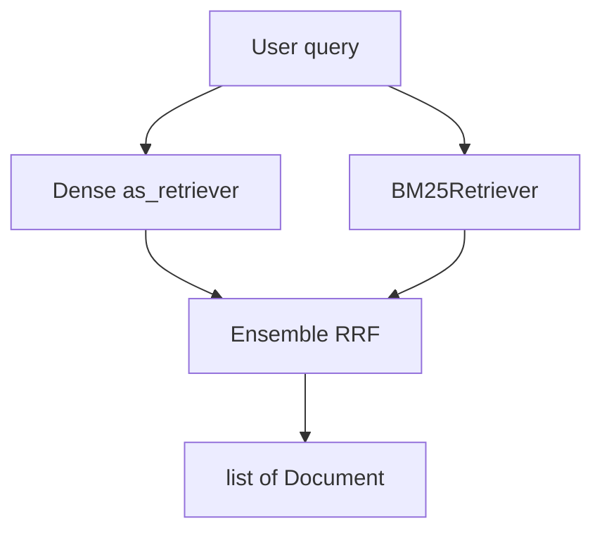

# Retrievers

## 30-second answer

A retriever is a Runnable with one contract: `str` in, `list[Document]` out. `.as_retriever()` wraps a vector store. Advanced forms rewrite the query (`MultiQueryRetriever`), compress context (`ContextualCompressionRetriever`), run BM25, fuse rankings with Reciprocal Rank Fusion (`EnsembleRetriever`), or match small children and return large parents (`ParentDocumentRetriever`). If the right chunk never enters the window, no prompt and no bigger model will save you.

## Tiny example

Maya asks the ops bot about `SOC 2` and sick leave in one afternoon.

1. Dense search alone misses the exact code `SOC 2` but finds bereavement paraphrases well.
2. `BM25Retriever` nails `SOC 2` and fails on soft leave wording.
3. She builds `EnsembleRetriever(retrievers=[bm25, dense], weights=[0.4, 0.6])`.
4. RRF merges ranks without normalizing incompatible scores.
5. She measures `hit@3` on a fixed question set before claiming victory.



*Picture: keyword path and vector path meet; ranks fuse; documents flow to the answer chain.*

## Why it exists

Vector similarity fails on vocabulary mismatch ("train ticket money back" vs "reimbursements"), exact tokens (`SOC 2`, `L4`), near-duplicates, and noisy long chunks. Shared I/O shape means you can swap naive similarity for hybrid without touching the answer chain.

## Runtime

1. Baseline: `vector_store.as_retriever(search_kwargs={"k": 3}).invoke(q)`.
2. Search types: `similarity`, `mmr`, `similarity_score_threshold` (may return `[]`).
3. Metadata filters at retrieve time; FAISS filters after fetch—inflate candidates when selective.
4. Multi-query: LLM paraphrases → retrieve each → union. Cost: 1 LLM + N searches.
5. Compression: `LLMChainExtractor` (LLM per doc) or `EmbeddingsFilter` pipeline (no LLM).
6. BM25 for exact terms; weak on conceptual paraphrases.
7. Hybrid: `EnsembleRetriever` + RRF.
8. Parent/child: small children in the vector store; parents in `InMemoryStore`.
9. Custom: subclass `BaseRetriever`, implement `_get_relevant_documents`.
10. Evaluate with `hit@k` before claiming improvement.

Empty results from a score threshold are a **feature**: refuse instead of feeding junk that invites hallucination.

## Objects, fields, and merge rules

| Object / field | In plain words |
|---|---|
| `search_kwargs["k"]` | How many docs returned |
| `search_type` | `similarity` / `mmr` / `similarity_score_threshold` |
| `score_threshold` | Drop weak hits; may return empty |
| `filter` | Metadata scope / ACL |
| `MultiQueryRetriever.from_llm` | Paraphrase + union |
| `LLMChainExtractor` / `EmbeddingsFilter` | Compress before generation |
| `BM25Retriever.k` | Sparse top-k |
| `EnsembleRetriever.weights` | Soft prior before RRF |
| `ParentDocumentRetriever` | Match children, return parents |

**RRF merge rule:** for each doc key, add `1/(k + rank + 1)` across lists; sort descending; take `top_n`. Only ranks matter—no score scale fights.

## Control surface

| Symptom | Try |
|---|---|
| On-topic but repetitive | MMR |
| Users phrase unpredictably | `MultiQueryRetriever` |
| Exact codes/names missed | BM25, then `EnsembleRetriever` |
| Context full of noise | `ContextualCompressionRetriever` |
| Chunks too small to answer, too big to match | `ParentDocumentRetriever` |
| Off-topic returns junk | `similarity_score_threshold` |
| Wrong docs for this user | metadata filter / custom clearance |

**Adoption order:** similarity → hybrid → reranking → query transformation. Earn each step with measured `hit@k`.

## Failure anatomy

| Symptom | Cause | Fix |
|---|---|---|
| Right topic, same paragraph thrice | Similarity redundancy | MMR (`lambda_mult` ~0.4–0.5) |
| Misses `SOC 2` | Dense weak on rare tokens | BM25 then Ensemble |
| Conceptual bereavement Q fails BM25 | Sparse needs shared terms | Dense / hybrid |
| Hallucination on off-topic Q | Weak hits still returned | Score threshold → empty |
| Context window stuffed | Long noisy chunks | Compression / EmbeddingsFilter |
| Wrong docs for user | No ACL | Filter / clearance retriever |
| Change "feels" better | No metric | `hit@k` on fixed eval set |

## Keywords

In plain words:

- **Retriever** — Runnable mapping query → `list[Document]`.
- **MMR** — diversify among relevant candidates.
- **Multi-query** — paraphrase then union retrievals.
- **Contextual compression** — shrink docs before generation.
- **BM25** — keyword ranking for exact terms and codes.
- **Ensemble / RRF** — fuse ranked lists by reciprocal rank.
- **ParentDocumentRetriever** — match children, return parents.
- **hit@k** — expected source appears in the top k.

## Minimal fragment

```python
from langchain_classic.retrievers import EnsembleRetriever
from langchain_community.retrievers import BM25Retriever

bm25 = BM25Retriever.from_documents(corpus)
bm25.k = 3
dense = vector_store.as_retriever(search_kwargs={"k": 3})
hybrid = EnsembleRetriever(retrievers=[bm25, dense], weights=[0.4, 0.6])
docs = hybrid.invoke("SOC 2")
```

## Interview traps

**Shallow answer.** Just increase `k` until answers improve.

**Better answer.** Larger `k` raises recall but dumps noise into the prompt. Prefer hybrid + compression/rerank, and measure `hit@k` plus answer quality.

**Shallow answer.** Embeddings made keyword search obsolete.

**Better answer.** Dense misses exact identifiers that BM25 nails; BM25 misses paraphrases dense nails. That is the whole argument for `EnsembleRetriever` with RRF.

**Shallow answer.** An empty retrieval is a bug.

**Better answer.** With a score threshold, empty means the corpus has nothing on-topic. It lets the chain refuse instead of hallucinating.

## Lab

[13_retrievers.ipynb](../../02-langchain-rag/13_retrievers.ipynb)
