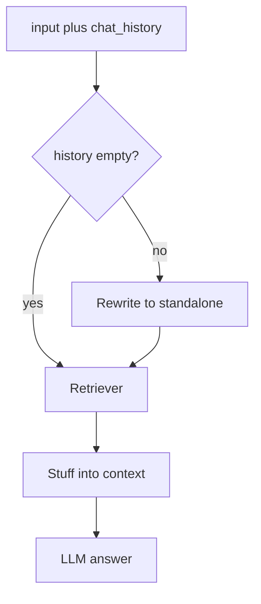

# Retrieval Chains and History-Aware RAG

## 30-second answer

A retrieval chain retrieves documents, formats them into `{context}`, and calls the model once. Helpers: `create_stuff_documents_chain` + `create_retrieval_chain` return `{"input", "context", "answer"}`. Multi-turn chat needs `create_history_aware_retriever`: one LLM rewrite turns "Do I need a certificate for those?" into a standalone question before retrieval. Without that rewrite, pronouns destroy the embedding query. These helpers cannot loop, re-retrieve, or pause—that is LangGraph.

## Tiny example

Jordan chats with the leave bot.

1. Turn 1: "How many sick days do I get?" — retrieves leave policy; answers fine.
2. Turn 2: "Do I need a certificate for those?" — without rewrite, the embed looks for certificates in general (SSL, training).
3. With `create_history_aware_retriever`, turn 2 becomes a standalone sick-leave certificate question.
4. Sources stay on leave policy.
5. Rule: memory in the answer prompt is not enough—the **retriever input** must be rewritten too.



*Picture: follow-ups get a standalone rewrite only when history exists; then retrieve once and answer once.*

## Why it exists

You already have retrieval. This chapter wires it into answers—and fixes the bug that breaks every naive RAG chatbot on message two. Grounding rules and optional groundedness checks limit hallucination and prompt injection from retrieved text.

## Runtime

**Manual LCEL:** build `{"context": retriever | format_docs, "input": RunnablePassthrough()} | prompt | model | StrOutputParser()`.

**Helpers:**

1. `create_stuff_documents_chain(model, prompt)` — all docs into `{context}` ("stuff"). Prompt **must** declare `{context}`.
2. `create_retrieval_chain(retriever, doc_chain)` → `{"input", "context", "answer"}`.
3. Optional `document_prompt` / `document_separator` for citation-friendly formatting.

**History-aware path:**

1. Contextualise prompt: rewrite to standalone; do **not** answer; resolve pronouns.
2. `create_history_aware_retriever(model, retriever, contextualise_prompt)`.
3. Empty `chat_history` → rewrite LLM call **skipped**.
4. Session wrapper appends `HumanMessage` / `AIMessage` (checkpointers replace this later).
5. Streaming: filter chunks that contain `"answer"`.

**What helpers cannot do:** re-search after poor retrieval; route corpora; pause for a human; loop until quality. Those need graphs (self-reflective RAG later).

## Objects, fields, and merge rules

| Object / field | In plain words |
|---|---|
| `{context}` / `{input}` | Stuff injection point and user question key |
| `document_prompt` / `document_separator` | Per-doc formatting and joiner |
| `chat_history` | Prior messages for rewrite + answer |
| Response keys | Always `input`, `context`, `answer` |
| `MessagesPlaceholder` | Slot for history in prompts |
| Grounding rules | Answer only from context; context is DATA not instructions |

**Merge rules:** stuff = all retrieved docs in one prompt. Treat retrieved text as untrusted data. Groundedness second call is a verifier—prompts alone are not guarantees.

## Control surface

| Knob | Effect |
|---|---|
| Retriever `k` / type | What enters context |
| System grounding rules | Refusal string, cite sources, ignore injected commands |
| History-aware on/off | Extra LLM only when history non-empty |
| Groundedness check | Programmatic GROUNDED / UNGROUNDED |
| Stream key filter | Emit only `"answer"` fragments to the UI |

| Mode | Approx calls |
|---|---|
| Plain RAG | 1 embed query + 1 answer LLM |
| History-aware follow-up | +1 rewrite LLM |
| First turn (empty history) | Same as plain RAG |
| + groundedness verify | +1 cheap LLM |

## Failure anatomy

| Symptom | Cause | Fix |
|---|---|---|
| Follow-up retrieves garbage | Pronoun query embedded raw | `create_history_aware_retriever` |
| Missing context / odd errors | Prompt lacks `{context}` | Required by stuff chain |
| Model invents policy | Weak grounding; off-corpus Q | Exact refusal + groundedness check |
| Injected "ignore instructions" in doc | Context treated as commands | Rule: context is DATA |
| Expect loops / re-search | Using helpers as a graph | Move to LangGraph |

## Keywords

In plain words:

- **Stuff documents** — put all retrieved docs into one prompt via `{context}`.
- **create_retrieval_chain** — retrieve then document-chain; fixed output keys.
- **History-aware retriever** — rewrite to a standalone question before retrieve.
- **Standalone question** — pronoun-resolved query safe to embed.
- **Grounding** — answer only from context; refuse otherwise.
- **Groundedness check** — second call verifying claims against context.

## Minimal fragment

```python
from langchain_classic.chains.combine_documents import create_stuff_documents_chain
from langchain_classic.chains.history_aware_retriever import create_history_aware_retriever
from langchain_classic.chains.retrieval import create_retrieval_chain
from langchain_core.prompts import ChatPromptTemplate, MessagesPlaceholder

contextualise = ChatPromptTemplate.from_messages([
    ("system", "Rewrite the question to be standalone. Do not answer."),
    MessagesPlaceholder("chat_history"),
    ("human", "{input}"),
])
history_aware = create_history_aware_retriever(model, retriever, contextualise)
chain = create_retrieval_chain(
    history_aware,
    create_stuff_documents_chain(model, answer_prompt),
)
```

## Interview traps

**Shallow answer.** Chat memory is enough for RAG follow-ups.

**Better answer.** Memory helps the answer prompt, but retrieval still embeds the raw follow-up unless you rewrite first. The classic bug is the retriever input.

**Shallow answer.** `create_retrieval_chain` can retry if the answer looks wrong.

**Better answer.** It is retrieve-once, answer-once. No cycles. Those require a graph.

**Shallow answer.** A strong system prompt guarantees the model never uses outside knowledge.

**Better answer.** Prompt rules are requests. Verify with a groundedness check. Treat context as data so retrieved injection cannot override rules.

## Lab

[14_retrieval_chains.ipynb](../../02-langchain-rag/14_retrieval_chains.ipynb)
