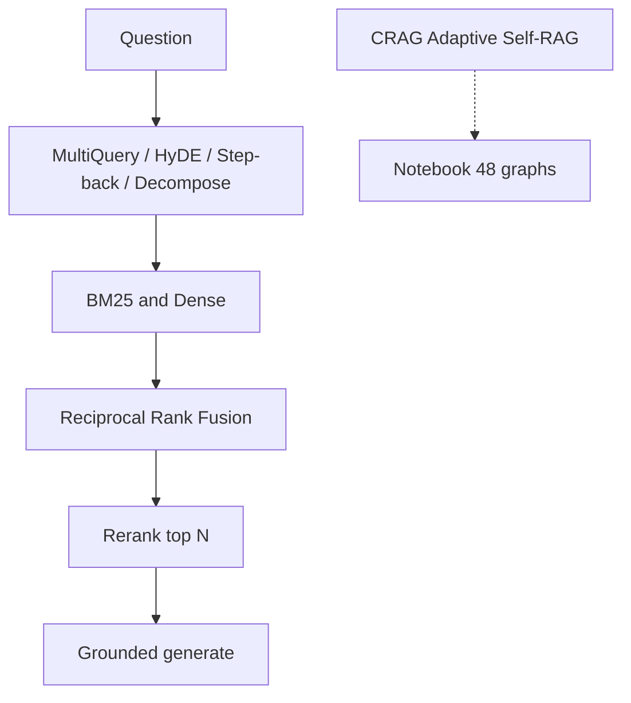

# Advanced RAG

## 30-second answer

Advanced RAG is a toolbox—not one API. **HyDE** embeds a hypothetical answer passage. **Step-back** generalizes a too-specific question. **Decomposition** splits compound questions. **Hybrid BM25+dense** fused with **RRF** fixes exact-term misses. **Rerankers** promote the right doc from rank 8 to rank 1. **CRAG**, **Adaptive RAG**, and **Self-RAG** are named compositions of these ideas plus graph control—built later (especially notebook 48), not new primitives here.

## Tiny example

A support ticket asks: "Can E-104 expense the ap-south-1 failover drill under TCK-1006?"

1. Dense alone may miss the ticket id; BM25 catches `TCK-1006`.
2. Hybrid + RRF merges both ranked lists.
3. A reranker lifts the right policy chunk from rank 12 to top 3.
4. HyDE invents a short policy-shaped paragraph for vague leave questions—but can drop exact ids.
5. Rule: add one technique at a time and measure `hit@k`. Do not stack everything by default.



*Picture: transforms feed hybrid search; fusion and rerank sharpen the shortlist; named pipelines wait for graphs.*

## Why it exists

Basic dense RAG plateaus on real corpora. Failures are systematic: wording mismatch, bundled sub-questions, exact codes missed, right doc ranked low, noisy context. Each technique costs latency. Adopt them one at a time and measure.

## Runtime

**HyDE:** LLM invents a short declarative passage → embed/search that passage instead of the raw question. Factual wrongness is OK—it only needs to be *shaped* like a document.

**Step-back:** rewrite specific → general; retrieve both; answer the specific question from the union.

**Decomposition:** emit 2–4 sub-questions; retrieve + short answer each; synthesize (N+1 LLM calls).

**Hybrid + RRF:** score `1/(k + rank + 1)` (lab `k=60`); sum across lists; take `top_n`. `EnsembleRetriever` packages this with `weights`.

**Reranking:** retrieve high-recall (`k=15–20`); re-score with `CohereRerank`, `CrossEncoderReranker`, or LLM-as-judge; keep `top_n`.

**Named pipelines → later graphs (not re-implemented here):**

| Name | What it is in this curriculum |
|---|---|
| **CRAG** (Corrective RAG) | Retrieval grader + fallback when confidence is low — notebook 48 |
| **Adaptive RAG** | Router: vectorstore vs web vs no retrieval — notebooks 25 / 48 |
| **Self-RAG** | Generate, grade grounding/usefulness, loop if needed — notebook 48 |

## Objects, fields, and merge rules

| Object / field | In plain words |
|---|---|
| Hypothetical document | Generated passage used only as an embedding query |
| RRF constant `k` | Smoothing in `1/(k+rank)`; lab default 60 |
| `EnsembleRetriever.weights` | Soft prior between sparse and dense |
| `CohereRerank` / `CrossEncoderReranker` | Hosted or local precision stage |
| `llm_rerank` | Batch score docs; sort by parsed score |
| Eval `hit@k` | Expected source in top results |

**Merge rules:** step-back unions by content. HyDE must not drop identifiers—bad for ID-heavy queries. RRF needs no score normalisation across systems.

## Control surface

| Technique | Fixes | Cost shape |
|---|---|---|
| Multi-query | Vocabulary mismatch | 1 LLM + N searches |
| HyDE | Question vs answer shape | 1 LLM + 1 search |
| Step-back | Over-specific questions | 1 LLM + 2 searches |
| Decomposition | Compound questions | N+1 LLM (+ N searches) |
| Hybrid + RRF | Exact terms missed | Biggest cheap win |
| Reranking | Right doc ranked low | 1 rerank API or N LLM scores |

**Adoption order:** hybrid → reranking → query transformation. Stop when the eval set is satisfied. On a small clean corpus, plain dense often ties advanced pipelines at far lower cost.

## Failure anatomy

| Symptom | Cause | Fix |
|---|---|---|
| HyDE retrieves worse | Domain alien; IDs lost in invent | Skip HyDE; keep exact query / BM25 |
| Compound Q half-answered | Single retrieval | Decompose |
| Dense misses `TCK-1006` / `SOC 2` | Rare token | Hybrid |
| Right chunk at rank 12 | Bi-encoder limits | Rerank top 20 → 3 |
| Latency explodes | Stacked transforms | Measure sec/query; drop losers |
| "Advanced" no better on hit@k | Clean small corpus | Keep dense; add complexity later |

## Keywords

In plain words:

- **HyDE** — embed an invented answer-shaped passage.
- **Step-back** — retrieve with a more general question, then answer the specific one.
- **Query decomposition** — split, retrieve per part, synthesize.
- **RRF** — Reciprocal Rank Fusion; rank-only merge of lists.
- **Reranking** — precision stage after high-recall retrieval.
- **CRAG** — corrective composition (grade + fallback) → notebook 48 graphs.
- **Adaptive RAG** — routed retrieval vs web vs none; later graphs.
- **Self-RAG** — generate-then-grade loop; later graphs.

## Minimal fragment

```python
def reciprocal_rank_fusion(ranked_lists, k=60, top_n=4):
    scores, lookup = {}, {}
    for ranked in ranked_lists:
        for rank, doc in enumerate(ranked):
            key = doc.page_content
            lookup[key] = doc
            scores[key] = scores.get(key, 0.0) + 1.0 / (k + rank + 1)
    ordered = sorted(scores, key=scores.get, reverse=True)
    return [lookup[key] for key in ordered[:top_n]]

fused = reciprocal_rank_fusion([
    vector_store.similarity_search(q, k=6),
    bm25.invoke(q),
])
```

## Interview traps

**Shallow answer.** CRAG is a special LangChain class you import.

**Better answer.** In this curriculum CRAG is a composition: retrieval grader + fallback + graph control. Primitives are transforms, hybrid, rerank, and graders; the durable loop lives in notebook 48.

**Shallow answer.** Always run the full advanced pipeline in production.

**Better answer.** On a small clean corpus, dense often matches advanced at far fewer LLM calls. Measure; adopt hybrid first; stop when eval is satisfied.

**Shallow answer.** HyDE is better because the LLM knows the answer.

**Better answer.** The invented passage may be factually wrong. It only needs to look like a document. It hurts when exact identifiers must be preserved.

## Lab

[15_advanced_rag.ipynb](../../02-langchain-rag/15_advanced_rag.ipynb)
