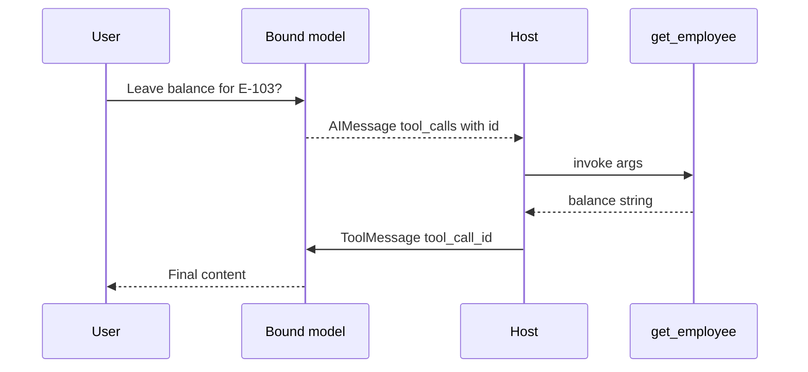

# Tools: Built-in, Custom, and Toolkits

## 30-second answer

A tool is a typed callable the model can **request** but never executes. `@tool` turns a function, docstring, and type hints into a schema. `bind_tools` sends schemas to the provider. The model returns `AIMessage.tool_calls`. Your code runs the tool and appends a `ToolMessage` whose `tool_call_id` **must match** `call["id"]`. That gap is the security boundary. Docstrings are prompts—the only description the model sees when choosing tools and arguments.

## Tiny example

An ops ticket asks: "Leave balance for E-103?"

1. `@tool` defines `get_employee` with a clear docstring and id examples.
2. `model.bind_tools([get_employee])` returns an `AIMessage` with `tool_calls`.
3. The host runs `get_employee.invoke(args)` and appends `ToolMessage(..., tool_call_id=call["id"])`.
4. Second model turn writes the answer in plain language.
5. Rule: never skip the id pairing—providers bind observations to requests by that id.



*Picture: the model only asks; the host runs the tool and returns a matching `ToolMessage`.*

## Why it exists

A model can only produce text or structured tool requests. Tools reach the world: SQLite, APIs, arithmetic it would otherwise invent. The Ops Assistant looks up employees and tickets, computes working days, submits leave, and searches policy—with validation and actionable error strings instead of crashes that kill the loop.

## Runtime

1. Define tools with `@tool` or `@tool("name", args_schema=PydanticModel)`.
2. Inspect `tool.name`, `.description`, `.args`—what the model reads.
3. `model_with_tools = model.bind_tools(tools)`.
4. On invoke, `AIMessage` may have empty `content` and populated `tool_calls`: `{name, args, id}`.
5. Manual loop: invoke tool → `ToolMessage(content=str(result), tool_call_id=call["id"])`.
6. Re-invoke until the model answers without tool calls.
7. Parallel tool calls: one AIMessage may request several; execute all before the next model turn.
8. Retriever-as-tool: wrap search so the agent *decides* whether to retrieve.

## Objects, fields, and merge rules

| Object / field | In plain words |
|---|---|
| `tool.name` / `.description` / `.args` | Schema surface the model reads |
| `args_schema` (Pydantic) | Validates before the function body runs |
| `Field` / `Literal[...]` | Constraints + argument help text |
| `AIMessage.tool_calls[].id` | Must equal `ToolMessage.tool_call_id` |
| Toolkit `get_tools()` | Bundle (e.g. `SQLDatabaseToolkit`) |
| `numexpr.evaluate` | Safer arithmetic than raw `eval()` |

**Safety rules:** return error **strings** the model can read—do not raise into a dead loop. SQL: read-only connection (`sqlite` `mode=ro`) plus keyword filters. Past ~15 tools, selection accuracy drops. Assume arguments are adversarial.

## Control surface

| Knob | Effect |
|---|---|
| Docstring quality | Tool selection + argument quality |
| Name as verb phrase | `get_employee` not `employee_data` |
| Pydantic constraints | Reject hallucinated args before side effects |
| Built-ins | Wikipedia, DuckDuckGo, Tavily, calculator |
| `SQLDatabaseToolkit` + `include_tables` | Limit SQL surface |
| Tool count | Keep low; accuracy falls with overload |

| Approach | When |
|---|---|
| `@tool` in-process | Agent-private helpers |
| Toolkit | Related ops (SQL, files, HTTP) |
| Retriever tool | Optional RAG under agent control |
| MCP server (16b) | Cross-team / isolation |
| REPL (16a) | Last resort; sandbox or refuse |

**Cost shape:** each model turn ≈ 1 LLM call. One tool round ≈ 2 LLM calls (request, then final).

## Failure anatomy

| Symptom | Cause | Fix |
|---|---|---|
| Agent ignores your tool | Vague docstring / bad name | Verb-phrase name; when-to-use description |
| Nonsense arguments | No schema constraints | Pydantic `args_schema` |
| Agent loop crashes | Tool raises | Return guidance strings |
| `DELETE` executes | Writable SQL user | Read-only DB user + filters |
| Wrong ticket/employee | Ambiguous ids | Normalize + examples in errors |
| Arithmetic wrong | Model mental math | Calculator tool (`numexpr`) |

## Keywords

In plain words:

- **Tool** — schema + callable; model requests, host executes.
- **bind_tools** — attach schemas so the provider returns structured `tool_calls`.
- **tool_calls / tool_call_id** — request/response correlation; ids must match.
- **args_schema** — validated arguments before your function runs.
- **Toolkit** — packaged set of related tools.
- **Retriever tool** — RAG as an optional agent-decided step.
- **Actionable error string** — failure text written for the model to self-correct.

## Minimal fragment

```python
from langchain.tools import tool
from langchain.messages import HumanMessage, ToolMessage

@tool
def get_employee(employee_id: str) -> str:
    """Look up leave balances by employee id (e.g. E-104)."""
    ...

tools = [get_employee]
llm = model.bind_tools(tools)
msgs = [HumanMessage("Leave balance for E-103?")]
ai = llm.invoke(msgs)
msgs.append(ai)
for call in ai.tool_calls:
    result = {t.name: t for t in tools}[call["name"]].invoke(call["args"])
    msgs.append(ToolMessage(str(result), tool_call_id=call["id"]))
print(llm.invoke(msgs).content)
```

## Interview traps

**Shallow answer.** When you bind tools, the LLM runs your Python.

**Better answer.** The model only emits `tool_calls`. Your runtime executes and must return `ToolMessage`s with matching `tool_call_id`s. That gap is where authz, validation, and auditing live.

**Shallow answer.** Tool docstrings are just for developers.

**Better answer.** They are the prompt. Vague docs cause non-selection and bad arguments. Type hints become JSON schema.

**Shallow answer.** `SQLDatabaseToolkit` is safe because the model is helpful.

**Better answer.** An LLM-generated `DELETE` runs on a writable connection. Use a read-only DB user first; keyword filters are a second layer.

## Lab

[16_tools_builtin_custom_toolkits.ipynb](../../03-langchain-agents/16_tools_builtin_custom_toolkits.ipynb)
