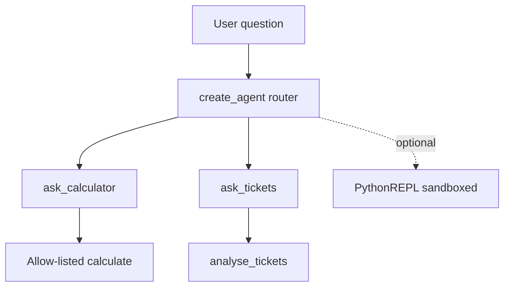

# Code Execution and Sandboxing

## 30-second answer

Code-execution tools (`PythonREPLTool`, CSV agents needing `allow_dangerous_code=True`) let models run arbitrary Python—and therefore read secrets, write files, and call the network. Prefer narrow tools (`calculate` with an allow-list, typed DataFrame aggregations) and a router over specialists. If you must ship a REPL, sandbox it (no host FS, no network, allow-listed imports, time/CPU limits) or do not ship it. Wire agents with modern `create_agent` plus `ModelCallLimitMiddleware`; treat `AgentExecutor` as historical.

## Tiny example

An ops ticket asks two things in one day: "(18 + 6) / 3" and "How many tickets per priority?"

1. A thin router agent has tools `ask_calculator` and `ask_tickets`.
2. Arithmetic goes to allow-listed `calculate` with empty `__builtins__`.
3. Ticket counts go to typed `analyse_tickets` over a fixed DataFrame—no free `exec`.
4. Someone suggests `PythonREPLTool` to "just plot everything into the repo." That is classroom demo energy and production blast-radius energy.
5. Rule: if you cannot tick the sandbox checklist, ship the calculator—not the REPL.



*Picture: route to narrow tools first; treat a full REPL as an optional, sandboxed last resort.*

## Why it exists

Notebook 16 names `PythonREPLTool` and never runs it. Code interpreters are a common production pattern—and the one with the worst blast radius. An agent that can `os.system` on your laptop is a liability. Writing files into the working directory is fine as a demo and terrible as a ship pattern.

## Runtime

1. Prefer a constrained calculator: digits and `+ - * / ** ( )` only; `eval(..., {"__builtins__": {}})`.
2. Optional REPL: `PythonREPLTool` + `create_agent` + system bans + `ModelCallLimitMiddleware(run_limit=..., exit_behavior="end")`. Prompt bans are soft; containers are hard.
3. CSV without REPL: typed tool over a fixed DataFrame (`group_by` + `metric` with Pydantic).
4. Router: thin `create_agent` whose tools call specialists—prefer this over one mega-agent.
5. Sandbox checklist before shipping any code-exec tool: allow-list imports; no host filesystem (scratch only); no network; CPU/memory/time limits; separate process/container; audit every snippet; human approval for writes.

Historical note: older courses use `AgentExecutor` + `create_react_agent`. That path is **legacy**. Same capability today: `create_agent` + middleware.

## Objects, fields, and merge rules

| Object / field | In plain words |
|---|---|
| `PythonREPLTool` | Experimental tool executing generated Python |
| `allow_dangerous_code` | Opt-in for experimental CSV/code agents |
| `ModelCallLimitMiddleware` | Cap model turns; `end` vs `error` |
| Typed `args_schema` | Structured plan; no free-form code |
| Router tools | Specialists behind one dispatcher |
| `ctx.artifact(...)` | Allowed write location vs repo root |
| Empty `__builtins__` eval | Arithmetic-only surface |

**Merge rules:** "never import os" in a prompt does not enforce isolation—process boundaries do. Never write agent outputs into the project root. If you cannot tick most sandbox controls, ship the calculator.

## Control surface

| Control | Why |
|---|---|
| Narrow tool first | Most "run Python" asks are arithmetic or groupbys |
| Character / import allow-lists | Block escapes (`os`, `subprocess`, `socket`) |
| No host filesystem | Mount scratch only |
| No network | Stop data exfiltration |
| CPU / memory / time limits | Infinite loop = denial of service |
| Separate process or container | Contain blast radius (Docker, gVisor, Firecracker, Deno, Pyodide) |
| Audit log every snippet | You will need to explain what ran |
| `run_limit` middleware | Bound loops even when the sandbox holds |

## Failure anatomy

| Symptom | Cause | Fix |
|---|---|---|
| `.env` / SSH keys readable | REPL shares process FS | Sandbox; or no REPL |
| Agent writes into repo root | Demo path = cwd | Dedicated scratch via artifacts |
| `__import__` escapes calculator | Allow-list too wide / builtins present | Empty builtins + char allow-list |
| Infinite tool loop | Unbounded agent | `ModelCallLimitMiddleware` |
| CSV agent mutates / deletes | `allow_dangerous_code` + free pandas | Typed tools only |
| Soft prompt ignored | Model "forgets" bans | Hard sandbox controls |
| Using `AgentExecutor` from old tutorials | Legacy API | Migrate to `create_agent` |

## Keywords

In plain words:

- **Narrow tool** — fixed schema, no arbitrary code execution.
- **PythonREPLTool** — full interpreter access; powerful and dangerous by default.
- **allow_dangerous_code** — explicit opt-in for experimental code-exec agents.
- **Router-over-specialists** — thin agent that calls constrained specialists.
- **Sandbox** — isolate FS, network, imports, and resources (blast radius).
- **ModelCallLimitMiddleware** — hard stop on runaway loops.
- **AgentExecutor** — historical agent runner; not the modern default.

## Minimal fragment

```python
from langchain.agents import create_agent
from langchain.agents.middleware import ModelCallLimitMiddleware
from langchain_core.tools import tool

@tool
def calculate(expression: str) -> str:
    """Evaluate +, -, *, /, ** and parentheses only."""
    allowed = set("0123456789.+-*/() %")
    if not set(expression) <= allowed:
        return "Rejected: only digits and + - * / ** ( ) are allowed."
    return str(eval(expression, {"__builtins__": {}}, {}))

router = create_agent(
    model, tools=[calculate],
    system_prompt="Use calculate for arithmetic. Never invent numbers.",
    middleware=[ModelCallLimitMiddleware(run_limit=4, exit_behavior="end")],
)
```

## Interview traps

**Shallow answer.** A system prompt telling the REPL not to import `os` is enough.

**Better answer.** Prompts are requests. Sandboxing is enforcement. If you cannot isolate FS/network/imports/time, ship a calculator instead of a REPL.

**Shallow answer.** Use `AgentExecutor` for code interpreters like the old tutorials.

**Better answer.** That path is historical. Use `create_agent` with middleware limits.

**Shallow answer.** `create_csv_agent` is the standard way to analyze tables.

**Better answer.** It requires `allow_dangerous_code=True` and executes model-written code. Prefer a typed aggregation tool over a fixed DataFrame unless you have a real sandbox.

## Lab

[16a_code_execution_and_sandboxing.ipynb](../../03-langchain-agents/16a_code_execution_and_sandboxing.ipynb)
