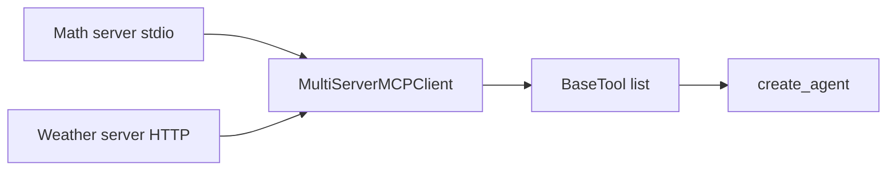

# MCP: Model Context Protocol

## 30-second answer

MCP is a **protocol** (not a LangChain feature) for advertising and calling tools across process and language boundaries. A FastMCP server exposes `@mcp.tool()` functions over **stdio** (local subprocess) or **streamable-http** (shared service). `MultiServerMCPClient` discovers those tools as LangChain `BaseTool` objects for `create_agent`. Use in-process `@tool` for agent-private helpers; use MCP when another team owns the capability or you need isolation.

## Tiny example

The weather team ships a small HTTP MCP server. Your ops agent never imports their code.

1. You write a local math server: `FastMCP("Math")`, `@mcp.tool()` on `add` / `multiply`, `mcp.run(transport="stdio")`.
2. `MultiServerMCPClient` points at that script with `transport: "stdio"`.
3. `tools = await client.get_tools()` → LangChain tools.
4. `create_agent(model, tools=tools)` answers "(3+5)*12" via remote math.
5. Later you uncomment the weather HTTP entry—same agent code, new tools after reconnect.



*Picture: servers advertise tools over stdio or streamable-http; the client turns them into normal LangChain tools.*

## Why it exists

Notebook 16 mentions MCP in one table row. MCP is how tools ship across teams now: one team writes a server, any agent framework consumes it, without copying Python functions. Transports: stdio for simple local demos; streamable-http for multi-client networked services.

## Runtime

1. Write a stdio server file: `FastMCP(...)`, `@mcp.tool()`, `mcp.run(transport="stdio")`.
2. Write an HTTP server the same way with `transport="streamable-http"`.
3. Client config: `MultiServerMCPClient({ "math": { "command": ..., "args": [...], "transport": "stdio" }, ... })`.
4. `tools = await client.get_tools()`.
5. `create_agent(model, tools=tools, middleware=[ModelCallLimitMiddleware(...)])` and `ainvoke`.
6. Uncomment an HTTP entry when that process is running—tools appear with **no agent code change**.
7. Jupyter: if a loop is already running, `nest_asyncio` may be required.

## Objects, fields, and merge rules

| Object / field | In plain words |
|---|---|
| FastMCP app | Named server advertising tools |
| `@mcp.tool()` | Registers a callable on the server |
| `MultiServerMCPClient({...})` | Multi-server connection map |
| `get_tools()` | Async discovery → LangChain `BaseTool`s |
| stdio transport | Client spawns process; talks via stdin/stdout |
| streamable-http / URL | Networked MCP endpoint (lab: `http://localhost:8000/mcp`) |

**Design rules:** one concern per server (math vs weather). Prefer stdio for local demos; HTTP for shared services. Never put secrets in tool output—MCP responses are often logged. Version servers: a schema break breaks every client overnight. Adding `divide` on the server appears after client restart without editing agent code—that is the point.

## Control surface

| Choice | Prefer when |
|---|---|
| stdio | Local demos; single client; simple tools |
| streamable-http | Shared service; multiple agents; remote hosts |
| In-process `@tool` | Private helpers; lowest latency |
| MCP | Cross-team ownership; isolation; non-Python servers |
| `ModelCallLimitMiddleware` | Bound agent loops using MCP tools |

| | `@tool` in-process | MCP server |
|---|---|---|
| Deployment | Same process | Separate process or host |
| Language | Python on the LangChain side | Any language with an MCP SDK |
| Sharing | Copy the function | Point the client at the server |
| Isolation | Shares memory and credentials | Process boundary |
| Latency | Function call | IPC or network hop |

## Failure anatomy

| Symptom | Cause | Fix |
|---|---|---|
| No tools listed | Server not running / wrong path | Check `command`/`args` or HTTP URL |
| Agent misses new tool | Client started before server update | Restart client after server change |
| HTTP tools missing | Weather server not started; entry commented | Run server; uncomment config |
| Auth/CORS pain on demo | Using HTTP too early | Prefer stdio locally |
| Secret leak in traces | Tool returned API keys | Redact; never echo secrets |
| Schema break overnight | Unversioned server change | Version MCP servers; coordinate clients |

## Keywords

In plain words:

- **MCP** — protocol for tooling across processes and languages.
- **FastMCP** — minimal Python server helper; `@mcp.tool()` is enough to start.
- **stdio transport** — subprocess stdin/stdout for local tools.
- **streamable-http** — networked MCP endpoint for shared services.
- **MultiServerMCPClient** — aggregates many servers into LangChain tools.
- **Decoupling** — consume a capability without importing its implementation.
- **Tool description as prompt** — same rule as `@tool`; docstrings drive selection.

## Minimal fragment

```python
from langchain.agents import create_agent
from langchain_mcp_adapters.client import MultiServerMCPClient

client = MultiServerMCPClient({
    "math": {
        "command": sys.executable,
        "args": ["math_server.py"],
        "transport": "stdio",
    },
})
tools = await client.get_tools()
agent = create_agent(model, tools=tools, system_prompt="Use math tools for arithmetic.")
result = await agent.ainvoke(
    {"messages": [{"role": "user", "content": "What is (3+5)*12?"}]}
)
```

## Interview traps

**Shallow answer.** MCP is a LangChain feature.

**Better answer.** MCP is a protocol. `langchain-mcp-adapters` only converts advertised tools into `BaseTool`s. Servers can be written in other languages.

**Shallow answer.** Replace every `@tool` with MCP for cleanliness.

**Better answer.** MCP adds process/network overhead. Keep private helpers in-process; use MCP for shared or isolated capabilities.

**Shallow answer.** Once the client is connected, new server tools appear automatically mid-run.

**Better answer.** Discovery happens when you `get_tools()`. After adding a server-side tool, restart/reconnect so the client re-lists—no agent logic change, but a refresh is required.

## Lab

[16b_mcp_servers_and_clients.ipynb](../../03-langchain-agents/16b_mcp_servers_and_clients.ipynb)
