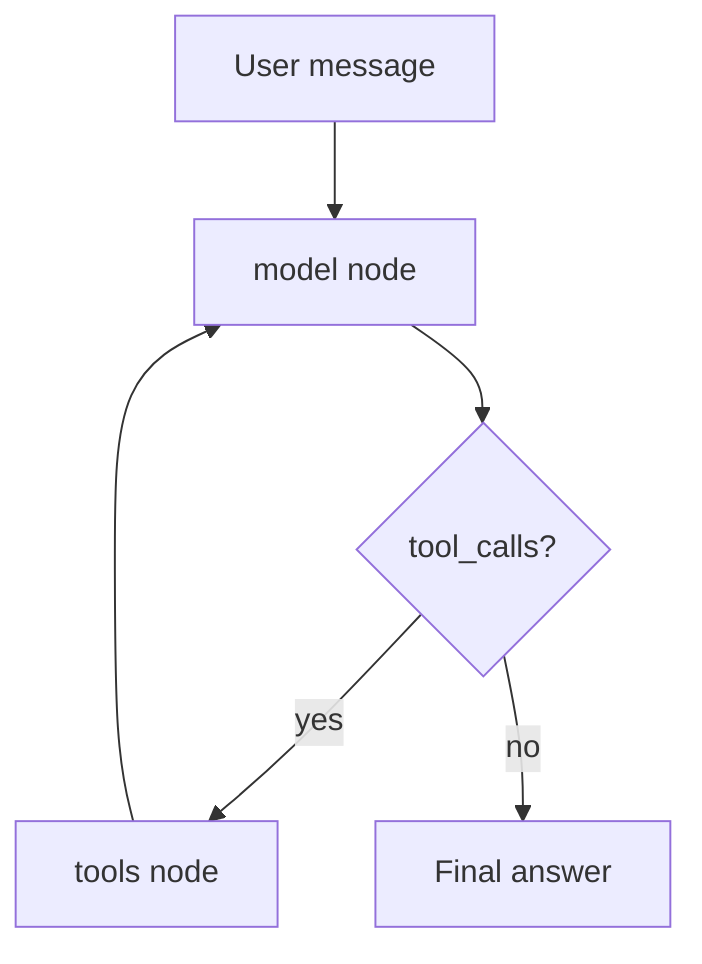

# Agents

## 30-second answer

An agent decides tool use at runtime: model → tools → model → … → answer. In LangChain v1, `create_agent` replaces historical `AgentExecutor` / `initialize_agent` / older `create_react_agent` helpers and returns a **compiled LangGraph**. Control the loop with middleware (`ModelCallLimitMiddleware`, `ToolCallLimitMiddleware`, `ToolRetryMiddleware`, `ToolErrorMiddleware`, `ModelFallbackMiddleware`). Message rule unchanged: each `ToolMessage.tool_call_id` must match an `AIMessage.tool_calls[].id`. Prefer chains when you can draw the flowchart.

## Tiny example

HR asks: "Leave balance for E-103, then check notice period for that person."

1. `create_agent(model, tools=TOOLS, system_prompt="Use tools for all facts. Never guess.")`.
2. First AI turn requests `get_employee`; host returns a `ToolMessage` with matching `tool_call_id`.
3. Second turn may call `search_policy` for notice period.
4. Middleware `ModelCallLimitMiddleware(run_limit=4)` stops a runaway "list every employee" loop.
5. Rule: if the path is always retrieve-then-answer, use an LCEL chain—not an agent.



*Picture: the agent is already a tiny graph—model and tools loop until there are no tool calls.*

## Why it exists

A chain has a fixed path you decided at build time. An agent decides the path at runtime: which tool, how many times, when to stop. That flexibility is powerful and risky—loops forever, burns cost, or answers from parametric knowledge without calling tools. This chapter covers how agents work, how to control them, and when not to use one.

## Runtime

1. `create_agent(model, tools, system_prompt=...)` compiles a graph with `model` and `tools` nodes.
2. Invoke with `{"messages": [{"role": "user", "content": "..."}]}`.
3. On each AI turn with `tool_calls`, the tools node appends `ToolMessage`s keyed by `tool_call_id`.
4. Trace by printing message types: human / ai (with calls) / tool.
5. Limit with `ModelCallLimitMiddleware`; per-tool caps via `ToolCallLimitMiddleware`.
6. Survive flaky tools: `ToolRetryMiddleware`, `ToolErrorMiddleware`, `ModelFallbackMiddleware`.
7. Structured final answer: `response_format=ToolStrategy(PydanticModel)` → `structured_response`.
8. Memory: `checkpointer=InMemorySaver()` + `thread_id`.
9. Stream: `stream_mode="updates"` for steps; `"messages"` for tokens.

**Historical types** (all strategies for "get a model to use tools"):

| Type | Status |
|---|---|
| ReAct text (`Thought:/Action:`) | Legacy; fragile |
| OpenAI Functions / Tools | Became the standard |
| **`create_agent`** | **Use this** — native tool calling on LangGraph |

**AgentExecutor (historical):** plan → `AgentAction` → execute → `AgentStep` until `AgentFinish` or limits. Problems: no persistence, no pausing, no branching, opaque post-loop state. `create_agent` keeps the loop and fixes those because it is a graph.

## Objects, fields, and merge rules

| Object / field | In plain words |
|---|---|
| `create_agent` result | Compiled LangGraph runnable |
| `messages` | Full transcript including tool messages |
| `ModelCallLimitMiddleware` | Cap model turns; `end` vs `error` |
| `ToolCallLimitMiddleware` | Per-tool budget |
| `ToolRetryMiddleware` / `ToolErrorMiddleware` | Survive flaky tools |
| `ModelFallbackMiddleware` | Secondary chat model |
| `ToolStrategy` / `structured_response` | Validated final object in-loop |
| `checkpointer` + `thread_id` | Multi-turn durable memory |

**Merge rules:** system prompt is a control surface—"never guess, always use tools" vs vague helpfulness changes whether tools run at all. Prefer `exit_behavior="end"` for user-facing partial answers; `"error"` for batch jobs.

## Control surface

| Knob | Effect |
|---|---|
| Tool docstrings / count | Selection quality |
| System prompt strictness | Tool use vs parametric hallucination |
| Call / tool limits | Stop infinite loops and runaway cost |
| Retry / error / fallback middleware | Survive flaky upstreams |
| `response_format` | Machine-integrable verdicts |
| Checkpointer | Cross-turn coreference |
| Stream modes | UX during long runs |

| Task | Better choice |
|---|---|
| Always retrieve then answer | LCEL RAG chain |
| Fixed 3-step pipeline | LCEL chain |
| Variable steps, tool-dependent | **Agent** |
| Approval mid-run / resume after crash | **StateGraph** |

**Cost shape:** each AI message ≈ 1 LLM call. For a fixed notice-period question, a chain is often 1 call; an agent may take several for the same fact.

## Failure anatomy

| Symptom | Cause | Fix |
|---|---|---|
| Infinite loop | Tool keeps returning something unsatisfying | `ModelCallLimitMiddleware` |
| Wrong tool chosen | Vague descriptions, too many tools | Rewrite docstrings; reduce count |
| Bad arguments | No validation | Pydantic `args_schema` |
| Answers without tools | Weak system prompt | Explicit never-guess policy |
| Crash on tool error | Tool raises | Error strings + `ToolErrorMiddleware` |
| Hallucinated employee id | Model invents args | Validation + actionable tool errors |

## Keywords

In plain words:

- **Agent loop** — model/tools alternation until final content (or a limit).
- **create_agent** — v1 standard; returns a compiled LangGraph.
- **AgentExecutor** — historical executor without durable graph features.
- **Middleware** — limits, retries, errors, fallbacks around the loop.
- **ToolStrategy** — structured final answer via tool calling inside the loop.
- **Checkpointer / thread_id** — durable multi-turn state across invokes.
- **tool_call_id** — still must match `AIMessage.tool_calls[].id`.

## Minimal fragment

```python
from langchain.agents import create_agent
from langchain.agents.middleware import ModelCallLimitMiddleware

agent = create_agent(
    model=model,
    tools=TOOLS,
    system_prompt="Use tools for all facts. Never guess.",
    middleware=[ModelCallLimitMiddleware(run_limit=4, exit_behavior="end")],
)
out = agent.invoke(
    {"messages": [{"role": "user", "content": "Leave balance for E-103?"}]}
)
print(out["messages"][-1].content)
```

## Interview traps

**Shallow answer.** Agents are always better than chains because they can use tools.

**Better answer.** Agents are slower, costlier, and less predictable. If you can draw the flowchart, build the flowchart. Use agents when the step sequence cannot be known ahead of time.

**Shallow answer.** `create_agent` is unrelated to LangGraph.

**Better answer.** It returns a compiled graph (`model` ⇄ `tools`). Checkpointing, streaming, and HITL learnings apply directly.

**Shallow answer.** ReAct text agents are fine if the prompt is careful.

**Better answer.** Format drift causes parse failures in production. Native tool calling returns structured JSON from the provider; that is why it won.

## Lab

[17_agents.ipynb](../../03-langchain-agents/17_agents.ipynb)
