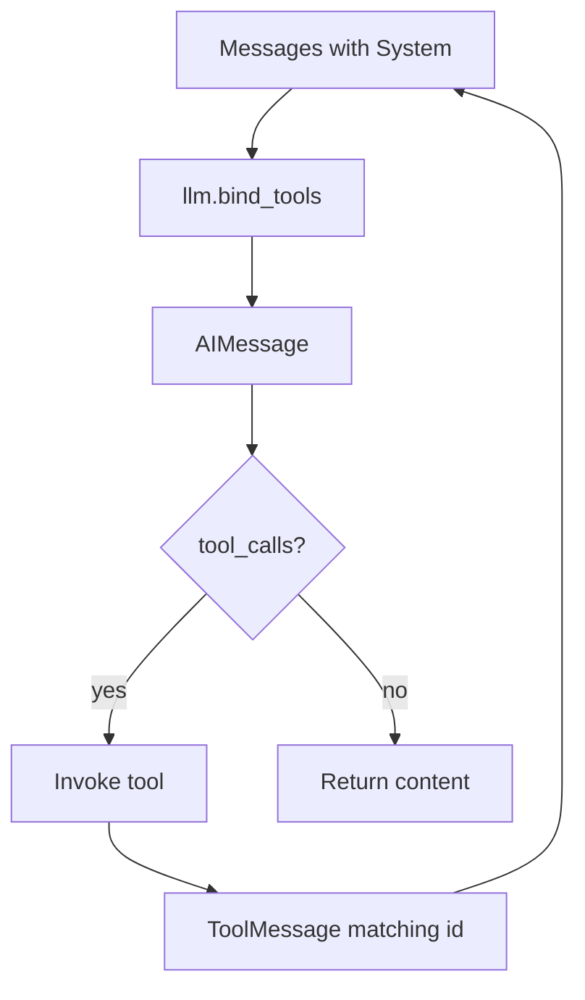

# The Agent Loop From Scratch

## 30-second answer

Every agent is the same message loop: bind tools → model returns `AIMessage.tool_calls` → execute → append `ToolMessage(tool_call_id=call["id"])` → model again until there are no tool calls. `create_agent` wraps that loop with middleware, streaming, and checkpointing. Raw ReAct text + regex parsing is the historical fragile alternative. The cheapest debugger is a `BaseCallbackHandler` that prints the messages the model is about to see—usually you discover the model never saw the tool result you think it saw.

## Tiny example

A shop bot must price a laptop with a gold discount—fixed catalogue so you can spot hallucination.

1. Level 1: hand-rolled `bind_tools` loop with STRICT rules ("never guess prices").
2. Model calls `get_product_price`, then `apply_discount`; each result returns with matching `tool_call_id`.
3. Remove the "never guess" rule once—watch the model invent a price.
4. Level 3 ReAct text parse fails on a typo in `Action:`.
5. Level 4 `create_agent` reaches the same answer with less boilerplate.



*Picture: the real agent algorithm is a message loop; ids must match or the provider loses the observation.*

## Why it exists

Notebook 17 teaches `create_agent`—the right API to ship, and a black box until you have written the loop yourself. When an agent loops, picks the wrong tool, or invents arguments, you need the message transcript and the correlation ids.

## Runtime

Shared catalogue in the lab: `get_product_price` and `apply_discount` with fixed prices.

### Level 1 — `bind_tools` (what `create_agent` wraps)

1. `messages = [SystemMessage(SYSTEM), HumanMessage(question)]` with STRICT rules.
2. `ai = llm.bind_tools(TOOLS).invoke(messages)`; append `ai`.
3. If `not ai.tool_calls` → return `ai.content`.
4. Else execute, append `ToolMessage(str(observation), tool_call_id=call["id"])`.
5. Repeat until max iterations.

**Critical correlation:** `call["id"]` must equal `ToolMessage.tool_call_id`.

### Level 2 — raw provider tool schemas

Convert each tool to OpenAI-style `{type: "function", function: {name, description, parameters}}` via `args_schema.model_json_schema()`. Same loop; explicit binding payload.

### Level 3 — raw ReAct text + regex

Prompt forces `Thought / Action / Action Input / Observation / Final Answer`. Parse with regex. Fragile: misspelled actions, missing lines, invented observations.

### Level 4 — `create_agent`

Same trajectory + `ModelCallLimitMiddleware`, streaming, checkpointers, HITL, retries.

## Objects, fields, and merge rules

| Object / field | In plain words |
|---|---|
| `AIMessage.tool_calls` | `[{name, args, id}, ...]` |
| `ToolMessage.tool_call_id` | Joins result to the request |
| `MAX_ITERATIONS` | Hand-rolled stop condition |
| `TOOLS_BY_NAME` | Dispatch map |
| OpenAI-style schema dict | Explicit provider payload |
| ReAct scratchpad | Growing text prompt with Observations |
| `PromptPrinter(BaseCallbackHandler)` | Logs pre-model messages |

| Concern | Hand-rolled loop | `create_agent` |
|---|---|---|
| Tool binding | You call `bind_tools` | Built in |
| Tool execution | You append `ToolMessage` | Built in |
| Max steps | Your `for` loop | `ModelCallLimitMiddleware` |
| Streaming / memory / HITL | You wire it | Built in |

**Merge rules:** hand-roll once for understanding; ship `create_agent`. Removing "NEVER guess a price" demonstrates immediate hallucination—rules are load-bearing.

## Control surface

| Knob | Effect |
|---|---|
| System STRICT RULES | Prevent parametric price invention |
| One-tool-per-turn (debug) | Readable trajectory |
| `MAX_ITERATIONS` / `run_limit` | Hard stop |
| Callbacks on invoke | See actual prompts |
| ReAct vs bind_tools | Fragile text vs structured JSON |

**Cost shape:** one LLM call per model visit. ReAct may waste turns on parse failures.

## Failure anatomy

| Symptom | Cause | Fix |
|---|---|---|
| Invented prices | Weak system rules | Restore STRICT tool rules |
| Provider confusion | Mismatched `tool_call_id` | Copy `call["id"]` exactly |
| Parse failure | ReAct format drift | Prefer native tool calling |
| "Model never saw the result" | Forgot to append ToolMessage | Prompt printer / message dump |
| Max iterations error | Loop without stop | Cap iterations / middleware |
| Wrong discount math | Model computes instead of tool | Rule: only discount tool outputs |

## Keywords

In plain words:

- **bind_tools loop** — structured tool calls until completion; the real agent algorithm.
- **tool_call_id** — joins `ToolMessage` to `AIMessage.tool_calls[].id`; must match exactly.
- **Provider schema** — explicit JSON function definitions for unfamiliar providers.
- **ReAct text** — historical Thought/Action parsing with regex; fragile.
- **Prompt printer** — callback logging pre-model messages; cheapest debugger.
- **create_agent wrapper** — production shell around the same message loop.

## Minimal fragment

```python
from langchain_core.messages import AIMessage, HumanMessage, SystemMessage, ToolMessage

llm = model.bind_tools(TOOLS)
messages = [SystemMessage(SYSTEM), HumanMessage(QUESTION)]
for _ in range(8):
    ai: AIMessage = llm.invoke(messages)
    messages.append(ai)
    if not ai.tool_calls:
        break
    call = ai.tool_calls[0]
    obs = TOOLS_BY_NAME[call["name"]].invoke(call["args"])
    messages.append(ToolMessage(str(obs), tool_call_id=call["id"]))
```

## Interview traps

**Shallow answer.** `create_agent` uses a totally different algorithm than bind_tools.

**Better answer.** It automates the same message-level loop and adds middleware/graph features. If you cannot hand-write Level 1, you cannot debug Level 4.

**Shallow answer.** ReAct prompting is just as reliable as tool calling if you are careful.

**Better answer.** Text plans break on formatting typos. Native tool calling returns structured JSON from the provider; that is why it replaced ReAct parsing in production.

**Shallow answer.** When an agent misbehaves, tweak temperature first.

**Better answer.** First log the messages list before each invoke. Most failures are missing ToolMessages, weak system rules, or id mismatches—not sampling temperature.

## Lab

[17a_agent_loop_from_scratch.ipynb](../../03-langchain-agents/17a_agent_loop_from_scratch.ipynb)
