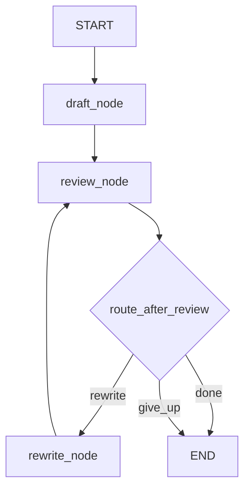

# From AgentExecutor to Graphs

## 30-second answer

The same quality-gate pipeline (draft → critique → rewrite) can be a Python loop, an agent, or a `StateGraph`. Only the graph gives you explicit state, durable checkpoints, interrupts for human approval, `update_state`, resume via `invoke(None)`, and time travel through `get_state_history`. **AgentExecutor is historical.** Even `create_agent` is already a small graph (`model` ⇄ `tools`). Use LCEL for fixed sequences, `create_agent` for variable tool loops, and `StateGraph` when you need cycles you define, guarantees, pause/resume, or parallelism.

## Tiny example

Support gets a messy CSV-export complaint. Every outbound reply must pass QA.

1. Version A: a Python `for` loop drafts, critiques, rewrites—state dies when the process crashes.
2. Version B: an agent with `draft_reply` / `review_reply` / `rewrite_reply` tools—the model may skip review. Prompt-suggested flow is a **defect** for compliance.
3. Version C: `StateGraph` with `draft` → `review` → conditional edge to `rewrite` or `done`.
4. Compile with `interrupt_before=["rewrite"]`; a human patches critique via `update_state`, then `invoke(None, thread)` resumes.
5. Rule: you cannot guarantee a step happened when the model decides the steps.



*Picture: the QA cycle is an explicit graph edge—not a hope in the system prompt.*

## Why it exists

This notebook bridges LangChain and LangGraph. Its job is to make you *feel* the limitation: crash mid-loop and resume, pause for human approval, edit state, continue hours later. Neither a local Python `for` nor a prompt-suggested agent plan has durable, external, editable state.

## Runtime

Shared craft: draft a support reply, critique against QA rules (no fix-date promises, ≤4 sentences, concrete next step), rewrite on FAIL.

### Version A — plain Python loop

Works until you need resume after crash, human approval, mid-loop edits, parallel steps, or durable traces. State lives in locals and vanishes on return.

### Version B — agent (`create_agent`)

Tools suggest the process. Works flexibly—and therefore non-guaranteedly. The model may skip review. `AgentExecutor`-era code is the historical packaging of this idea; do not start new work there.

### Version C — graph

1. `ReviewState` TypedDict: `message`, `draft`, `critique`, `attempts`, `status`.
2. Nodes return partial dict updates: `draft_node`, `review_node`, `rewrite_node`.
3. `add_conditional_edges("review", route_after_review, {...})` makes the `if` a named edge.
4. `add_edge("rewrite", "review")` is the cycle LCEL cannot express.
5. `stream_mode="updates"` shows every node patch.

### Only the graph: interrupt + checkpoint

1. `compile(checkpointer=InMemorySaver(), interrupt_before=["rewrite"])`.
2. `invoke(initial, thread)` pauses; `get_state` shows `next` and values.
3. Human calls `update_state(thread, {"critique": "FAIL: ..."})`.
4. Resume with `invoke(None, thread)`.
5. `get_state_history(thread)` lists checkpoints for time travel (deeper later).

Inspecting `create_agent`: `get_graph()` / `draw_mermaid()` shows the hidden agent loop was a graph all along.

## Objects, fields, and merge rules

| Object / field | In plain words |
|---|---|
| `StateGraph(ReviewState)` | Builder for typed state machine |
| Node return `dict` | Shallow-merged into state |
| `add_conditional_edges` | Named routing function → edge map |
| `interrupt_before` | Pause before listed nodes |
| `checkpointer` | Persist state across steps/processes |
| `thread_id` | Run isolation under `configurable` |
| `update_state` | Human or system patch mid-flight |
| `invoke(None, thread)` | Resume from interrupt |
| `get_state` / `get_state_history` | Inspect / time travel |
| `AgentExecutor` | Historical non-graph agent runner |

**Merge rules:** agent control flow is advisory (prompt); graph edges are authoritative. Checkpointed state is external and editable. `create_agent` is a prebuilt graph; custom `StateGraph` when you need cycles and guarantees beyond the standard tool loop.

## Control surface

| | LCEL chain | `create_agent` | `StateGraph` |
|---|---|---|---|
| Control flow | you, fixed | the model | you, explicit, can cycle |
| Cycles | no | tool loop only | **any shape** |
| Guaranteed steps | yes | no | yes |
| Persistence | no | with checkpointer | with checkpointer |
| Pause for a human | no | via middleware | **anywhere** |
| Parallel branches | `RunnableParallel` | no | fan-out/fan-in |

**Decision rule:**

```
Fixed sequence?                       -> LCEL chain
Variable tool use, standard loop?     -> create_agent
Need cycles you define, approval,
resumability, parallelism, or
multiple cooperating agents?          -> StateGraph
```

Do not start with a graph. Start with a chain, upgrade when you hit a wall.

**Cost shape:** draft/critique/rewrite cost similar LLM calls across versions. Graphs add checkpoint I/O but avoid full restarts. Agents may add exploratory tool calls the graph would never take.

## Failure anatomy

| Symptom | Cause | Fix |
|---|---|---|
| Process crash loses attempt 2 | State only in locals | Checkpointer + graph |
| Agent skipped QA review | Prompt-suggested flow | Encode review edge in graph |
| Cannot edit mid-flight | No external state | `update_state` at interrupt |
| Resume restarts from scratch | Re-invoke with full input | `invoke(None, thread)` |
| Need last Tuesday's bad run | No history | `get_state_history` / time travel |
| Compliance process flaky | Agent flexibility | Graph with guaranteed nodes |
| Using AgentExecutor for HITL | Historical API | Graphs + interrupts |

## Keywords

In plain words:

- **StateGraph** — explicit nodes, edges, and cycles over shared typed state.
- **Conditional edge** — routing function replacing buried `if`s; named and traceable.
- **Checkpointer** — durable state between steps and processes.
- **interrupt_before** — pause for human inspection and edit.
- **update_state / resume** — patch mid-flight; continue with `invoke(None)`.
- **get_state_history** — every step addressable; basis of time travel.
- **AgentExecutor** — historical agent runner; no durable pause/branch/persist story.
- **create_agent as graph** — prebuilt `model`⇄`tools` loop you already use.

## Minimal fragment

```python
from langgraph.checkpoint.memory import InMemorySaver
from langgraph.graph import END, START, StateGraph

builder = StateGraph(ReviewState)
builder.add_node("draft", draft_node)
builder.add_node("review", review_node)
builder.add_node("rewrite", rewrite_node)
builder.add_edge(START, "draft")
builder.add_edge("draft", "review")
builder.add_conditional_edges(
    "review", route_after_review,
    {"rewrite": "rewrite", "done": END, "give_up": END},
)
builder.add_edge("rewrite", "review")
graph = builder.compile(
    checkpointer=InMemorySaver(),
    interrupt_before=["rewrite"],
)
```

## Interview traps

**Shallow answer.** Agents and graphs are interchangeable ways to call tools.

**Better answer.** Agents hide control flow in prompts; graphs make edges explicit and enforceable. Persistence, interrupts, and guaranteed QA steps require graph state—not AgentExecutor or prompt hope.

**Shallow answer.** LangGraph replaces create_agent.

**Better answer.** `create_agent` already is a graph. Reach for custom `StateGraph` when you need cycles and guarantees beyond the standard tool loop.

**Shallow answer.** A Python while-loop with a database write is the same as a checkpointer.

**Better answer.** Checkpointers integrate with graph steps, interrupts, `update_state`, and history APIs. Ad-hoc DB writes do not give you `invoke(None)` resume or addressable time travel without rebuilding that machinery.

## Lab

[18_from_agentexecutor_to_graphs.ipynb](../../03-langchain-agents/18_from_agentexecutor_to_graphs.ipynb)
