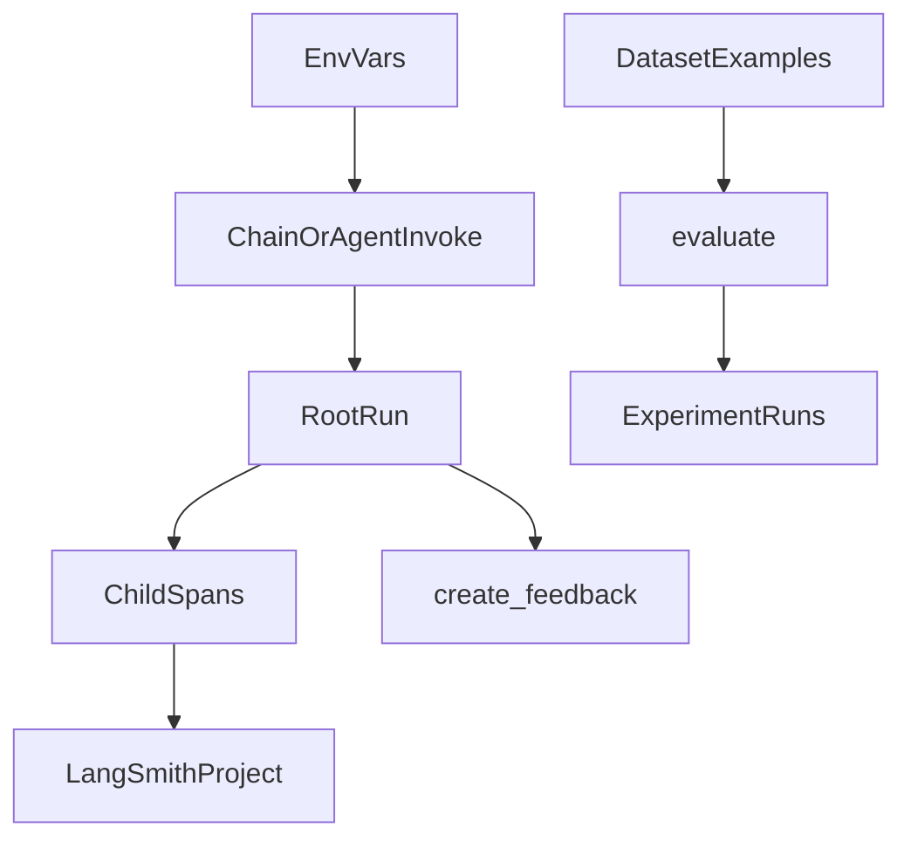

# LangSmith: tracing, datasets, and feedback

## 30-second answer

LangSmith sits beside your app. Set `LANGSMITH_TRACING=true` and `LANGSMITH_API_KEY`. Every LangChain or LangGraph call becomes a **run** — a tree of timed **spans**. Name trees with `.with_config(run_name=..., tags=..., metadata=...)`. Wrap your own functions with `@traceable`. Turn bad answers into dataset examples. Score changes with `evaluate`. Attach thumbs to a concrete `run_id` with `create_feedback`.

## Tiny example

A user says the leave bot gave the wrong day count. You open LangSmith, filter by their `user_id`, and open that run. First you look at the **prompt that was actually sent** — the `{context}` slot is empty. You never need to argue about the model. You fix the retriever, add this ticket to a dataset, and re-run `evaluate` so the bug cannot sneak back.

## Why it exists

LLM apps fail without a stack trace. Wrong tool, cut-off context, or a plausible wrong answer. Guessing wastes time. LangSmith records the rendered prompt, nested inputs and outputs, token counts, and latency. One bad report becomes one tree you can open. Datasets plus `evaluate` turn that bug into a gate before the next prompt ships. Notebook 45 extends the same platform to graphs and Studio.

## Runtime

**Turn tracing on**

1. Set `LANGSMITH_TRACING=true`, `LANGSMITH_API_KEY=lsv2_pt_...`, and `LANGSMITH_PROJECT=...`.
2. Prefer `LANGSMITH_*` names. Older `LANGCHAIN_*` names still work.
3. `enable_tracing(project="...")` sets the project when a key exists. Without a key, cloud cells skip; local alternatives still teach the idea.
4. Once the switch is on, LangChain components in the process are traced. You do not wrap every `invoke`.

**First tree**

1. `prompt | model | parser` becomes parent chain → prompt → LLM → parser.
2. `.with_config(run_name="ticket_triage")` names the parent so you can find it.
3. Open the LLM span and read the **rendered** prompt. That is the debugging habit.

**Readable trees**

1. Give child runnables their own `run_name` (`summarise`, `categorise`, `prioritise`).
2. Parent `RunnableParallel(...).with_config(run_name="ticket_analyser", tags=[...], metadata={...})` names the fan-out.
3. Always add `user_id` / `tenant` / `environment` metadata in production so a customer report maps to their run.

**Your code as spans**

1. LangChain pieces trace themselves. Business logic does not, unless you decorate it.
2. `@traceable(run_type="retriever", name="policy_lookup")` makes ranking bugs visible.
3. Nested `@traceable(run_type="chain", ...)` wraps lookup plus LLM as one parent.
4. `run_type` controls the UI: `llm`, `chain`, `tool`, `retriever`, `prompt`, `parser`.

**Offline helpers**

1. `prompt.invoke(...)` then `to_messages()` — see what would be sent.
2. `astream_events(..., version="v2")` — watch start/end events with names.
3. `set_verbose(True)` — global dump; turn it off after.
4. Timed `RunnableLambda` wrappers print stage latency. LangSmith shows the same as a waterfall.

**Datasets → evaluate → feedback**

1. Examples: `inputs` (for example `{"ticket": ...}`) plus reference `outputs`.
2. `Client.create_dataset` / `create_examples`. Use `has_dataset` to skip recreate.
3. `evaluate(target, data=..., evaluators=[...], experiment_prefix=..., max_concurrency=...)` scores a change.
4. Local twin: `chain.batch(..., config={"max_concurrency": 4})` plus exact-match rows.
5. Production failure → new example (or local JSONL) so the bug cannot return quietly.
6. Feedback: `with collect_runs() as runs:` around invoke → `runs.traced_runs[0].id` → `client.create_feedback(...)`.

**Debugging order (open a run in this order)**

1. **The prompt that was actually sent** — `None` variables, truncated context, missing system message. Most bugs live here.
2. **`finish_reason`** — `length` means truncation.
3. **Retrieved docs / tool I/O** — wrong chunk or bad args.
4. **Token counts per step** — one step usually owns the bill.
5. **Latency waterfall** — one step usually owns the wait.



*Picture: env turns tracing on; each invoke becomes a tree; datasets feed scored experiments; feedback sticks to one run id.*

## Objects, fields, and merge rules

| Object / field | Meaning |
|---|---|
| Run | One top-level call plus nested work |
| Span | One timed step inside a run |
| Project | Named bucket (`LANGSMITH_PROJECT`) |
| `LANGSMITH_TRACING` | Master switch |
| `LANGSMITH_API_KEY` | Auth |
| `run_name` / `tags` / `metadata` | Label, filters, searchable keys |
| `run_type` | How the UI draws the span |
| Dataset / experiment | Fixed examples + scored re-runs |
| Feedback | Score or comment on one `run_id` |
| `collect_runs().traced_runs[0].id` | Id to annotate after invoke |

**Merge rules**

- Tracing is process-wide once env is on.
- `.with_config` nests under the parent tree. Outer metadata and per-invoke `config` combine.
- `@traceable` does not wrap undecorated helpers.
- Dataset examples append; they do not overwrite the original run.
- Feedback attaches to **one** `run_id`. Wrap `collect_runs` around the exact invoke.

## Control surface

| Knob | Effect |
|---|---|
| `LANGSMITH_TRACING` / API key / project | On/off, auth, destination |
| `.with_config(run_name, tags, metadata)` | Readable, filterable trees |
| `@traceable(run_type=..., name=...)` | Trace your own code |
| Dataset + `evaluate` / local batch | Gate a prompt change |
| `collect_runs` + `create_feedback` | User thumbs on the right run |
| `astream_events` / `set_verbose` | Offline visibility |

## Failure anatomy

| Symptom | Cause | Fix |
|---|---|---|
| No runs in UI | Missing key or tracing off | Set env; confirm key |
| Unsearchable `RunnableSequence` trees | No `run_name` / tags | Name verbs; tag env |
| Cannot find a customer’s bad answer | No `user_id` / `tenant` | Always attach ids |
| “Model is broken” | Bad rendered prompt or `finish_reason=length` | Inspect LLM span first |
| Prompt “improved” but silent regressions | No dataset | Add failures as examples |
| Feedback on wrong call | Wrong nested run | `collect_runs` around exact invoke |
| Retriever bugs invisible | Undecorated lookup | `@traceable(run_type="retriever")` |

## Keywords

- **Run / span / project** — tree, step, bucket.
- **`run_name` / tags / metadata** — find and filter.
- **`@traceable`** — make your function a span.
- **Dataset / `evaluate` / experiment** — regression gate.
- **`create_feedback` / `collect_runs`** — thumbs on a concrete run.
- **Rendered prompt first** — debugging order step one.

## Minimal fragment

```python
from langsmith import traceable
from langchain_core.prompts import ChatPromptTemplate
from langchain_core.output_parsers import StrOutputParser

chain = (
    ChatPromptTemplate.from_template("Classify: {ticket}")
    | model
    | StrOutputParser()
).with_config(
    run_name="ticket_triage",
    tags=["triage"],
    metadata={"tenant": "northwind"},
)

@traceable(run_type="retriever", name="policy_lookup")
def lookup_policy(question: str) -> list[str]:
    ...

print(chain.invoke({"ticket": "webhook 401 after key rotation"}))
```

## Interview traps

**Shallow:** "LangSmith replaces LangChain."

**Better:** It watches and scores chains and graphs. It does not replace models, stores, or orchestration.

**Shallow:** "Turn on the API key and you're done."

**Better:** Without `run_name` / tags / metadata, trees are hard to find. Without `@traceable`, your ranking code never appears as a span.

**Shallow:** "If latency is bad, the model is slow."

**Better:** Open the waterfall. Retrieval, a “cheap” rerank, or a hidden second LLM call often owns the wait.

**Shallow:** "Start debugging at the final answer text."

**Better:** Look at the prompt that was actually sent first. Most “model” bugs are empty variables or truncated context.

## Lab

Hands-on: [19_langsmith.ipynb](../../04-langchain-production/19_langsmith.ipynb)
