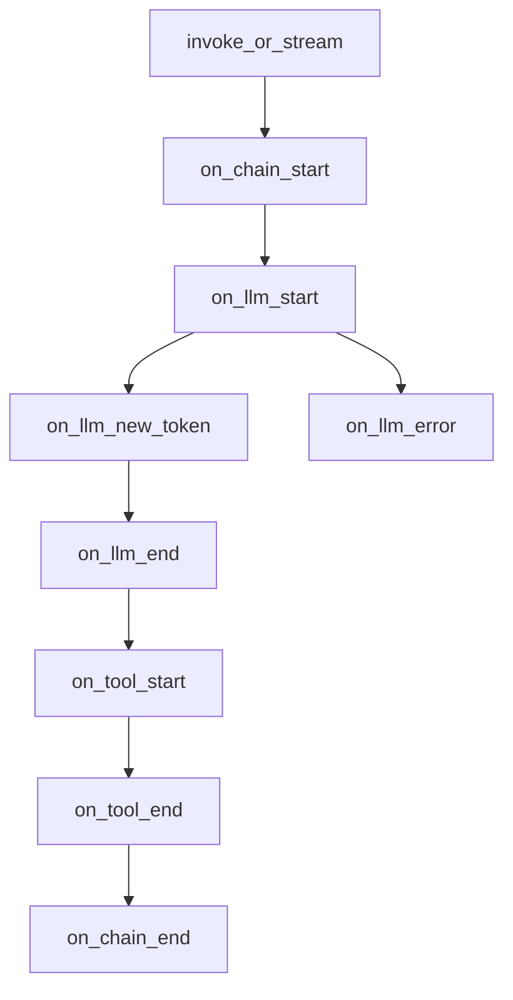

# Callbacks: the event hook system

## 30-second answer

Callbacks are push hooks under every LangChain runnable. Events like `on_chain_*`, `on_llm_*`, `on_tool_*`, and `on_retriever_*` fire as work runs. Subclass `BaseCallbackHandler` (or `AsyncCallbackHandler`). Attach via the model constructor or `config={"callbacks": [...]}`. Push metrics, cost, audit lines, or tokens to sinks you own. LangSmith tracing is itself a callback handler — not a rival API.

## Tiny example

Your support API must bill per request and write an audit line when a tool runs. You attach a fresh `CostTracker` and `AuditLog` on each HTTP request with `config={"callbacks": [...]}`. When `lookup_leave` runs, `on_tool_start` / `on_tool_end` pair by `run_id`. At the end you print tokens and USD for that user only — not a shared counter on the model.

## Why it exists

Providers and LCEL do not know about your Prometheus meter, JSONL audit file, or WebSocket. You need a push hook that sees nested calls — including agent tool loops — without rewriting every chain. Callbacks are that seam. Notebook 19 stores searchable history. Notebook 21 pulls events in your loop. Callbacks push to sinks LangChain does not own.

## Runtime

**Attach and fire**

1. Invoke or stream with handlers in `config["callbacks"]` and/or model `callbacks=`.
2. Parent fires `on_chain_start`; children nest; `on_chain_end` closes.
3. Before the provider call: `on_llm_start` / `on_chat_model_start` with prompts or messages.
4. If streaming: each token → `on_llm_new_token`. With `invoke` alone you only get `on_llm_end`.
5. On completion: `on_llm_end` carries `response.generations[0][0].message` with `usage_metadata`.
6. Tools: `on_tool_start` / `on_tool_end` / `on_tool_error` paired by `run_id`.
7. Retrievers: `on_retriever_end` delivers the documents used.
8. Errors: `on_*_error` for alerting.

**Cost tracker pattern**

1. On each `on_llm_end`, sum `input_tokens` / `output_tokens` from `usage_metadata`.
2. Price by `response_metadata.model_name`.
3. `cost_usd = (in * price_in + out * price_out) / 1_000_000`.
4. Attach a **new** tracker per request: `config={"callbacks": [tracker]}`.

**Constructor vs request scope**

1. `get_chat_model(callbacks=[lifetime_tracker])` — every later call on that instance.
2. `config={"callbacks": [request_tracker]}` — this call only.
3. Use request scope for anything per-user. Constructor-shared counters mix users.

**Streaming to a UI**

1. `TokenStreamHandler.on_llm_new_token` sends each token.
2. Pair with `.stream()`. `invoke` alone → end event only.
3. For LCEL UIs, `astream_events` (notebook 21) is often the better pull API. Callbacks stay the push path for WebSockets and metrics.

**Audit + async**

1. `AuditLog` writes JSONL with actor, tool name, truncated I/O, status.
2. `AsyncCallbackHandler` for event-loop services — sync DB writes in handlers stall requests.
3. Wrap handler bodies in `try/except` so metrics never kill the run (`SafeHandler`).



*Picture: one invoke fires a chain of start/token/end hooks; errors have their own path.*

| Mechanism | Direction | Use when |
|---|---|---|
| Callbacks | Push out | Metrics, audit, WebSocket, cost |
| `astream_events` | Pull in your loop | UI streaming with typed events |
| LangSmith | Store + UI | Searchable history, datasets |

## Objects, fields, and merge rules

| Piece | Role |
|---|---|
| `BaseCallbackHandler` | Sync base; override what you need |
| `AsyncCallbackHandler` | Async hooks |
| `run_id` | Joins tool start/end/error |
| `usage_metadata` | Tokens on `on_llm_end` |
| Constructor `callbacks=` | Lifetime attachment |
| `config={"callbacks": [...]}` | Request-scoped attachment |

**Merge rules**

- Constructor and config handlers both see events; constructor handlers see every later call on that model.
- New handler instance per request for per-user state.
- `on_llm_new_token` only fires when the call actually streams.
- Handler exceptions can abort the run — never raise for logging.
- Do not log full prompts blindly; they often hold PII (see notebook 20a).

## Control surface

| Knob | Effect |
|---|---|
| `config={"callbacks": [...]}` | Per-request push |
| Model constructor `callbacks=` | Forever-on (dangerous for per-user state) |
| Cost / audit / token handlers | Meter, prove, stream |
| `AsyncCallbackHandler` | Non-blocking metrics |
| `SafeHandler` try/except | Metrics never break the request |

## Failure anatomy

| Symptom | Cause | Fix |
|---|---|---|
| Token counter mixes users | Handler on shared model constructor | New handler per request in `config` |
| No token events | Used `invoke` | Stream, or use `astream_events` |
| Request stalls under load | Sync handler blocks on I/O | Async handler + await |
| Chain dies after successful LLM | Handler raised | Swallow metrics errors |
| Audit missing failures | Only `on_tool_end` | Also `on_tool_error`; key by `run_id` |
| PII in logs | Logged full prompts | Redact first |

## Keywords

- **`BaseCallbackHandler` / `AsyncCallbackHandler`** — sync vs async hooks.
- **`on_llm_end` / `usage_metadata`** — where cost lives.
- **`on_llm_new_token`** — only when streaming.
- **`run_id`** — join key for tool audit.
- **Constructor vs config scope** — shared forever vs per request.
- **Safe handler** — never raise for logging.

## Minimal fragment

```python
from langchain_core.callbacks import BaseCallbackHandler

class CostTracker(BaseCallbackHandler):
    def __init__(self):
        self.input_tokens = self.output_tokens = 0

    def on_llm_end(self, response, **kwargs):
        try:
            usage = response.generations[0][0].message.usage_metadata or {}
        except (AttributeError, IndexError):
            return
        self.input_tokens += usage.get("input_tokens", 0)
        self.output_tokens += usage.get("output_tokens", 0)

tracker = CostTracker()
chain.invoke({"question": "What is RAG?"}, config={"callbacks": [tracker]})
print(tracker.input_tokens, tracker.output_tokens)
```

## Interview traps

**Shallow:** "Callbacks are legacy; use LangSmith only."

**Better:** LangSmith *is* a callback path. You still need custom handlers for audit, cost, and WebSocket sinks LangSmith does not own.

**Shallow:** "Attach the cost tracker once on the model."

**Better:** Constructor scope shares mutable state across requests — billing bug and data leak.

**Shallow:** "`on_llm_new_token` always fires."

**Better:** Only when the call streams. LCEL UIs often prefer `astream_events`.

## Lab

Hands-on: [20_callbacks.ipynb](../../04-langchain-production/20_callbacks.ipynb)
