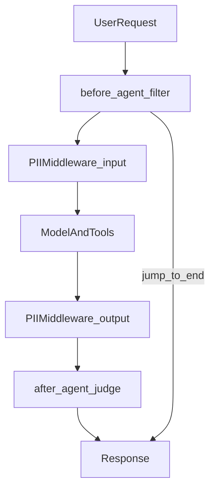

# Guardrails: PII, injection, and safety middleware

## 30-second answer

Guardrails are automatic middleware on `create_agent`. They block or rewrite content before the model or before the user. Built-in `PIIMiddleware` redacts, masks, blocks, or hashes known PII on input and/or output. Custom `AgentMiddleware` hooks (`before_agent`, `after_agent`, `wrap_model_call`, `wrap_tool_call`) add injection filters and topic fences. Run **cheap checks before the model**. Use human approval for irreversible tools, not every chat turn.

## Tiny example

A user pastes an email and a card number, then tries “ignore previous instructions.” Your stack runs in order: keyword filter in `before_agent` (free) → `PIIMiddleware` redacts email and masks the card → model never sees raw PII → output PII pass → optional cheap judge for medical advice. The jailbreak never burns a model call. The card digits never hit the provider log.

## Why it exists

Human-in-the-loop (notebook 36) pauses for a human click. Guardrails are the automatic half: refuse or redact without waiting. Security reviews ask three questions: Can the agent leak PII? Can a user inject jailbreak text? Can the agent give regulated advice it should not? This chapter answers all three.

## Runtime

**Wire middleware into the agent**

1. `create_agent(model, tools=[], system_prompt=..., middleware=[...])` compiles hooks into the graph.
2. Inspect with `agent.get_graph().nodes` — middleware is graph structure, not a sidecar process.
3. Pair with `ModelCallLimitMiddleware(run_limit=..., exit_behavior="end")` so attacks cannot burn unbounded tokens.

**Built-in `PIIMiddleware`**

1. One instance per type: `"email"`, `"credit_card"` (phone is a common exercise).
2. Strategies: `redact` → `[REDACTED_EMAIL]`; `mask` → keep last digits; `block` → refuse; `hash` → irreversible for analytics.
3. `apply_to_input=True` so the model never sees raw PII.
4. `apply_to_output=True` so a leaky model cannot echo PII back.

**Cheap input filter (`before_agent`) — run this first**

1. Keyword or regex checks cost CPU only. No model call.
2. Read human text from `state["messages"]`.
3. On banned phrases (`ignore previous`, `jailbreak`, `dan mode`), return `{"messages": [AIMessage(...)], "jump_to": "end"}`.
4. Return `None` to continue.

**Model judge (`after_agent`) — run this last**

1. After the agent answers, a second cheap model grades via `.with_structured_output(SafetyVerdict)`.
2. `SafetyVerdict`: `safe: bool`, `reason: str`.
3. If safe, return `None`. If unsafe, replace the final answer with a refusal.
4. Use for topic fences regex cannot express (medical / legal / personal finance).

**Layered stack (order matters)**

1. Cheap `before_agent` filter.
2. `PIIMiddleware` on input.
3. `ModelCallLimitMiddleware`.
4. Optional HITL for irreversible tools only (notebook 36).
5. Model + tools.
6. `PIIMiddleware` on output.
7. Expensive safety judge last.



*Picture: cheap filter and PII run before the model; PII and the judge run after; a bad phrase can jump straight to the response.*

| Hook | Fires | Use for |
|---|---|---|
| `before_agent` | Start | Block bad inputs early (cheap) |
| `wrap_model_call` | Around each model call | Rewrite prompts, swap models |
| `wrap_tool_call` | Around each tool call | Timeouts, allow-lists |
| `after_agent` | End | Output validation (expensive) |
| `PIIMiddleware` | Built-in | Known PII types |
| `HumanInTheLoopMiddleware` | Before selected tools | Irreversible actions |

## Objects, fields, and merge rules

| Object | Role |
|---|---|
| `AgentMiddleware` | Base for custom hooks |
| `PIIMiddleware(...)` | Built-in PII wrap |
| `ModelCallLimitMiddleware` | Cost / loop ceiling |
| `SafetyVerdict` | `safe` + `reason` for the judge |
| Return with `jump_to: "end"` | Short-circuit without LLM spend |
| Return `None` | No change; continue |

**Merge rules**

- Middleware list order **is** execution order: cheap first, expensive last.
- Apply PII on **input and output**.
- `before_agent` short-circuit prevents model spend on injection phrases.
- Guardrails do not replace HITL for irreversible side effects.

## Control surface

| Knob | Effect |
|---|---|
| `before_agent` banned phrases | Free injection block |
| `PIIMiddleware` type / strategy / apply_to_* | What gets redacted where |
| `ModelCallLimitMiddleware` | Hard stop under attack |
| Judge prompt + `SafetyVerdict` | Topic fence |
| HITL `interrupt_on` | Irreversible tools only |

## Failure anatomy

| Symptom | Cause | Fix |
|---|---|---|
| Model still sees raw email | Only output PII | `apply_to_input=True` |
| Injection still burns tokens | Filter after model / prompt only | Move check to `before_agent` + `jump_to` |
| Agent loops forever under attack | No call limit | `ModelCallLimitMiddleware` |
| HITL on every chat turn | Misplaced approval | HITL for irreversible tools only |
| Safety false positives | Vague judge prompt | Tighten criterion; log verdicts |

## Keywords

- **Guardrails** — automatic refuse/redact without a human pause.
- **`PIIMiddleware`** — redact/mask/block/hash on known PII.
- **`before_agent` / `jump_to`** — cheap early exit.
- **`after_agent`** — post-answer validation.
- **Defence in depth** — cheap checks before the model; expensive judges last.
- **`ModelCallLimitMiddleware`** — hard ceiling on model calls.

## Minimal fragment

```python
from langchain.agents import create_agent
from langchain.agents.middleware import PIIMiddleware, ModelCallLimitMiddleware

agent = create_agent(
    model,
    tools=[],
    system_prompt="Repeat back what the user told you.",
    middleware=[
        PIIMiddleware("email", strategy="redact", apply_to_input=True),
        PIIMiddleware("credit_card", strategy="mask", apply_to_input=True),
        PIIMiddleware("email", strategy="redact", apply_to_output=True),
        ModelCallLimitMiddleware(run_limit=3, exit_behavior="end"),
    ],
)
out = agent.invoke({
    "messages": [{"role": "user", "content": "My email is a@b.com"}],
})
```

## Interview traps

**Shallow:** "System prompts are enough against jailbreaks."

**Better:** Put cheap keyword checks in `before_agent` so bad phrases never reach the model. Add an output judge for advice regex cannot catch.

**Shallow:** "Redact on output only."

**Better:** Input redaction keeps PII out of provider logs and the model. Output redaction catches echoes.

**Shallow:** "One fat middleware does everything."

**Better:** Cheap filters first. Expensive LLM judges last. Order is the design.

**Shallow:** "Guardrails replace human approval."

**Better:** HITL still owns irreversible tool calls. Guardrails own automatic refuse/redact.

## Lab

Hands-on: [20a_guardrails_pii_and_safety.ipynb](../../04-langchain-production/20a_guardrails_pii_and_safety.ipynb)
