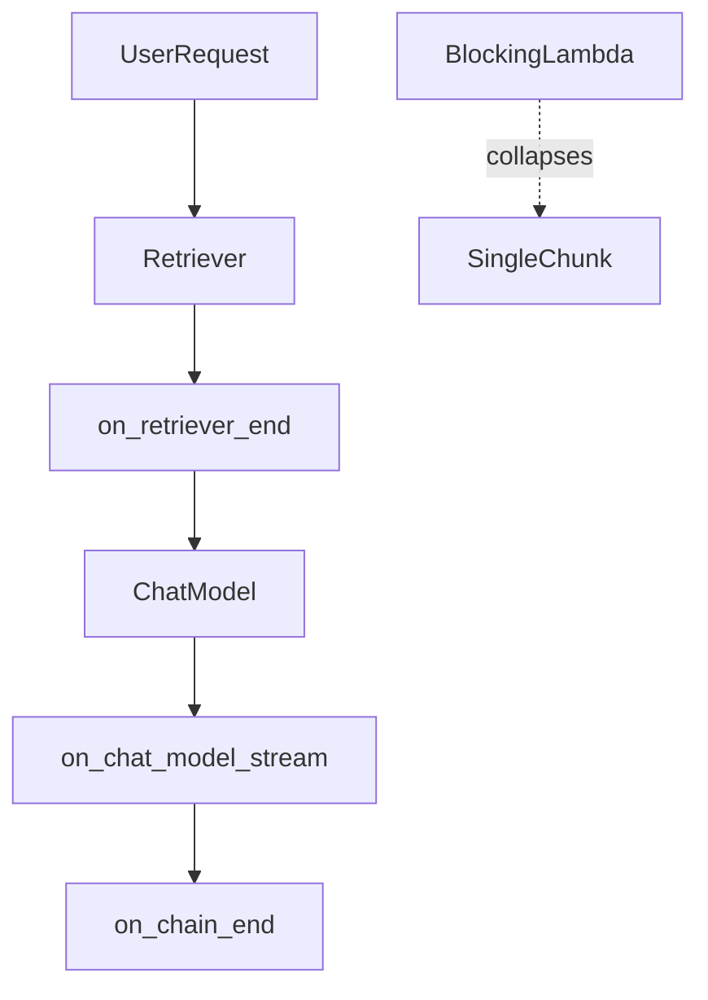

# Streaming: TTFT, events, and stream modes

## 30-second answer

Streaming cuts **felt** wait, not provider generation time. Tokens arrive as they generate. Models yield `AIMessageChunk` pieces that add with `+`. LCEL `.stream()` works end-to-end only if every step can emit partials. Use `astream_events(version="v2")` for fine-grained UI events. Use LangGraph `stream_mode` (`values` / `updates` / `messages` / …) for agents.

## Tiny example

A policy answer takes about four seconds. With `invoke`, the browser spinner sits still until the end — the user thinks the product is broken. With `.stream()` or `astream_events`, the first token paints in a few hundred milliseconds. Same total time. Completely different product. If you add a blocking `lambda text: text.upper()` after the model, the client waits until the end again — one late chunk.

## Why it exists

A RAG answer may take ~4 seconds. An agent may take ~20. Without streaming the user stares at a blank screen. With streaming they see progress fast. **Perceived** latency is the whole game. This chapter covers the four streaming surfaces and which to use where.

## Runtime

**Model stream vs invoke**

1. `model.stream(prompt)` yields chunks. Measure first non-empty content as TTFT (time to first token).
2. `model.invoke(...)` waits for the full answer — same total time, nothing visible until done.
3. Accumulate: `collected = chunk if collected is None else collected + chunk` → full message including usage on the rebuilt object.

**Why the client sometimes waits until the end anyway**

1. You called `invoke` instead of `stream` / `astream`.
2. An LCEL step needs the **whole** upstream string (eager lambda, some parsers) — the pipeline collapses to one chunk.
3. Proxies buffer the response (nginx without `X-Accel-Buffering: no`).
4. Retrieval and rewrite run **before** the first token — TTFT includes that work even when tokens stream after.

**LCEL chain streaming**

1. `prompt | model | StrOutputParser()` streams string pieces.
2. A blocking `RunnableLambda(lambda text: text.upper())` collapses to **one** chunk.
3. Generator form preserves flow: yield each uppercased token.
4. `JsonOutputParser` emits progressive dicts — forms fill field by field.

**`astream_events` (fine-grained)**

1. `stream` gives incremental **final** output. `astream_events(..., version="v2")` gives every internal event.
2. RAG pattern: on `on_retriever_end` show sources; on `on_chat_model_stream` print token content; on root `on_chain_end` mark done.
3. Filter with `include_names=[...]` to isolate one component.

**Agents / graphs (`stream_mode`)**

1. `"updates"` — what each node produced — good for “calling tool X…”.
2. `"messages"` — `(token, metadata)` tuples; filter `langgraph_node == "model"` for answer tokens.
3. `"values"` — full state after each step — debugging / progress bars.
4. Multiple modes: `stream_mode=["updates", "messages"]` yields `(mode, payload)` pairs.
5. Also: `"custom"` (notebook 42), `"debug"`.

**SSE and errors**

1. FastAPI shape: `StreamingResponse` + SSE events `sources` / `token` / `done`.
2. Heartbeat ~every 15s; `X-Accel-Buffering: no` behind nginx; cancel on disconnect so you stop paying.
3. Mid-stream failure: decide partial answer vs re-raise in advance.



*Picture: retrieval can paint sources early; tokens stream next; a blocking step turns the whole stream into one late chunk.*

| `stream_mode` | Yields | Use for |
|---|---|---|
| `"values"` | Full state after each step | Debugging |
| `"updates"` | Per-node delta | “Calling tool X…” |
| `"messages"` | `(token, metadata)` | Chat tokens |
| `"custom"` / `"debug"` | Your emits / everything | Progress / deep debug |

## Objects, fields, and merge rules

| Object / mode | Role |
|---|---|
| `AIMessageChunk` | Partial message; `+` merges |
| LCEL `.stream()` | Incremental final output |
| `astream_events` | Typed internal events |
| `stream_mode` | Graph observation grain |
| `include_names` | Restrict event stream |

**Merge rules**

- Chunk addition rebuilds one logical message.
- Any step that must see the whole upstream value kills streaming after it.
- Graph `messages` mode still includes non-answer nodes — filter by `langgraph_node`.
- TTFT includes work **before** the first token.

## Control surface

| Knob | Effect |
|---|---|
| `.stream` / `.astream` | Incremental final output |
| `astream_events(version="v2")` | Every internal event |
| `stream_mode` | Agent/graph grain |
| Generator vs eager lambda | Preserve vs kill streaming |
| SSE heartbeats / nginx headers | Keep proxies from buffering |
| TTFT measurement | Optimise what users feel |

## Failure anatomy

| Symptom | Cause | Fix |
|---|---|---|
| Blank UI until done | Called `invoke` | Switch to stream / astream |
| One chunk, long wait | Blocking post-step | Generator / stream-aware parser |
| Tokens from tool thoughts | Unfiltered `messages` | Filter by `langgraph_node` |
| Proxy closes connection | No heartbeats / buffering | SSE comments; disable buffer |
| Bad TTFT after “optimization” | Rewrite/rerank before tokens | Measure TTFT; skip empty-history rewrite |
| Still paying after user left | No disconnect cancel | Stop generation on abort |

## Keywords

- **TTFT** — time to first token; what users feel.
- **`AIMessageChunk`** — streamed partial; add with `+`.
- **Blocking step** — needs whole input; collapses the stream.
- **`astream_events`** — sources-then-answer UIs.
- **`stream_mode`** — LangGraph grain for agents.
- **SSE** — transport; heartbeats and disconnect handling required.

## Minimal fragment

```python
async for event in rag_chain.astream_events({"question": q}, version="v2"):
    if event["event"] == "on_retriever_end":
        docs = event["data"]["output"]
        print("sources", len(docs))
    elif event["event"] == "on_chat_model_stream":
        token = event["data"]["chunk"].content
        if token:
            print(token, end="", flush=True)

for token, meta in agent.stream(question, stream_mode="messages"):
    if token.content and meta.get("langgraph_node") == "model":
        print(token.content, end="", flush=True)
```

## Interview traps

**Shallow:** "Streaming makes the model faster."

**Better:** Total generation time is similar. TTFT and progressive paint change how fast it *feels*.

**Shallow:** "Any LCEL chain streams."

**Better:** A step that needs the full input collapses the stream to one chunk — the client waits until the end.

**Shallow:** "`stream` and `astream_events` are the same."

**Better:** `stream` is final output. `astream_events` exposes retrieval, tools, and model internals for the UI.

**Shallow:** "TTFT only measures the LLM."

**Better:** Retrieval, rewriting, and blocking pre-steps all count against first paint.

## Lab

Hands-on: [21_streaming.ipynb](../../04-langchain-production/21_streaming.ipynb)
