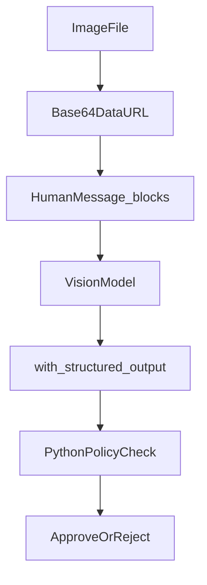

# Multimodal: images as message content blocks

## 30-second answer

Text messages use string `content`. Multimodal messages use a **list of blocks**: text plus `{"type": "image_url", "image_url": {"url": ...}}`. The URL is remote or `data:image/{mime};base64,...`. Vision models (`get_vision_model` / `VISION_MODEL`) read pixels. Pair with `with_structured_output` for extraction, then apply policy in plain Python. Resize before encoding — base64 adds ~33% and every character is billed.

## Tiny example

An employee uploads a hotel receipt photo. You resize to ~1024px, build a `HumanMessage` with text + base64 image blocks, and call `vision_model.with_structured_output(ExpenseReceipt)`. The model fills vendor, nights, and totals. Your Python `check_expense_policy` decides auto-approve or manager review. The model never owns the money decision.

## Why it exists

Half of support tickets arrive as screenshots. Half of expense claims arrive as receipt photos. A text-only assistant is blind. Multimodal models take images beside text in the same message. Most Groq models are text-only — set `VISION_MODEL` or cells skip cleanly.

## Runtime

**Content blocks**

1. Text-only: `HumanMessage("What is in this image?")` → `content` is a `str`.
2. Multimodal: list of `{type: text}` and `{type: image_url, image_url: {url}}` blocks.
3. Remote URL only works if the provider can reach it. Private files need inline base64.

**Local image → data URL**

1. Load or generate a file (lab builds a receipt PNG).
2. Encode to base64; MIME from suffix (`png`, `jpeg`, `webp`, `gif`).
3. Base64 inflates size ~33%. Resize before encode.

**Ask and extract**

1. Freeform: `vision_model.invoke([image_message(path, prompt)])`.
2. Product path: `vision_model.with_structured_output(ExpenseReceipt)`.
3. Policy in Python (`HOTEL_LIMITS`, `APPROVAL_LIMITS`) → approve / reject / manual review.
4. Rule: **model reads pixels; Python owns arithmetic and the verdict.**

**Multiple images, chains, agents**

1. Several `image_url` blocks in one `HumanMessage` for comparison.
2. `ChatPromptTemplate` human part as a list of blocks with placeholders.
3. `create_agent(model=vision_model, tools=[get_expense_limit], ...)` with multimodal human messages.

**Cost hygiene**

1. Prefer ~1024px long edge. PNG for screenshots; JPEG for photos.
2. Verify numbers: `abs((subtotal + tax) - total) < 1` else manual review.
3. Handwriting is weak — use dedicated OCR when needed.
4. Other modalities: PDF → pages/images/text; audio → transcript first; video → sampled frames.



*Picture: file becomes a data URL inside a message; the vision model extracts fields; Python applies the policy.*

## Objects, fields, and merge rules

| Piece | Shape / role |
|---|---|
| Text `HumanMessage` | `content: str` |
| Multimodal `HumanMessage` | `content: list[dict]` blocks |
| Image block | `{"type": "image_url", "image_url": {"url": "..."}}` |
| Data URL | `data:image/{mime};base64,{payload}` |
| `ExpenseReceipt` | Pydantic extraction schema |
| `VISION_MODEL` / `get_vision_model()` | Multimodal chat model |

**Merge rules**

- Block order is part of the prompt.
- MIME must match the file type.
- Multiple images are multiple blocks in **one** message.
- Treat text OCR’d from images as untrusted (image prompt injection is real).

## Control surface

| Knob | Effect |
|---|---|
| `VISION_MODEL` | Select multimodal provider/model |
| Remote URL vs base64 | Public reachability vs private inline |
| Resize `max_edge` | Token and latency control |
| `with_structured_output` | Image → typed record |
| Arithmetic cross-check | Catch misread digits |
| Provider `detail` (OpenAI) | `"low"` / `"high"` / `"auto"` |

## Failure anatomy

| Symptom | Cause | Fix |
|---|---|---|
| Cells skip | No vision model | Set `VISION_MODEL` |
| Provider cannot fetch image | Private URL | Inline base64 |
| Huge bill | Full phone resolution | Resize before encode |
| Wrong totals | Digit misread | Structured fields + sum check |
| Model “approves” over-limit stay | Policy left to the LLM | Deterministic limits in Python |
| Injection via image text | Adversarial OCR’d instructions | Treat image text as untrusted |

## Keywords

- **Content blocks** — multimodal `content` is a list of typed dicts.
- **`image_url` / data URL** — remote or base64 payload.
- **Base64 inflation** — ~+33%; resize first.
- **Policy split** — model reads pixels; Python owns the verdict.
- **Number verification** — cross-check extracted totals.

## Minimal fragment

```python
import base64
from langchain.messages import HumanMessage

def image_message(path, prompt: str) -> HumanMessage:
    b64 = base64.b64encode(path.read_bytes()).decode("utf-8")
    return HumanMessage(content=[
        {"type": "text", "text": prompt},
        {"type": "image_url", "image_url": {
            "url": f"data:image/png;base64,{b64}",
        }},
    ])

receipt = vision_model.with_structured_output(ExpenseReceipt).invoke(
    [image_message(receipt_path, "Extract the expense details.")]
)
decision = check_expense_policy(receipt)
print(decision["verdict"], decision["reason"])
```

## Interview traps

**Shallow:** "Pass the file path to the model."

**Better:** Providers need a URL or base64 content blocks inside the message.

**Shallow:** "Let the vision model decide approve/reject."

**Better:** Model reads pixels. Python owns arithmetic and policy so you can audit it.

**Shallow:** "Higher resolution is always better."

**Better:** Tokens scale with image size. About 1024px often matches accuracy at far lower cost.

**Shallow:** "Multimodal means the model draws images."

**Better:** Chat vision is input understanding. Image **output** is a separate generation API.

## Lab

Hands-on: [22_multimodal.ipynb](../../04-langchain-production/22_multimodal.ipynb)
