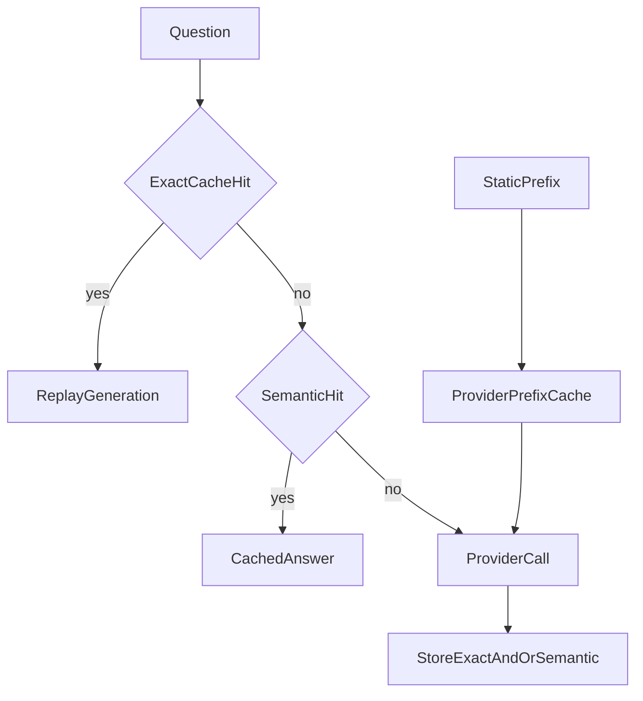

# Caching: exact, semantic, and prompt-prefix

## 30-second answer

Three different caches. (1) **Model cache** (`set_llm_cache(InMemoryCache|SQLiteCache)`) keys on exact prompt + model + params and replays a prior generation. (2) **Semantic cache** embeds the query and returns a stored answer above a similarity threshold. (3) **Provider prompt caching** reuses work on a shared **prefix** — you still get a fresh completion, cheaper input. Never share one response cache across tenants. Version keys or use TTL for invalidation.

## Tiny example

Forty people ask “What are the API rate limits?” in slightly different words. Exact cache hits only the identical string. Semantic cache can hit paraphrases if the threshold is high enough. A long static handbook in the system message is a third story: provider prompt caching discounts the repeated prefix; the answer is still new each time.

## Why it exists

Support bots hear the same questions all day. Paying for identical generations is waste. People mix up three mechanisms: exact duplicate answers, near-duplicate intent, and re-processing a long static prompt. Mixing them up makes “why didn’t it hit?” debugging painful.

## Runtime

**Exact model cache**

1. `set_llm_cache(InMemoryCache())` installs a global exact-match cache.
2. First `model.invoke(q)` misses → provider. Second identical call hits → same content replayed.
3. Cache key = prompt string + model name + all parameters. Trailing space, different case, or different temperature → miss.
4. `SQLiteCache(database_path=...)` persists across restarts. `InMemoryCache` dies with the process.
5. Disable: `set_llm_cache(None)`, or `get_chat_model(cache=False)`.

**When exact caching is wrong**

- Answer depends on time or live state.
- You want variety (brainstorming).
- Answers are user-specific — shared cache across tenants leaks data.
- Prompt embeds changing retrieved content — verify the key includes it.

**Per-tenant isolation**

1. `TENANT_CACHES[tenant_id] = InMemoryCache()`; pass that object into `get_chat_model(cache=...)`.
2. Never share one FAQ response cache for personalized content.

**Semantic caching**

1. Embed the query; if best score ≥ threshold, return stored answer; else generate and store.
2. Lab cosine similarity: higher is better. Start threshold high (~0.95). Lower only with evidence.
3. Danger: negation and near-synonyms (“annual leave” vs “sick leave”) can false-hit.
4. Never semantically cache high-stakes domains (pricing, legal, medical, security). Log both questions on a hit. Set a TTL.
5. Optional Redis: `RedisSemanticCache` — **distance** lower is stricter (opposite of cosine similarity thresholds).

**Provider prompt caching**

1. Provider caches processing of a repeated **prefix** (long system prompt, big doc, tool schema).
2. You still get a fresh generation. You pay less for the prefix. Read `usage_metadata.input_token_details.cache_read`.
3. Rule: put static content **first**, variable question **last**. Variable content early destroys the shared prefix.



*Picture: exact hit replays an answer; semantic hit can catch paraphrases; prompt caching only cheapens a repeated prefix before a fresh generation.*

| Layer | Cache | Why |
|---|---|---|
| Embeddings | `CacheBackedEmbeddings` (notebook 11) | Always safe |
| Model responses | `SQLiteCache` / Redis | Exact repeats |
| Near-duplicate questions | Semantic, high threshold | FAQ traffic |
| Long static prompts | Provider prompt caching | Big automatic saving |

## Objects, fields, and merge rules

| Cache | Key / match | Returns |
|---|---|---|
| `InMemoryCache` / `SQLiteCache` | Prompt + model + params | Exact prior generation |
| Lab `SemanticCache` | Similarity ≥ threshold | Prior answer string |
| `RedisSemanticCache` | Distance ≤ threshold + TTL | Semantic via Redis |
| Provider prompt cache | Shared prefix | Fresh output; cheaper input |
| `VersionedCache` | `(version, question)` | App-level answer map |

**Merge rules**

- Exact hit **replays** a previous generation — it does not resample.
- Prompt-cache hit is not an answer hit: output is new; prefix input is discounted.
- Tenant isolation: separate caches or tenant id in the key.
- Redis distance vs cosine similarity use opposite “stricter” directions.

## Control surface

| Knob | Effect |
|---|---|
| `set_llm_cache(...)` | Global backend |
| `get_chat_model(cache=...)` | Opt out or dedicate a cache |
| Semantic threshold / Redis distance | Hit rate vs false positives |
| Prompt ordering | Static first → cacheable prefix |
| Versioned key / TTL | Invalidate after policy change |
| Per-tenant cache map | Isolation |

## Failure anatomy

| Symptom | Cause | Fix |
|---|---|---|
| Expected hit is miss | Trailing space / temp / case | Normalize inputs |
| Wrong answer on paraphrase | Semantic threshold too low | Raise threshold; log both questions |
| Negation served as yes | Embeddings ignore “not” | Do not semantic-cache high-stakes domains |
| Stale policy answer | No invalidation | Version key or TTL |
| Cross-tenant leak | Shared cache | Per-tenant caches |
| Prompt cache never warms | Variable content at front | Move static bulk first |

## Keywords

- **Exact cache** — prompt + model + params; replay generation.
- **Semantic cache** — embedding similarity; paraphrase risk.
- **Prompt caching / `cache_read`** — cheaper repeated prefixes; fresh output.
- **Per-tenant cache** — never share user-specific answers.
- **Version / TTL** — kill stale policy answers.

## Minimal fragment

```python
from langchain_core.caches import InMemoryCache
from langchain_core.globals import set_llm_cache

set_llm_cache(InMemoryCache())
first = model.invoke(question)   # miss
second = model.invoke(question)  # hit — same content

set_llm_cache(None)
uncached = get_chat_model(cache=False)

# Prompt caching: static SystemMessage(LONG_POLICY) first,
# then HumanMessage(question); check usage cache_read.
```

## Interview traps

**Shallow:** "Caching always means cheaper completions."

**Better:** Exact/semantic caches store answers. Prompt caching only discounts repeated **prefixes**.

**Shallow:** "Semantic cache is always better."

**Better:** Negation and near-synonym collisions make it dangerous for pricing, legal, and medical.

**Shallow:** "InMemoryCache is fine for production."

**Better:** It dies on restart. Use SQLite or Redis, and isolate tenants.

**Shallow:** "A cache hit means the provider regenerated faster."

**Better:** Exact hits replay a stored generation. Prompt-cache hits still generate new output with a discounted prefix.

## Lab

Hands-on: [23_caching.ipynb](../../04-langchain-production/23_caching.ipynb)
