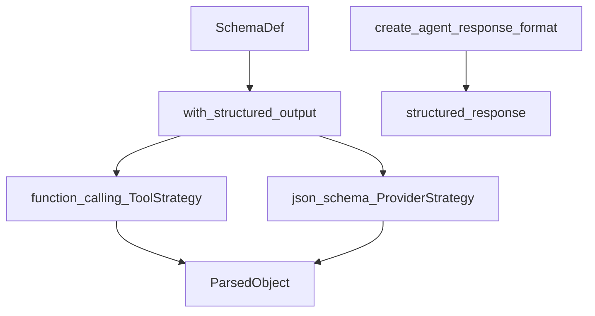

# Structured outputs: schemas, strategies, agents

## 30-second answer

`.with_structured_output(Schema)` turns a chat model into a typed function: Pydantic / TypedDict / JSON schema in, validated object or dict out. Under the hood, `method="function_calling"` (`ToolStrategy`) or `method="json_schema"` (`ProviderStrategy`) constrains decoding. Use `include_raw=True` for `parsed` / `raw` / `parsing_error`. Agents finish as typed objects via `create_agent(..., response_format=ToolStrategy(Schema))` and read `outcome["structured_response"]`.

## Tiny example

A triage bot must return priority, category, and whether to escalate — not free prose. You define `TicketTriage` with `Literal` fields and call `model.with_structured_output(TicketTriage)`. The next line of code reads `result.priority` and routes a queue. No regex. No “please reply in JSON” hope.

## Why it exists

Notebook 05 taught hope-driven parsing: ask for JSON, parse text, repair when it fails. Providers now support constrained decoding. You hand them a schema and the model is restricted to matching output. That turns a text generator into a typed node you can insert into a database and assert on in a test.

## Runtime

**Schema → typed call**

1. Prefer Pydantic `BaseModel` + `Field(description=...)` + `Literal`.
2. `structured = model.with_structured_output(TicketTriage)` — leave `method` unset and LangChain picks.
3. `invoke` / `batch` returns a validated instance (Pydantic) or a plain `dict` (TypedDict / raw JSON schema).
4. Force the mechanism when you need reproducibility: `method="function_calling"` or `method="json_schema"`.

**Three schema forms**

1. Pydantic — validation, defaults, attribute access. Default choice.
2. TypedDict — lighter; returns `dict`.
3. Raw JSON schema `dict` — dynamic or external schemas; returns `dict`.

**Strategies**

1. `ToolStrategy` / `function_calling`: schema as a tool the model “calls”. Portable.
2. `ProviderStrategy` / `json_schema`: native constrained decoding. Strongest where supported.
3. Imports: `from langchain.agents.structured_output import ProviderStrategy, ToolStrategy`.

**Production hardening**

1. `include_raw=True` → `parsed`, `raw`, `parsing_error`.
2. If `parsing_error` or `parsed is None`, return a manual-review fallback — do not crash the request.
3. Provider enforces **shape**. `@field_validator` / `@model_validator` enforce **business rules**.

**Chains and agents**

1. LCEL: `ChatPromptTemplate | model.with_structured_output(Schema)`.
2. Agent: `create_agent(..., response_format=ToolStrategy(TicketAnalysis))`.
3. Read `outcome["structured_response"]` after tools run.

**Schema design**

1. Describe every field — `description` is prompt text the model reads.
2. Prefer `Literal` over free `str` for closed sets.
3. Keep schemas flat; deep nesting hurts accuracy.
4. Put reasoning fields before the decision field.
5. Avoid more than ~15 fields per call; split instead.



*Picture: a schema binds the model; function calling or provider JSON schema both produce a parsed object; agents expose it as structured_response.*

## Objects, fields, and merge rules

| Schema type | Returns | Use when |
|---|---|---|
| Pydantic | Validated instance | Default |
| TypedDict / JSON schema | `dict` | Light or dynamic |

| Strategy | Guarantee | Notes |
|---|---|---|
| `ToolStrategy` (`function_calling`) | Very high | Portable |
| `ProviderStrategy` (`json_schema`) | Absolute where supported | Fall back if unsupported |

**Merge rules**

- Provider validates JSON shape. Your validators encode product rules the model forgets.
- Unset `method` → best available. Set explicitly for reproducible behaviour.
- Field order is generation order: reason before decide.
- Agent `response_format` fills `structured_response` — no mandatory extra free-text call.

## Control surface

| Knob | Effect |
|---|---|
| `.with_structured_output(Schema)` | Typed function over the model |
| `method=` | Force function calling vs json schema |
| `include_raw=True` | Survive parse failures |
| `Field(description=...)` / `Literal` | Model-facing instructions and enums |
| Validators | Domain invariants after shape check |
| `response_format=ToolStrategy(...)` | Typed agent finale |

## Failure anatomy

| Symptom | Cause | Fix |
|---|---|---|
| `json_schema` exception | Provider unsupported | Fall back to `function_calling` |
| Crash on bad output | No `include_raw` | Check `parsing_error`; fallback object |
| Security ticket not escalated | Relied on prompt memory | `model_validator` forcing specialist |
| Low accuracy on fat schema | Too many fields / deep nest | Split calls; flatten |
| Agent returns prose only | No `response_format` | `ToolStrategy` + read `structured_response` |

## Keywords

- **`.with_structured_output`** — schema-bound typed call.
- **`ToolStrategy` / `ProviderStrategy`** — portable tool call vs native constrained decoding.
- **`include_raw`** — `parsed` / `raw` / `parsing_error`.
- **`response_format` / `structured_response`** — typed agent finale.
- **Field order** — reason before decide.

## Minimal fragment

```python
from langchain.agents import create_agent
from langchain.agents.structured_output import ToolStrategy

structured = model.with_structured_output(TicketTriage, include_raw=True)
outcome = structured.invoke(ticket_text)
parsed = outcome["parsed"]  # or fallback if outcome["parsing_error"]

agent = create_agent(
    model,
    tools=[ticket_history],
    system_prompt="Always check ticket history before deciding priority.",
    response_format=ToolStrategy(TicketAnalysis),
)
report = agent.invoke(
    {"messages": [{"role": "user", "content": "Acme dashboards are still slow."}]}
)["structured_response"]
print(report.priority, report.escalate)
```

## Interview traps

**Shallow:** "Structured output is just JSON mode in the prompt."

**Better:** Tool calling or provider constrained decoding binds the token space to the schema. Prompting for JSON is hope.

**Shallow:** "Pydantic validators are redundant if the provider validates."

**Better:** The provider validates shape. Your validator encodes product rules like “security always escalates.”

**Shallow:** "Always use `json_schema`."

**Better:** Not universal. `function_calling` / `ToolStrategy` is the portable default.

**Shallow:** "Agents cannot return typed objects."

**Better:** `response_format=ToolStrategy(Schema)` fills `structured_response` after the tool loop.

## Lab

Hands-on: [24_structured_outputs.ipynb](../../04-langchain-production/24_structured_outputs.ipynb)
