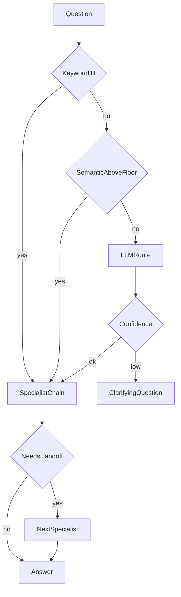

# Routing and handoffs

## 30-second answer

Routing classifies a request, then sends it to a specialist chain (short prompt, one job). Three classifiers: **keyword** scores, **semantic** centroid cosine with a floor for `"other"`, and **LLM** structured `Route`. Cascade cheap → expensive. Mid-conversation **handoffs** re-route with a hop cap. Low confidence should ask a clarifying question, not guess. `RunnableBranch` is one-shot — graphs own multi-hop shared state later.

## Tiny example

“You took money twice” has no billing keyword, so keyword routing says `"other"`. Semantic routing still lands on billing. The billing specialist answers in three sentences. Mid-chat the user asks about a SOC2 report — the billing desk returns a handoff to security with a short note, and a hop counter stops infinite bouncing.

## Why it exists

One prompt cannot be good at everything. A 2,000-token “do all desks” system prompt is mediocre at all four. Routing fixes this: classify, then send to a specialist. You get shorter prompts, cheaper calls, and the chance to use a small model for easy paths.

## Runtime

**Specialists first**

1. Build short LCEL chains (`billing`, `security`, `technical`, `howto`, `other`) with a hard answer budget.
2. Put them in a `ROUTES` dict. Each specialist is independently testable.

**Keyword routing (cheapest)**

1. Score keyword hits per route.
2. Wire with `RunnableBranch(*[(pred, chain), ...], default)` — first true wins; default last.
3. Score 0 → `"other"`. Free and predictable. Weak on unexpected phrasing.

**LLM routing**

1. `Route` model: `destination` Literal, `confidence`, `reason`.
2. `classifier = prompt | model.with_structured_output(Route)`.
3. Dispatch with `RunnablePassthrough.assign(route=classifier).assign(answer=...)`.

**Semantic routing (best default for most routers)**

1. Embed example utterances per route; store the mean **centroid**.
2. Cosine vs each centroid. If best score < `floor` (lab ~0.35), return `"other"`.
3. Without a floor, weather questions land on billing.

**Cascading (production shape)**

1. Keyword if not `"other"`.
2. Else semantic if score ≥ ~0.55.
3. Else LLM classifier.
4. Most traffic never pays for a full model classification call.

**Model routing**

1. Structured `Complexity` → `simple` vs `complex`.
2. Simple → fast/small model; complex → strong model. Often the largest cost saving.

**Handoffs**

1. Routing decides once at entry. A handoff happens when the specialist realises the desk is wrong.
2. `HandoffDecision`: `can_handle`, `handoff_to`, `context_for_next`.
3. Loop with `max_hops` (lab: 3). Without the cap, two specialists bounce forever.

**Low confidence**

1. If `route.confidence == "low"`, ask one clarifying question instead of dispatching.



*Picture: cheap keyword, then semantic, then LLM; low confidence asks; specialists can hand off with a hop limit.*

| Strategy | Cost | Robustness | Use when |
|---|---|---|---|
| Keyword | Free | Low | Controlled vocabulary |
| Semantic | One embedding | Good | Best default |
| LLM | One model call | Best | Nuanced overlap |

## Objects, fields, and merge rules

| Piece | Role |
|---|---|
| `ROUTES` | Name → specialist runnable |
| `RunnableBranch` | Ordered conditions + default last |
| `Route` | Destination + confidence + reason |
| Centroids / floor | Semantic match + other bucket |
| `HandoffDecision` / `max_hops` | Mid-flight re-route safety |

**Merge rules**

- Keyword score 0 ⇒ `"other"`.
- Semantic without a floor force-fits off-topic — always keep an other bucket.
- Cascade: first non-`other` keyword; else semantic above threshold; else LLM.
- `RunnableBranch` cannot pause for HITL or remember desks across turns — that is graph territory (labs 32/41).

## Control surface

| Knob | Effect |
|---|---|
| Keyword lists | Free, brittle |
| Example utterances / floor | Semantic robustness |
| Cascade thresholds | Cost vs accuracy |
| Fast vs strong model ids | Cost by complexity |
| `max_hops` | Handoff safety and cost bound |
| Confidence == low | Clarifier path |

## Failure anatomy

| Symptom | Cause | Fix |
|---|---|---|
| “You took money twice” → other | No billing keywords | Semantic or LLM hop |
| Weather → billing | No semantic floor | Require minimum cosine |
| Infinite handoff loop | No hop cap | `max_hops` |
| Ambiguous “it’s broken” | Forced route | Low-confidence clarifier |
| Cost explosion | Always LLM or always large model | Cascade + complexity routing |
| Branch cannot re-route later | `RunnableBranch` one-shot | Move to LangGraph |

## Keywords

- **`RunnableBranch`** — one path to completion.
- **Keyword / semantic / LLM routing** — cheap → embedding → model.
- **Cascading** — pay for LLM only when uncertain.
- **Model routing** — small for easy; large for hard.
- **Handoff** — mid-conversation re-route with hop caps.
- **Confidence clarifier** — ask instead of guess.

## Minimal fragment

```python
route = classifier.invoke({"question": question})  # Route structured
if route.confidence == "low":
    return clarifier.invoke({"question": question})
return ROUTES[route.destination].invoke({"question": question})

hit = keyword_route({"question": q})
if hit != "other":
    return hit
dest, score = semantic_route(q)
return dest if score >= 0.55 else classifier.invoke({"question": q}).destination
```

## Interview traps

**Shallow:** "Routing is just an if/else on intents."

**Better:** Production stacks cascade keyword → embedding → LLM and treat confidence as a first-class control.

**Shallow:** "Always use the LLM router."

**Better:** Most traffic can be semantic. LLM is the expensive uncertain tier.

**Shallow:** "Handoffs are the same as routing."

**Better:** Routing is once at entry. Handoffs reclassify mid-flight with notes and hop limits.

**Shallow:** "`RunnableBranch` is a multi-agent system."

**Better:** It picks one path to completion. Shared-state multi-agent handoffs need LangGraph.

## Lab

Hands-on: [25_routing_and_handoffs.ipynb](../../04-langchain-production/25_routing_and_handoffs.ipynb)
