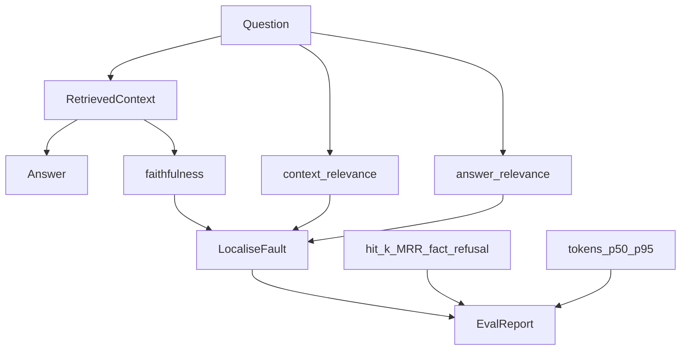

# Evaluation: retrieval, generation, and judges

## 30-second answer

Evaluate layers separately. **Retrieval** with deterministic `hit@k` / MRR. **Generation** with fact recall and **refusal accuracy**. Qualities code cannot check use LLM-as-judge structured `Judgement`. Use the RAG triad (context relevance / faithfulness / answer relevance) to find the broken layer. Prefer pairwise A/B with both orderings. Calibrate judges against humans. Track tokens and p50/p95 in the same harness.

## Tiny example

You raise retriever `k` from 3 to 6. Fact recall goes up. Refusal accuracy goes down — the model now has a weakly related chunk to latch onto for “Does Northwind cover pet insurance?” You catch it because the eval set includes refuse rows, not only happy-path facts.

## Why it exists

You cannot improve what you cannot measure. A prompt change *feels* better on three examples, then breaks four you were not looking at. This chapter is the harness: code checks where they apply, judges where they do not, and the RAG triad that says whether retrieval or generation is the problem.

## Runtime

**What to measure**

| Layer | Question | Metrics |
|---|---|---|
| Retrieval | Right context? | hit@k, MRR, recall@k |
| Generation | Good answer given context? | faithfulness, relevance, correctness |
| End to end | User got what they needed? | task success, escalation rate |
| Operational | Can we afford it? | latency, tokens, cost, errors |

Measure retrieval and generation **separately**. Bad answer from good context → prompt problem. Bad answer from bad context → retrieval problem.

**System under test**

1. Corpus → splitter → FAISS → retriever (`k=3`).
2. RAG: retrieve, stuff context, answer with a fixed refusal phrase when uncovered.

**Eval set**

1. Twenty examples you look at beat two thousand you ignore.
2. Tuples: `(question, expected_source, reference_facts, should_answer)`.
3. Include questions the system **should refuse** (pet insurance, CEO address).

**Deterministic metrics first**

1. `evaluate_retrieval`: expected source in top-k → hit rate and MRR.
2. `evaluate_generation`: fact substring hits; refusal-marker hits on unanswerable rows.
3. Cheap and reproducible — prefer code before paying for a judge.

**LLM-as-judge**

1. `Judgement`: `verdict`, `score` 1–5, `reason` with evidence.
2. Graders via `prompt | model.with_structured_output(Judgement)`.
3. Faithfulness: no outside facts, even if true in the world.
4. Feed an intentionally unfaithful answer — the judge should fail it.

**RAG triad**

| Metric | Low score means |
|---|---|
| Context relevance | Retrieval broken |
| Faithfulness | Generation hallucinating |
| Answer relevance | Model answering a different question |

**Pairwise A/B**

1. Absolute scores drift. “Which of these two is better?” is more stable.
2. Run both orderings. Only count a win when the judge agrees with itself — cancels position bias.

**Judge biases**

| Bias | Mitigation |
|---|---|
| Position | Run both orderings |
| Verbosity | Say “ignore length” |
| Self-preference | Different model as judge |
| Leniency | Anchor: most acceptable answers are 3 |

Calibrate: grade ~20 examples yourself; if agreement is below ~80%, fix the rubric first.



*Picture: triad scores point at retrieval vs generation; deterministic checks and ops meters land in the same report.*

## Objects, fields, and merge rules

| Metric | Layer | Meaning |
|---|---|---|
| `hit@k` / MRR | Retrieval | Expected source present / ranked |
| Fact recall | Generation | Known fact strings in the answer |
| Refusal accuracy | Generation | Unanswerable → refusal markers |
| Faithfulness / answer relevance / context relevance | Judge | Triad axes |
| Preference | Pairwise | A / B / tie with dual ordering |

**Merge rules**

- Retrieval metrics only on answerable rows with a known `expected_source`.
- Fact recall and refusal accuracy must not collapse into one “accuracy” number — they trade off.
- Inconsistent pairwise orderings → count as `tie`.

## Control surface

| Knob | Effect |
|---|---|
| Eval set size / refuse rows | Coverage of regressions |
| Retriever `k` | Recall vs noise / refusal trade-off |
| Judge rubrics / anchors | Harshness and bias |
| `judge_sample` | Cost of LLM grading |
| Dual ordering | Cancels position bias |
| Callback meter | Tokens and latency in the same harness |

## Failure anatomy

| Symptom | Cause | Fix |
|---|---|---|
| High fact recall, dangerous answers | No refuse rows | Track refusal accuracy |
| Bad answers, good context | Prompt / grounding | Fix prompt; check faithfulness |
| Bad answers, bad context | Retrieval | Fix chunking, embeddings, `k` |
| Judge always gives 4/5 | Leniency | Anchor scale; demand evidence |
| A/B flips randomly | Position bias | Run both orderings |
| Optimising wrong layer | Combined “accuracy” only | Split retrieval vs generation |

## Keywords

- **`hit@k` / MRR** — cheap retrieval metrics.
- **Fact recall / refusal accuracy** — generation checks code can run.
- **LLM-as-judge / `Judgement`** — structured grading.
- **RAG triad** — localise the fault.
- **Pairwise + dual ordering** — cancels position bias.
- **Operational metrics** — tokens and p50/p95 in the same harness.

## Minimal fragment

```python
retrieval = evaluate_retrieval(retriever, EVAL_SET)  # hit@k, mrr
generation = evaluate_generation(rag, EVAL_SET)      # fact_recall, refusal_accuracy

payload = {"question": q, "context": format_docs(docs), "answer": answer}
verdict = faithfulness_judge.invoke(payload)  # Judgement via with_structured_output

baseline = run_evaluation(rag, EVAL_SET, "baseline k=3")
variant = run_evaluation(wider_rag, EVAL_SET, "wider k=6")
# compare deltas; watch refusal_accuracy when k grows
```

## Interview traps

**Shallow:** "Just ask an LLM if the answer is good."

**Better:** Prefer deterministic retrieval and fact/refusal checks first. Use judges only for qualities code cannot check, with structured output and human calibration.

**Shallow:** "Higher hit@k means the system is better."

**Better:** Wider `k` can raise recall while lowering refusal accuracy. Measure both.

**Shallow:** "Absolute judge scores are stable enough for A/B."

**Better:** Prefer pairwise preference and run both orderings.

**Shallow:** "Refusal accuracy is optional."

**Better:** It catches confident invention on unanswerable questions — the failure mode production regrets most.

## Lab

Hands-on: [26_evaluation.ipynb](../../04-langchain-production/26_evaluation.ipynb)
