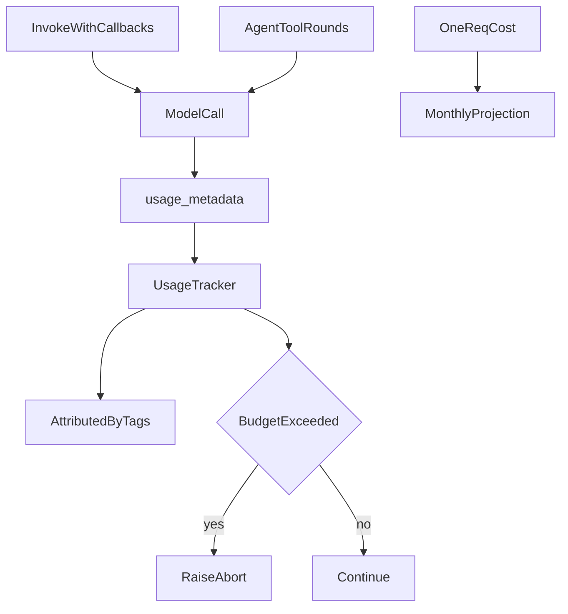

# Usage and cost tracking

## 30-second answer

Bill against provider `usage_metadata` on each response (`input_tokens`, `output_tokens`, cache/reasoning details). Estimate size before send with `get_num_tokens` (or tiktoken). Accumulate nested and agent calls with a `BaseCallbackHandler` at **invocation** scope. Attribute spend with tenant/feature tags (or LangSmith metadata). Enforce ceilings with a raise-from-callback `BudgetGuard` or graceful `ModelCallLimitMiddleware`. Project monthly cost from one measured request before you choose architecture.

## Tiny example

A leave Q&A costs a fraction of a cent. An agent that looks up three tools can cost many times more because history is resent each round. You attach a `UsageTracker` on one invoke, print the report, multiply by expected daily requests, and suddenly routing easy traffic to a small model (notebook 25) is not optional — it is the budget.

## Why it exists

The first surprise bill is a rite of passage. A chatbot that feels free at one question becomes expensive at 5,000 employees — or one pasted 40-page contract. You need visibility (what does each request cost?), attribution (which team?), and limits (what stops a runaway loop?).

## Runtime

**`usage_metadata` — source of truth**

1. Bill against provider token counts, not guesses.
2. Shape: `input_tokens`, `output_tokens`, `total_tokens`, plus optional `input_token_details.cache_read` and `output_token_details.reasoning`.
3. Cached input is often ~10% price. Reasoning tokens bill as output even when you never see them.

**Count before you send**

1. `model.get_num_tokens(text)` — reject or truncate oversized input before paying.
2. Fall back to tiktoken if needed.
3. ~4 characters/token is a rough English heuristic. Code, JSON, and non-Latin scripts break it.

**Cost tracking callback**

1. Real chains make several calls — accumulate with `UsageTracker(BaseCallbackHandler)`.
2. Hook `on_llm_end` to read `usage_metadata` and model name.
3. Attach at **invocation** scope: `config={"callbacks": [tracker]}` — sees nested agent tool loops.

**Agent cost shape**

1. Each tool round resends the full conversation as input.
2. Cost grows roughly **quadratically** with tool-call count, not linearly.
3. Capping iterations is a cost control, not only a safety measure.

**Attribution and budgets**

1. `AttributedTracker` groups by tags (`tenant=...`, `feature=...`). Same idea in LangSmith metadata.
2. `BudgetGuard`: raise `BudgetExceeded` after `on_llm_end` if USD or call ceiling crossed — circuit breaker only.
3. Gentler agent path: `ModelCallLimitMiddleware(..., exit_behavior="end")` returns partial work.

**Cost modelling before launch**

1. Measure one representative request.
2. Extrapolate: cost/req × requests/day → month.
3. Compare simple Q&A vs multi-tool agent vs RAG-with-reranking — gap is often 10–30×.

**Levers that actually reduce cost**

| Lever | Typical saving |
|---|---|
| Route to a small model | 70–90% on routed traffic |
| Cache (notebook 23) | 100% on repeats |
| Provider prompt caching | ~90% on cached prefix |
| Trim conversation history | Grows with turn count |
| Retrieve fewer chunks | Linear in `k` |
| Cap `max_tokens` | Bounds worst case |



*Picture: every model call reports usage into a tracker; tags attribute spend; a budget can abort; one measured request projects the month.*

## Objects, fields, and merge rules

| Object / field | Role |
|---|---|
| `usage_metadata` | Provider token counts on the AI message |
| `cache_read` / reasoning details | Discounted input; hidden billed output |
| `get_num_tokens` | Pre-send estimate |
| `UsageTracker` / `AttributedTracker` | Accumulate and bucket spend |
| `BudgetGuard` | Raise when ceiling crossed |
| `ModelCallLimitMiddleware` | Graceful agent loop cap |
| `trim_messages` | Bound history tokens |

**Merge rules**

- Billable input ≈ `input_tokens - cached_tokens`; cached portion uses discounted rate.
- Invocation-scope callbacks see every nested LLM call in that invoke.
- Raising inside a callback aborts the whole run — use only for circuit breakers.
- Agent input tokens climb each turn because history is resent.

## Control surface

| Knob | Effect |
|---|---|
| Pricing table / cached discount | Accuracy of `$` reports |
| Callback attachment scope | Whether nested/agent calls are visible |
| Attribution tags / LangSmith metadata | Chargeback slices |
| `max_usd` / `max_calls` | Hard abort thresholds |
| `ModelCallLimitMiddleware` | Soft agent cap with partial return |
| `trim_messages` / retriever `k` / model routing | Structural cost levers |

## Failure anatomy

| Symptom | Cause | Fix |
|---|---|---|
| Surprise bill | No visibility | `usage_metadata` + invocation callbacks |
| Agent cost explodes | History resent each tool round | Cap iterations; trim; route easy traffic |
| Oversized paste billed then fails | No pre-check | `get_num_tokens` before invoke |
| Total known, nobody owns it | No attribution | Tenant/feature tags |
| Runaway loop | No budget | `BudgetGuard` or `ModelCallLimitMiddleware` |
| English cost model underestimates | Non-Latin / JSON / code | Measure on real traffic |

## Keywords

- **`usage_metadata`** — bill against this.
- **Cache-read discount** — track separately.
- **`get_num_tokens`** — guard oversized input.
- **`UsageTracker`** — accumulate nested calls.
- **Quadratic agent cost** — full history resent every tool turn.
- **`BudgetGuard` / `ModelCallLimitMiddleware`** — hard abort vs graceful cap.

## Minimal fragment

```python
tracker = UsageTracker("summarise + critique")
summary = summarise.invoke({"text": policy}, config={"callbacks": [tracker]})
critique.invoke({"summary": summary}, config={"callbacks": [tracker]})
print(tracker.report())

guard = BudgetGuard(max_usd=0.01, max_calls=10)
try:
    agent.invoke({"messages": [("user", "...")]}, config={"callbacks": [guard]})
except BudgetExceeded as exc:
    print(exc, guard.report())
```

## Interview traps

**Shallow:** "Estimate tokens with characters divided by four."

**Better:** Fine as a rough English heuristic. Use `get_num_tokens` / tiktoken and bill against `usage_metadata`.

**Shallow:** "Agent cost is linear in the number of tool calls."

**Better:** Input history is resent every turn, so cost grows roughly quadratically. Caps are cost controls.

**Shallow:** "Raise from every callback to be safe."

**Better:** Callback exceptions abort the run. Raise only for circuit breakers; prefer `ModelCallLimitMiddleware` for graceful agent stops.

**Shallow:** "A single total spend number is enough."

**Better:** Without tenant/feature attribution you cannot chargeback or find the expensive path.

## Lab

Hands-on: [27_usage_tracking.ipynb](../../04-langchain-production/27_usage_tracking.ipynb)
