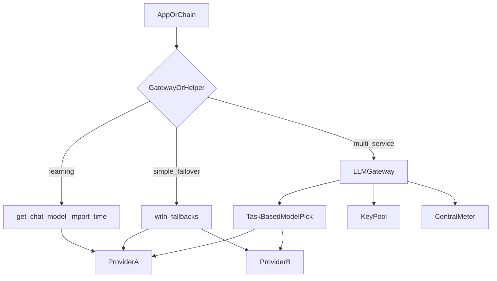

# LLM gateways: fallbacks, routing, and load balancing

## 30-second answer

`shared.llm.get_chat_model()` picks a provider **once at import**. Production needs **per-call** decisions: fallback when a provider is down, route cheap tasks to small models, pool keys, and meter spend in one place. Smallest upgrade: LCEL `.with_fallbacks([...])`. Full layer: an LLM gateway (LiteLLM and peers) as an OpenAI-compatible endpoint. Do not start with a gateway — graduate when a second service needs the same routing rules.

## Tiny example

Groq blips for two minutes. Every call in a process that resolved Groq at import fails until restart. You wrap the primary model with `.with_fallbacks([secondary])` and the same request succeeds on OpenRouter. Later, classification traffic goes to a small model via a task table, and a LiteLLM proxy meters all services in one dashboard.

## Why it exists

Import-time provider selection is fine for learning. In production you want per-call failover, cost-aware model choice, key pooling, and one place to account for spend. That layer is an **LLM gateway**. LiteLLM is the open-source option many teams reach for. LangChain talks to it like any OpenAI-compatible endpoint.

## Runtime

**What the helper does (and does not)**

1. `get_chat_model()` resolves Groq → OpenRouter → OpenAI → Anthropic **once** when the process starts.
2. If Groq goes down mid-request, every call fails until restart.
3. A gateway retries and fails over **inside the same call**.

**Poor man's gateway — LCEL fallbacks**

1. `primary.with_fallbacks([secondary, ...])` — try alternatives on failure.
2. Covers “provider A is down, try B”.
3. Does **not** do cost-based routing, key pooling, or spend dashboards.

**LiteLLM as a unified router (optional)**

1. Install `litellm`; model strings like `groq/llama-3.3-70b-versatile`.
2. Per-call fallbacks: `litellm.completion(model=..., fallbacks=[...])`.
3. Wire into LangChain via `ChatOpenAI(base_url="http://localhost:4000/v1", ...)` pointing at a LiteLLM proxy.

**Cost-aware / task-based routing**

1. Classification and extraction rarely need a frontier model.
2. `ROUTING_TABLE`: `classify` / `extract` → small-fast; `reason` → stronger; `write` → quality prose.
3. `model_for(task)` selects the string; construct the chat model per call.

**Load balancing and key pooling**

1. When one key is rate-limited, rotate across a pool.
2. In LiteLLM: `Router` with `Deployment` entries.
3. Keys are a pool, not a singleton.

**Choosing the tier**

| Need | Use |
|---|---|
| Learning / single-box demos | `get_chat_model()` |
| “If A fails, try B” | `.with_fallbacks([...])` |
| Multi-service, cost routing, key pools, spend caps | LLM gateway |

Graduation path: helper → feel the first outage → add fallbacks → add a gateway when a second service shares the same rules.



*Picture: demos pick once at import; fallbacks retry on failure; a gateway also routes by task, pools keys, and meters spend.*

## Objects, fields, and merge rules

| Object / idea | Role |
|---|---|
| `get_chat_model()` | Import-time provider pick for demos |
| `.with_fallbacks([...])` | Ordered LCEL failover |
| LiteLLM `completion` + `fallbacks` | Per-call multi-provider list |
| `ROUTING_TABLE` / `model_for(task)` | Task → model string |
| `ChatOpenAI(base_url=...)` | Point LangChain at an OpenAI-compatible proxy |
| Key ring / `Router` deployments | Rotate across rate-limit budgets |
| `GatewayMeter` | Central per-model call/token/USD buckets |

**Merge rules**

- Import-time identity: one process, one default provider until restart.
- Fallback order: first success wins; later entries only run on failure.
- Task routing: the *task label* selects the model, not the user message alone.
- Meter buckets key by model string for cost attribution.

## Control surface

| Knob | Effect |
|---|---|
| Fallback list order | Which provider runs after primary failure |
| `ROUTING_TABLE` entries | Cost/quality per task class |
| Proxy `base_url` / API key | Where LangChain sends traffic |
| Key pool size / rotation | Resilience to rate limits |
| Gateway spend caps | Org-wide circuit breaker |

## Failure anatomy

| Symptom | Cause | Fix |
|---|---|---|
| All requests fail when Groq blips | Import-time single provider | `.with_fallbacks` or gateway fallbacks |
| Classification costs frontier prices | One model for every task | Task-based `ROUTING_TABLE` |
| 429 storms on one key | Singleton API key | Key pool / gateway deployments |
| Twelve services, twelve meters | No central gateway | Meter at the gateway |
| Premature gateway complexity | Started with infra | Helper → fallbacks → gateway when shared |
| Fallback never tried | Same dead provider twice | Use a truly different secondary |

## Keywords

- **Import-time vs per-call** — helper picks once; gateway/fallbacks pick every call.
- **`.with_fallbacks`** — smallest resilience upgrade inside LCEL.
- **LLM gateway** — unified routing, failover, pooling, metering (e.g. LiteLLM).
- **Task-based routing** — small model for classify/extract; large for reason/write.
- **Key pooling** — rate limits become a fleet problem.
- **Graduation path** — helper → fallbacks → gateway when a second service shares rules.

## Minimal fragment

```python
primary = get_chat_model()
fallback_chain = primary.with_fallbacks([get_chat_model()])  # pass a real second provider in prod
print(fallback_chain.invoke("Say OK in one word.").content)

ROUTING_TABLE = {
    "classify": "groq/llama-3.1-8b-instant",
    "reason": "groq/llama-3.3-70b-versatile",
    "write": "openrouter/openai/gpt-4o-mini",
}
model_id = ROUTING_TABLE["classify"]
# ChatOpenAI(base_url="http://localhost:4000/v1", model=model_id) when using a proxy
```

## Interview traps

**Shallow:** "Point everything at one provider API key and restart if it fails."

**Better:** Import-time selection dies with that provider mid-process. Use `.with_fallbacks` or a gateway for per-call failover.

**Shallow:** "Always deploy LiteLLM on day one."

**Better:** Start with the helper. Add fallbacks after the first outage. Add a gateway when a second service needs the same routing rules.

**Shallow:** "Fallbacks and task routing are the same thing."

**Better:** Fallbacks are failure-driven. Task routing is cost/quality-driven on healthy calls. You usually want both.

**Shallow:** "Key pooling is optional until you scale users."

**Better:** A single key hits rate limits long before “scale”. Treat keys as a pool as soon as production traffic is continuous.

## Lab

Hands-on: [27a_llm_gateways.ipynb](../../04-langchain-production/27a_llm_gateways.ipynb)
