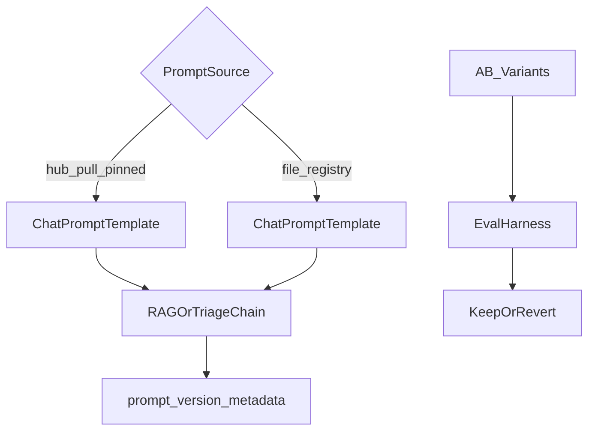

# LangChain Hub and prompt management

## 30-second answer

Prompts are configuration, not forever-hardcoded strings. `hub.pull("owner/name")` returns a real `ChatPromptTemplate` (public pulls need no key; push/private need `LANGSMITH_API_KEY`). **Pin versions** (`owner/name:hash`) in production. File-based registries give git review and offline use with no runtime Hub dependency. A/B prompt variants with the evaluation harness (notebook 26). Log `prompt_version` in run metadata so regressions are attributable weeks later.

## Tiny example

You pull `rlm/rag-prompt:50442af1` into a RAG chain. A teammate edits the unpinned Hub prompt overnight. Your pinned hash does not move. Separately you A/B a terse variant vs a grounded refusal variant on the same probes — fact hits and refusal markers — then log `prompt_version` on every invoke so next month’s quality dip has a cause.

## Why it exists

Prompts start hardcoded in a Python file. That works until a product manager wants to tweak the tone and the change needs a PR and a deploy. Prompt management separates the prompt from the code: version it, review it, roll it back. LangChain Hub is the hosted answer. A file-based registry works with no account at all.

## Runtime

**Pull a public prompt**

1. `from langchain import hub` then `hub.pull("rlm/rag-prompt")`.
2. Returns a real `ChatPromptTemplate` you can pipe immediately.
3. Public prompts need no API key. Private prompts and any `push` need `LANGSMITH_API_KEY`.
4. Offline/lab fallback: if pull fails, substitute a local equivalent.

**Pin a version**

1. **Never pull an unpinned prompt in production.** Latest can change with no deploy on your side.
2. Pin by commit hash: `hub.pull("rlm/rag-prompt:50442af1")`.

**Use in a real chain**

1. Your retriever + model; Hub (or local) prompt in the middle.
2. `{"context": retriever | format_docs, "question": RunnablePassthrough()} | rag_prompt | model | parser`.

**Prompts worth knowing**

| Prompt | What it is |
|---|---|
| `rlm/rag-prompt` | Minimal grounded QA |
| `hwchase17/react` | Original ReAct Thought/Action/Observation |
| `hwchase17/openai-tools-agent` | Tool-calling agent scaffold |
| `langchain-ai/retrieval-qa-chat` | RAG with chat history |

**Push your own**

1. Build a `ChatPromptTemplate`.
2. `hub.push("northwind-ticket-triage", triage_prompt)` → URL.
3. Each push is a new immutable version with its own hash. Roll back by pulling an older hash.

**File-based registry (no account)**

1. Store versioned prompts in `registry.json`.
2. Entry fields: `version`, `description`, `messages`, `changelog`.
3. `load_prompt(name)` → `ChatPromptTemplate` with metadata.
4. Git history, PR review, works offline / air-gapped.

**Hub vs files**

| | LangChain Hub | Files in the repo |
|---|---|---|
| Non-engineers can edit | Yes, in the UI | No |
| Change without deploying | Yes | No |
| Code review | Separate flow | Standard PR |
| Rollback | Pull an older hash | `git revert` |
| Works offline | No | Yes |

Use the Hub when prompt iteration is owned by people who do not deploy code. Use files when prompts and code change together. **Never use the Hub unpinned in production.**

**A/B and service metadata**

1. Define variants (`v1_terse` vs `v2_grounded` with explicit refusal).
2. Same probes: fact hits; refusal markers. Wire to notebook 26 for keep-or-revert.
3. `PromptRegistry` loads once, caches, exposes `get` / `reload` / `versions`.
4. Always log `metadata={"prompt_name", "prompt_version"}` on invoke (notebook 19).



*Picture: pinned Hub or file registry both feed a real ChatPromptTemplate; versions land in traces; A/B decides keep or revert.*

## Objects, fields, and merge rules

| Object | Role |
|---|---|
| `hub.pull("owner/name")` | Latest Hub prompt as `ChatPromptTemplate` |
| `hub.pull("owner/name:hash")` | Pinned immutable version |
| `hub.push(name, prompt)` | Publish new immutable version |
| `registry.json` / `load_prompt` / `PromptRegistry` | File-based versioned prompts |
| Run `metadata` | Make prompt version visible in LangSmith |

**Merge rules**

- Unpinned pull identity is “whatever Hub serves today” — not reproducible.
- Push creates a **new** version; it does not mutate old hashes.
- A/B identity: same retriever/model, different prompt only — otherwise you cannot attribute deltas.
- Without `prompt_version` metadata, prompt changes are invisible in historical runs.

## Control surface

| Knob | Effect |
|---|---|
| Pin hash vs latest | Reproducibility vs chasing upstream edits |
| Hub vs file registry | Who can edit; offline; review model |
| `PromptRegistry.reload()` | Pick up file edits without restart |
| Variant wording (refusal / citation) | Fact recall vs refusal accuracy |
| `prompt_version` metadata | Debuggability of quality regressions |
| `LANGSMITH_API_KEY` | Private pull / push |

## Failure anatomy

| Symptom | Cause | Fix |
|---|---|---|
| Behaviour changed with no deploy | Unpinned `hub.pull` | Pin `owner/name:hash` |
| Offline / air-gapped break | Runtime Hub dependency | File registry |
| Push fails | Missing/write-denied key | Check `LANGSMITH_API_KEY` |
| Demo looks good, prod hallucinates | Weak refusal wording | Grounded variant + measure refusals |
| Cannot tell which prompt shipped | No version metadata | Log `prompt_name` / `prompt_version` |
| A/B inconclusive | Changed model and prompt together | Isolate the prompt variable |

## Keywords

- **`hub.pull` / pinning** — download a prompt; pin `owner/name:hash` in production.
- **`hub.push`** — publish an immutable new version.
- **File registry** — versioned prompts in-repo; offline; PR review.
- **Hub vs files** — Hub for non-engineer iteration; files when prompts ship with code.
- **A/B prompt variants** — measure fact/refusal before keeping a change.
- **`prompt_version` metadata** — attribute quality drops weeks later.

## Minimal fragment

```python
from langchain import hub
from langchain_core.prompts import ChatPromptTemplate

rag_prompt = hub.pull("rlm/rag-prompt:50442af1")  # pinned
rag_chain = (
    {"context": retriever | format_docs, "question": RunnablePassthrough()}
    | rag_prompt
    | model
    | parser
)
answer = rag_chain.invoke(
    "How many days of casual leave?",
    config={"metadata": {"prompt_name": "rlm/rag-prompt", "prompt_version": "50442af1"}},
)
```

## Interview traps

**Shallow:** "Pull the latest Hub prompt in production so you always get improvements."

**Better:** Unpinned pulls make your behaviour depend on someone else’s edit with no deploy. Pin hashes; upgrade on purpose.

**Shallow:** "Hub replaces git for prompts."

**Better:** Files keep prompts and code in sync with PR review and offline use. Hub wins when non-engineers own iteration.

**Shallow:** "If the new prompt sounds better, ship it."

**Better:** A/B with fact recall and refusal accuracy (and notebook 26). Explicit refusal instructions often matter more than tone.

**Shallow:** "Prompt version does not belong in traces."

**Better:** Without `prompt_version` metadata you cannot attribute quality drops to a prompt change weeks later.

## Lab

Hands-on: [28_langchain_hub.ipynb](../../04-langchain-production/28_langchain_hub.ipynb)
