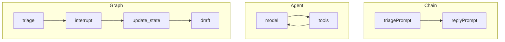

# Graphs vs Chains vs Agents

## 30-second answer

A **chain** is a fixed pipeline. Same steps every time. No pause.

An **agent** (`create_agent`) is a model that picks tools. `invoke` runs until it finishes. You cannot stop it mid-run before a refund tool fires.

A **graph** (`StateGraph`) is nodes and edges you draw. With a checkpointer you can pause, inspect, edit, resume, and rewind. Agents are graphs under the hood. The choice is: take the prebuilt loop, or draw your own.

## Tiny example

Support ticket: triage, then draft a reply.

- Chain: triage prompt → reply prompt. Done. No human veto.
- Agent: tools like `lookup_account` and `issue_refund`. May refund on its own.
- Graph: triage node → pause before draft → human bumps priority → resume draft.

## Why it exists

Chains and agents hit four walls in production:

1. Can a human approve this refund first?
2. Can the user close the tab and resume tomorrow?
3. Can we rewind step 4 and try another branch?
4. Can the reviewer send it back to the writer, up to three times?

A chain cannot pause. An agent cannot be steered mid-`invoke`. A graph can. The win is **control over the loop**, not “more intelligence.”

## Runtime

1. Build the same ticket task three ways (chain, agent, graph).
2. Graph shape: `TicketState` with `ticket`, `category`, `priority`, `reply`. Nodes return partial updates. Edges: `START → triage → draft → END`.
3. Recompile with `checkpointer=InMemorySaver()` and `interrupt_before=["draft"]`.
4. Pass `config={"configurable": {"thread_id": "ticket-4821"}}`. That `thread_id` is the **conversation id**.
5. First `invoke` stops before draft. `get_state(config).next` shows `("draft",)`. Reply is still empty.
6. `update_state(config, {"priority": "critical"})` then `invoke(None, config)` to resume.
7. A different `thread_id` is a different conversation. Tickets stay isolated.
8. `get_state_history` lists save points (newest first). Notebook 39 uses them for time travel.



*Picture:* three paths for one ticket. Only the graph has a pause and an edit before draft.

Print `create_agent(...).get_graph().draw_ascii()` and you see: you already paid for a graph. Custom graphs buy the pause/edit/resume surface the prebuilt loop hides.

## Objects, fields, and merge rules

| Object | Role |
|---|---|
| Chain (LCEL) | Fixed pipeline. Cannot pause. |
| `create_agent` | Prebuilt graph. Model picks tools. `invoke` finishes the loop. |
| `StateGraph(TicketState)` | Builder for your nodes and edges. |
| Node function | Takes state, returns a **partial update** dict. Never mutates in place. |
| `compile(checkpointer=..., interrupt_before=...)` | Durability + pause points. |
| `thread_id` | Conversation id. Selects which save-game chain. |
| `get_state` / `update_state` / `invoke(None)` | Inspect, edit, resume. |
| `get_state_history` | Every save point for that conversation. |

**Partial update:** `return {"category": "billing"}` merges in. Other keys stay. That merge model makes checkpointing and rewind possible.

**Three pieces of every graph:** state (TypedDict), nodes (functions), edges (what runs next).

| | Chain | Agent | Graph |
|---|---|---|---|
| Control flow | Fixed | Model decides | You decide |
| Pause / resume | No | No | Yes |
| Inspect / edit mid-run | No | No | Yes |
| Cost | Lowest | Low | Highest |

## Control surface

| Knob | Effect |
|---|---|
| Prompt → model → parse | Stay a **chain**. |
| Model picks tools, no approval | **`create_agent`**. |
| Human approval, durable threads, handoffs | **Graph**. |
| `interrupt_before=["draft"]` | Pause and wait for a human click before draft. |
| Stable `thread_id` | Same conversation across requests. |
| `update_state` then `invoke(None)` | Fix triage, then continue. |

Start with a chain. Upgrade to `create_agent` when the model must choose. Reach for a graph when you need control over the loop.

## Failure anatomy

| Symptom | Cause | Fix |
|---|---|---|
| Agent refunded with no veto | `invoke` finished the tool loop | Put money tools behind a graph interrupt |
| Pause vanished after restart | No checkpointer | `compile(checkpointer=...)` |
| Resume starts a new chat | New or missing `thread_id` | Reuse the same conversation id |
| Undeclared key from a node | Key not in schema | Align returns with the TypedDict (keys are dropped) |
| Expected in-place mutation | Nodes must return updates | Return a partial dict |

## Keywords

- **chain** — fixed LCEL pipeline
- **`create_agent`** — prebuilt agent graph
- **`StateGraph`** — your nodes and edges
- **partial update** — return only changed keys
- **`interrupt_before`** — pause and wait for a human click
- **`thread_id`** — conversation id
- **checkpointer** — save game for graph state

## Minimal fragment

```python
from langgraph.checkpoint.memory import InMemorySaver
from langgraph.graph import END, START, StateGraph

builder = StateGraph(TicketState)
builder.add_node("triage", triage_node)
builder.add_node("draft", draft_node)
builder.add_edge(START, "triage")
builder.add_edge("triage", "draft")
builder.add_edge("draft", END)

approval_graph = builder.compile(
    checkpointer=InMemorySaver(), interrupt_before=["draft"]
)
config = {"configurable": {"thread_id": "ticket-4821"}}
paused = approval_graph.invoke(
    {"ticket": TICKET, "category": "", "priority": "", "reply": ""}, config
)
print(approval_graph.get_state(config).next)
approval_graph.update_state(config, {"priority": "critical"})
resumed = approval_graph.invoke(None, config)
```

## Interview traps

**Shallow:** "Agents and graphs are different products."

**Correction:** `create_agent` builds a graph. The difference is control: prebuilt tool loop vs your interrupts and edges.

**Shallow:** "Graphs are always better than chains."

**Correction:** Graphs cost code. Straight prompt→parse stays a chain.

**Shallow:** "`interrupt_before` alone makes the run durable."

**Correction:** You need a checkpointer plus a stable conversation id.

**Shallow:** "Nodes mutate a shared state object."

**Correction:** Nodes return partial updates. LangGraph merges.

## Lab

[29_graphs_vs_agents.ipynb](../../05-langgraph-beginner/29_graphs_vs_agents.ipynb)
