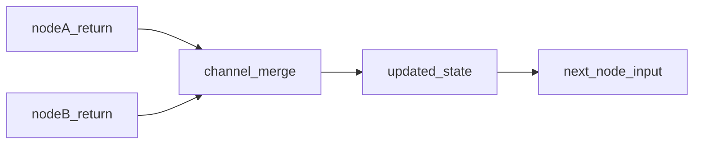

# State Schemas and Reducers

## 30-second answer

Graph state is a schema (`TypedDict` or Pydantic). Nodes return **partial updates**. Channels without a reducer **replace** (last write wins). Channels with `Annotated[T, reducer]` **append or merge** — for example `operator.add` concatenates lists. Chat uses `add_messages` (append, replace by id, or delete). Undeclared return keys are **dropped**. Parallel writes to a non-reducer channel raise. Think **append vs replace** every time you design a field.

## Tiny example

Two researchers write notes for a support ticket.

- Plain `notes: list[str]` → second researcher **replaces** the first. A's notes vanish.
- `notes: Annotated[list[str], operator.add]` → both notes **append**. Fan-out is safe.

## Why it exists

State is the biggest design choice in a LangGraph app. Get reducers wrong and one node silently erases another. Default is replace. That default causes most beginner bugs.

## Runtime

1. Declare channels on a `TypedDict` (hints only) or Pydantic (validates on input to each node).
2. Each node returns only keys it changed.
3. For each key, LangGraph applies the reducer — or **replace** if none.
4. `Annotated[list[str], operator.add]` means append lists / sum ints / concat strings.
5. Chat channels use `add_messages` so same-id updates replace and `RemoveMessage` deletes.
6. Fan-out: two nodes writing the same key in one step need a reducer or the run errors.
7. Optional `input_schema` / `output_schema` hide scratch fields from callers.
8. Keep state flat and small. Huge blobs bloat every save game.



*Picture:* both nodes write; the reducer decides append vs replace into one state.

**Validation timing:** a bad Pydantic write from the **last** node can escape into the returned dict. Add a downstream node and the same write fails on the way into that node. `invoke` always returns a plain **dict**, not a model instance.

## Objects, fields, and merge rules

| Object | Role |
|---|---|
| `TypedDict` | Default schema. No runtime type checks. |
| Pydantic state | Validates on input **to each node**. |
| Default (no Annotation) | **Replace** — last write wins. |
| `Annotated[T, reducer]` | **Append / merge** with `reducer(existing, new)`. |
| `operator.add` | Lists concat; ints sum; strings concat. |
| `add_messages` | Append, replace-by-id, delete via `RemoveMessage`. |
| `MessagesState` | Prebuilt messages channel; subclass for extra fields. |
| Undeclared key | Not in schema → **dropped** (no raise for TypedDict). |
| Parallel write, no reducer | Runtime error. |

**Append vs replace in one line:** no Annotation = replace. `operator.add` on a list = append. Parallel researchers need append.

Custom reducers from the lab: `merge_unique`, `keep_highest`, `merge_dict`, `last_n(n)`.

## Control surface

| Knob | Effect |
|---|---|
| Plain channel | Replace every time. Classic "notes vanished" bug. |
| `Annotated[..., operator.add]` | Append / accumulate. |
| `Annotated[..., add_messages]` | Chat with id-aware replace and delete. |
| Pydantic at the trust boundary | Fail loud on bad input. |
| `input_schema` / `output_schema` | Public contract vs internal scratch. |
| Separate keys per parallel writer | Avoid concurrent-write errors without a shared reducer. |

## Failure anatomy

| Symptom | Cause | Fix |
|---|---|---|
| Second researcher wiped first's notes | Replace on a list | `Annotated[list[str], operator.add]` |
| Parallel fan-out crashes | Two writers, no reducer | Add reducer, sequence nodes, or separate keys |
| Bad Pydantic value in final output | Last node wrote invalid data | Downstream node or validate at API edge |
| Expected a Pydantic instance from `invoke` | Validation is inbound only | Treat return as a dict |
| Undeclared key vanished | Key not in schema | Align keys (silent drop) |
| Nested `data: dict` blob | Reducers cannot merge nested cleanly | Flatten channels |

## Keywords

- **partial update** — return only changed keys
- **replace** — default; last write wins
- **append** — `operator.add` on lists
- **`Annotated[T, reducer]`** — attach merge rule
- **`add_messages`** — chat append / replace-by-id / delete
- **dropped keys** — undeclared returns discarded
- **concurrent write error** — parallel write needs a reducer

## Minimal fragment

```python
import operator
from typing import Annotated, TypedDict
from langgraph.graph import END, START, StateGraph

class AccumulatingState(TypedDict):
    topic: str
    notes: Annotated[list[str], operator.add]  # append, not replace

builder = StateGraph(AccumulatingState)
builder.add_node("a", lambda s: {"notes": ["A: pricing"]})
builder.add_node("b", lambda s: {"notes": ["B: churn"]})
builder.add_edge(START, "a")
builder.add_edge("a", "b")
builder.add_edge("b", END)
print(builder.compile().invoke({"topic": "renewals", "notes": []}))
# Parallel writers to a non-reducer channel raise — add operator.add.
# Undeclared return keys are dropped.
```

## Interview traps

**Shallow:** "State is a dict nodes mutate."

**Correction:** Nodes return partial updates. Merge rules (append vs replace) decide the next state.

**Shallow:** "Pydantic validates every write immediately."

**Correction:** Validation runs on input **to a node**. A bad last-node write can escape.

**Shallow:** "`operator.add` is fine for chat messages."

**Correction:** Chat needs `add_messages` for replace-by-id and `RemoveMessage`.

**Shallow:** "Fan-out always merges somehow."

**Correction:** Without a reducer, concurrent writes error. Parallel write needs a reducer.

## Lab

[30_state_schemas.ipynb](../../05-langgraph-beginner/30_state_schemas.ipynb)
