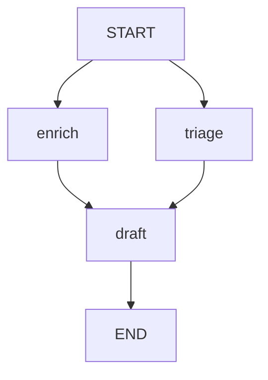

# StateGraph: Nodes and Edges

## 30-second answer

`StateGraph` is the program. **Nodes** take state and return a partial update (or `None`). **Edges** say what runs next. Wire with `add_node`, `add_edge`, `add_sequence`, plus `START` / `END`. `compile()` checks the shape. Each **superstep** runs ready nodes, merges writes, then advances. Fan-out runs in parallel; fan-in waits for all. Unknown return keys are **silently dropped**. `recursion_limit` counts **supersteps**, not single node calls.

## Tiny example

Support ticket router: enrich and triage leave `START` together. Draft waits for both. Then `END`.

That is fan-out then fan-in. Shared lists need an append reducer (notebook 30).

## Why it exists

State is the data. Nodes and edges are the program. Half of LangGraph bugs show up in `draw_ascii` / `draw_mermaid` before you spend a token. This chapter is the mechanics — including rebuilding the agent loop from `call_model` + `ToolNode` + `tools_condition`.

## Runtime

1. Define a state schema with channels and reducers.
2. Register nodes with explicit names: `add_node("triage", fn)`. Names show in traces and streams.
3. Connect `START` → work → `END`, or use `add_sequence` for a straight line (still wire START and END).
4. `compile()` fails on dangling edges and missing entry. Orphans may compile but never run.
5. `invoke` advances supersteps: run ready nodes → merge → next step.
6. Multiple edges from one node = parallel. Multiple edges into one node = wait for all.
7. Agent shape: `MessagesState`, `model.bind_tools`, `ToolNode`, `tools_condition`, edge `tools → model`.



*Picture:* enrich and triage run together; draft waits; then stop.

## Objects, fields, and merge rules

| Object | Role |
|---|---|
| `START` / `END` | Entry and exit sentinels. |
| `add_node(name, fn)` | Register a callable; name is the identity. |
| Partial update / `None` | Changed keys, or side effect only. |
| `add_edge` / `add_sequence` | Unconditional wiring. |
| Superstep | Run ready nodes, merge, advance. |
| Fan-out / fan-in | Parallel split; join waits for all. |
| `ToolNode` | Runs last message's `tool_calls`; needs `messages`. |
| `tools_condition` | Tools if tool calls present, else `END`. |
| Silent key drop | Typo in return key → discarded, no error. |
| `recursion_limit` | Superstep ceiling (default 25). |

**Silent drop:** return `{"knwon": "oops"}` when the schema has `known` → nothing changes. Looks like "my node did nothing."

**LLM nodes:** ordinary Python. Constrain with `with_structured_output`. Specialise prompts from earlier state.

## Control surface

| Knob | Effect |
|---|---|
| Explicit `add_node("triage", fn)` | Stable names under renames. |
| `add_sequence` | Straight pipeline with less boilerplate. |
| Multiple edges from `START` | Parallel start. |
| Deterministic tool call vs `ToolNode` | You pick args vs model-requested calls. |
| `draw_ascii` / `draw_mermaid` | Catch bad wiring before tokens. |
| `config={"recursion_limit": N}` | Cap supersteps while you add real exits. |

## Failure anatomy

| Symptom | Cause | Fix |
|---|---|---|
| "My node did nothing" | Typo; key dropped | Match keys to schema |
| `compile()` fails on edge | Target never registered | Fix name or `add_node` |
| Orphan never runs | No path from `START` | Wire an edge |
| Infinite loop until error | Cycle with no exit | Dual exits (notebook 32); limit is a net |
| Thought limit counts node calls | It counts **supersteps** | One fan-out of three nodes = one step |
| Parallel findings lost / error | Shared channel, no reducer | `operator.add` (append) |

## Keywords

- **`START` / `END`** — entry and exit
- **node contract** — `(state) -> partial dict | None`
- **superstep** — parallel barrier then merge
- **fan-out / fan-in** — split; wait for all
- **`ToolNode` / `tools_condition`** — agent loop parts
- **silent key drop** — undeclared keys discarded
- **`GraphRecursionError`** — superstep budget exhausted

## Minimal fragment

```python
from langgraph.graph import END, START, StateGraph, MessagesState
from langgraph.prebuilt import ToolNode, tools_condition

builder = StateGraph(MessagesState)
builder.add_node("model", call_model)
builder.add_node("tools", ToolNode(tools))
builder.add_edge(START, "model")
builder.add_conditional_edges(
    "model", tools_condition, {"tools": "tools", END: END}
)
builder.add_edge("tools", "model")  # the agent loop
agent_graph = builder.compile()
print(agent_graph.get_graph().draw_ascii())
# Unknown return keys are silently dropped.
# recursion_limit counts supersteps, not per-node calls.
```

## Interview traps

**Shallow:** "A node returns the full new state."

**Correction:** Nodes return partial updates. Runtime merges by channel rules.

**Shallow:** "`recursion_limit` is how many times a node can run."

**Correction:** It counts supersteps. Design real exits; treat the limit as a safety net.

**Shallow:** "Wrong keys raise immediately."

**Correction:** Undeclared keys are silently dropped.

**Shallow:** "`create_agent` is magic."

**Correction:** Model node + `ToolNode` + `tools_condition` + tools→model edge. That is the diagram.

## Lab

[31_stategraph_nodes_edges.ipynb](../../05-langgraph-beginner/31_stategraph_nodes_edges.ipynb)
