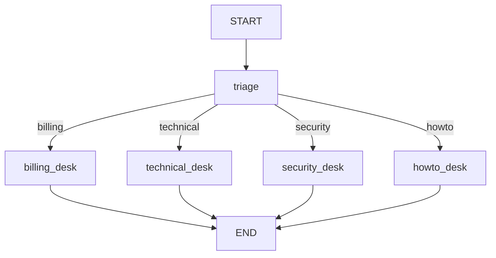

# Conditional Routing

## 30-second answer

Unconditional edges build pipelines. **`add_conditional_edges(source, path_fn, path_map)`** builds programs. The path function returns a **key** (or a **list** of keys). It is not a node and writes no state. Loops need **two exits**: quality met and budget exhausted. **`Command(update=..., goto=...)`** lets a node write and choose next together. Prefer **code** for thresholds and money; use the **model** to fill a field, then route in code.

## Tiny example

Support ticket: spam check → triage by category → billing / technical / security / howto desks. Critical tickets escalate. Soft tickets draft → review loop until score is good **or** revisions hit the cap.

## Why it exists

Conditional edges give branches, loops, early exits, and retry limits. The big design choice: which decisions are **code** and which are the **model**. Get that wrong and you get rigid systems or unpredictable ones.

## Runtime

1. After triage writes `category`, register `add_conditional_edges("triage", route_by_category, path_map)`.
2. Path function returns a string key in the map — e.g. `"billing"` → `"billing_desk"`. No state write.
3. Route to `END` for early exit (spam).
4. Loop: write → critique → continue. Exit when `score >= GOOD_ENOUGH` **or** `revisions >= MAX_REVISIONS`.
5. Classify-then-route: model fills `category`; code routes on that field.
6. `Command` node: return `Command(update={...}, goto="oncall")`.
7. List destinations: path returns `["grammar", "financial"]`; selected nodes run in parallel.



*Picture:* one triage, four specialist desks. The path function only returns a key.

## Objects, fields, and merge rules

| Object | Role |
|---|---|
| `add_conditional_edges` | Branch after a node using path fn + map. |
| Path function | `(state) -> key \| list[key]`; no state write. |
| `path_map` | Key → node name or `END`. |
| Dual exits | Quality **and** budget on every loop. |
| `revisions: Annotated[int, operator.add]` | Append/sum attempt counts. |
| `Command(update=, goto=)` | Write + route in one return. |
| List of destinations | Parallel conditional fan-out. |

**Code vs model:** if it can be an `if`, write an `if`. Model classifies into state; code routes. Loggable, testable, overridable.

## Control surface

| Knob | Effect |
|---|---|
| `path_map` coverage | Must cover every return value. |
| Return `END` | Skip remaining work. |
| `MAX_REVISIONS` + `GOOD_ENOUGH` | Dual loop exits. |
| Deterministic `route_by_priority` | Free, auditable. |
| `Command(goto=..., update=...)` | Assess and route together. |
| Path returns `list[str]` | Run only needed parallel checks. |

## Failure anatomy

| Symptom | Cause | Fix |
|---|---|---|
| Wrong branch | Key not in `path_map` | Print the key; fix map or function |
| Loop never ends | Missing budget exit | Add a counter |
| `GraphRecursionError` | Same, safety net fired | Dual exits + sensible limit |
| Unpredictable routing | LLM inside every path fn | Classify to state, route in code |

## Keywords

- **`add_conditional_edges`** — path fn is not a node
- **`path_map`** — key → destination
- **dual exits** — quality and budget
- **`Command`** — update + goto
- **classify-then-route** — model fills field; code chooses edge

## Minimal fragment

```python
from typing import Literal
from langgraph.graph import END, START, StateGraph
from langgraph.types import Command

def route_by_category(state: TicketState) -> str:
    return state["category"]

builder.add_conditional_edges(
    "triage",
    route_by_category,
    {
        "billing": "billing_desk",
        "technical": "technical_desk",
        "security": "security_desk",
        "howto": "howto_desk",
    },
)

def should_continue(state) -> Literal["write", "__end__"]:
    if state["score"] >= GOOD_ENOUGH or state["revisions"] >= MAX_REVISIONS:
        return END
    return "write"
```

## Interview traps

**Shallow:** "The path function is just another node."

**Correction:** It returns a routing key only — no state merge.

**Shallow:** "Loops exit when the answer is good enough."

**Correction:** Always add a budget exit. Quality-only loops burn tokens.

**Shallow:** "Put the LLM in the router for flexibility."

**Correction:** Prefer classify-then-route. Judgement in state is auditable.

## Lab

[32_conditional_routing.ipynb](../../05-langgraph-beginner/32_conditional_routing.ipynb)
