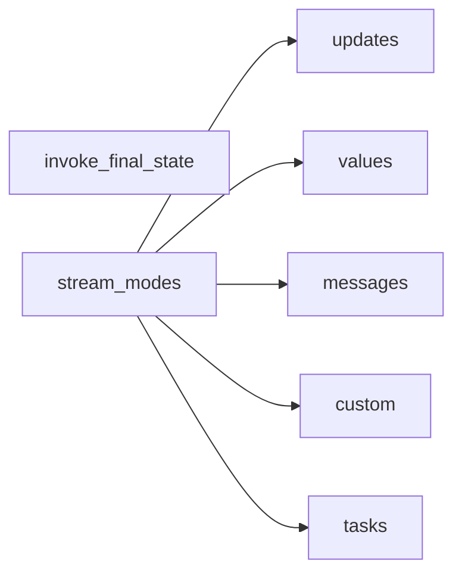

# Compile, Invoke and Stream

## 30-second answer

`compile()` turns a builder into a runnable. Attach checkpointer, interrupts, name here. One builder, many compiles. `invoke` / `batch` return final state. `stream` / `astream` yield progress. Modes shown in the lab: `updates`, `values`, `messages`, `custom` (via `get_stream_writer()`), and `tasks`. A table also lists `debug` and `checkpoints` — know they exist; do not invent demos. Prefer async twins in async servers.

## Tiny example

Research desk: plan → write → condense.

- `updates` → "Planning… Writing… Condensing…"
- `messages` → typewriter tokens (filter to the condense node)
- `custom` → progress bars inside a long index loop

## Why it exists

`invoke` returns the final state and nothing else. A 15-second graph with four model calls becomes a blank screen then a wall of text. Stream modes answer different UI questions. Pick the right mode.

## Runtime

1. Build with `add_sequence`, wire START/END, `compile()`.
2. Compile variants: plain; with checkpointer; with `interrupt_before`; with `name=`.
3. `invoke` → final dict. `batch` runs whole graphs concurrently (`max_concurrency`).
4. `stream_mode="updates"` — one chunk per node (partials).
5. `stream_mode="values"` — full state each step, **including initial** (one more chunk than updates).
6. `stream_mode="messages"` — `(token, metadata)`; filter `metadata["langgraph_node"]`.
7. Long node: `writer = get_stream_writer(); writer({...})` under `stream_mode="custom"`. No-op under plain `invoke`.
8. Combine: `stream_mode=["updates", "messages"]` → `(mode, payload)`.
9. Async: `ainvoke` / `astream` / `astream_events`. Sync `invoke` in FastAPI blocks the event loop.
10. `get_config()` reads `configurable` (tone, `thread_id` / conversation id) inside nodes.



*Picture:* invoke is one final answer; stream modes are five different feeds of progress.

## Objects, fields, and merge rules

| Object | Role |
|---|---|
| `builder.compile(...)` | Attach infrastructure; builder stays reusable. |
| `stream_mode="updates"` | Per-node partials — default progress. |
| `stream_mode="values"` | Full state; includes initial snapshot. |
| `stream_mode="messages"` | Tokens + metadata; always filter. |
| `get_stream_writer()` | Custom events; no-op under `invoke`. |
| `stream_mode="tasks"` | Task start/finish. |
| `debug` / `checkpoints` | Listed in lab table; not code-demoed here. |
| `get_config()` | Read per-run knobs inside a node. |

## Control surface

| Knob | Effect |
|---|---|
| Multiple compiles | Same topology with/without persistence. |
| Filter `langgraph_node` / tags | Show only user-visible tokens. |
| Mode list | Labels + tokens in one pass. |
| `configurable` via `get_config()` | Tone, conversation id, limits. |
| Async twins | Required under FastAPI concurrency. |

## Failure anatomy

| Symptom | Cause | Fix |
|---|---|---|
| Chat shows outline tokens | Unfiltered `messages` | Filter by node or tags |
| Off-by-one updates vs values | `values` includes initial | Expect one extra chunk |
| Custom progress never appears | Only `invoke` or missing `custom` | Use `stream_mode="custom"` |
| Async server stalls | Sync `invoke` in async handler | `ainvoke` / `astream` |

## Keywords

- **`compile()`** — attach infrastructure
- **`updates` / `values` / `messages` / `custom` / `tasks`** — stream modes
- **`get_stream_writer`** — in-node progress; no-op under invoke
- **`astream_events`** — finest async feed
- **`get_config` / `configurable`** — per-run settings

## Minimal fragment

```python
from langgraph.config import get_stream_writer, get_config

for chunk in graph.stream(inputs, stream_mode="updates"):
    for node_name, update in chunk.items():
        print(node_name, list(update))

for token, metadata in graph.stream(inputs, stream_mode="messages"):
    if metadata.get("langgraph_node") == "condense" and token.content:
        print(token.content, end="")

def index_documents(state):
    writer = get_stream_writer()
    for i, doc in enumerate(state["documents"], 1):
        writer({"phase": "indexing", "done": i, "total": len(state["documents"])})
    return {"indexed": len(state["documents"])}
```

## Interview traps

**Shallow:** "There is one stream mode."

**Correction:** Modes answer different questions. `updates` ≠ `messages` ≠ `custom`.

**Shallow:** "`values` and `updates` yield the same chunk count."

**Correction:** `values` emits initial state first.

**Shallow:** "`debug` and `checkpoints` are demoed like the others here."

**Correction:** They appear in the table; lab code demos are updates, values, messages, custom, tasks.

## Lab

[33_compile_invoke_stream.ipynb](../../06-langgraph-intermediate/33_compile_invoke_stream.ipynb)
