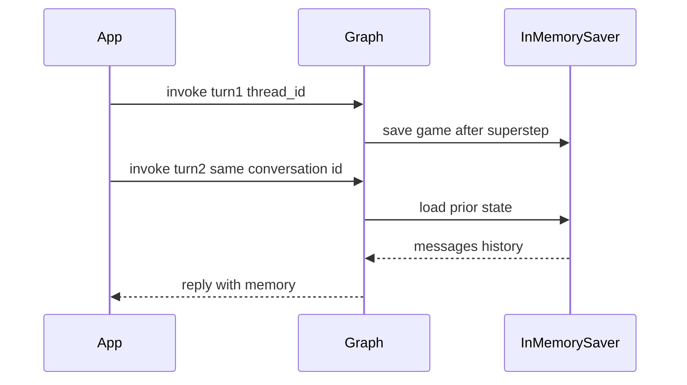

# Checkpointing and Thread IDs

## 30-second answer

A checkpointer is a **save game** for graph state after steps. It is keyed by **`thread_id`** — the **conversation id**. That one mechanism gives chat memory, crash recovery, human-in-the-loop, and time travel. Without a checkpointer each `invoke` starts empty. With `InMemorySaver` and a stable conversation id, messages accumulate. `get_state` inspects; `update_state` edits; `invoke(None)` resumes; `get_state_history` lists save points newest-first.

## Tiny example

Support chat: "My name is Mukesh." then "What is my name?"

- No checkpointer → amnesia.
- Same `thread_id` + checkpointer → remembers.
- New UUID every request → looks fine in one cell, forgets on the next HTTP call.

## Why it exists

Notebook 06 said modern memory is a checkpointer. Here it is. Conversation memory, crash recovery, pause/resume, and time travel are four consequences of the same save-game mechanism — not four features.

## Runtime

1. Without checkpointer: two invokes, second forgets the name.
2. `compile(checkpointer=InMemorySaver())` + `thread_id: "mukesh-1"` → remembers.
3. Isolation: `mukesh-1` and `priya-1` never see each other. One conversation id = one conversation.
4. Bad pattern: new `uuid4()` every request silently kills cross-request memory.
5. `get_state(config)` → values, `next`, checkpoint id, metadata, tasks.
6. `update_state` writes like a node (reducers apply). Use **`as_node`** so `next` stays correct after an interrupt.
7. Resume: `invoke(None, config)` continues from the pause.
8. History: newest first; `source` is `input` / `loop` / `update`.
9. Cost: every step serialises the whole state. Keep blobs out — store ids/paths.
10. `delete_thread` for retention and privacy. Threads do not expire alone.



*Picture:* same conversation id loads the save game; a new id starts a fresh game.

## Objects, fields, and merge rules

| Object | Role |
|---|---|
| Checkpointer | Save game after steps. |
| `thread_id` | Conversation id; must be **stable across requests**. |
| `InMemorySaver` | Dict-backed; dies on process exit. Alias `MemorySaver`. |
| `get_state` | Snapshot: values, next, checkpoint id, metadata, tasks. |
| `update_state` / `as_node` | External write; `as_node` keeps scheduling correct. |
| `invoke(None, config)` | Resume without new user input. |
| `get_state_history` | Newest-first list of save points. |
| `delete_thread` | Drop a conversation's checkpoints. |

| Product | Sensible conversation id |
|---|---|
| Chat app | Session / conversation id |
| Support tool | Ticket id |
| Per-user assistant | User id |

## Control surface

| Knob | Effect |
|---|---|
| Omit checkpointer | Every invoke is amnesiac. |
| Stable `thread_id` | Multi-turn memory and resume. |
| Fresh UUID per request | Silently disables memory. |
| `as_node` on update | Keep `next` meaningful. |
| Lean state | Control serialisation cost. |

## Failure anatomy

| Symptom | Cause | Fix |
|---|---|---|
| Forgets name next request | New conversation id or no checkpointer | Stable id + checkpointer |
| Pause lost after restart | `InMemorySaver` exited | Sqlite/Postgres (notebook 35) |
| Resume restarts | New input or wrong thread | `invoke(None)` same conversation id |
| Steps get slow | Huge state every save | Bound messages; store blobs by id |

## Keywords

- **checkpointer** — save game
- **`thread_id`** — conversation id
- **`InMemorySaver`** — ephemeral; notebooks/tests
- **`get_state` / `update_state` / `as_node`** — inspect and edit
- **resume** — `invoke(None, config)`
- **`delete_thread`** — retention / privacy

## Minimal fragment

```python
from langgraph.checkpoint.memory import InMemorySaver
from langgraph.graph import END, START, MessagesState, StateGraph
from langchain_core.messages import HumanMessage

builder = StateGraph(MessagesState)
builder.add_node("chat", chat_node)
builder.add_edge(START, "chat")
builder.add_edge("chat", END)

remembering = builder.compile(checkpointer=InMemorySaver())
config = {"configurable": {"thread_id": "mukesh-1"}}  # conversation id
remembering.invoke({"messages": [HumanMessage("My name is Mukesh.")]}, config)
second = remembering.invoke(
    {"messages": [HumanMessage("What is my name?")]}, config
)
# Resume after interrupt: graph.invoke(None, config)
# Cleanup: saver.delete_thread("mukesh-1")
```

## Interview traps

**Shallow:** "Checkpointing is just chat memory."

**Correction:** Same save game unlocks interrupt/resume, crash recovery, and time travel.

**Shallow:** "Any `thread_id` works."

**Correction:** It must be stable across requests. New UUID each call = new empty game.

**Shallow:** "`InMemorySaver` is fine for production."

**Correction:** Process-local dict. Restarts wipe threads.

## Lab

[34_checkpointing_thread_ids.ipynb](../../06-langgraph-intermediate/34_checkpointing_thread_ids.ipynb)
