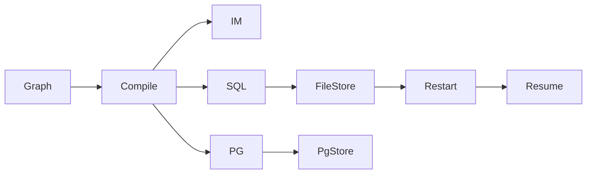

# SQLite and Postgres Savers

## 30-second answer

`InMemorySaver` dies when the process exits. Durable checkpointers (`SqliteSaver`, `PostgresSaver`, and async twins) keep the same graph API — only the object passed to `compile(checkpointer=...)` changes. SQLite is one file, **one writer**, one host. Use WAL and `busy_timeout` to soften contention, but move to Postgres when you have app replicas. Postgres needs `setup()` once per deploy.

## Tiny example

Support chat saves turns to a SQLite file. Kill the process. Reopen the file with a new connection and new compiled graph. Same conversation id → messages and `turn_count` come back. That is the save game surviving restart.

## Why it exists

Checkpointing only helps products if the saver survives deploys. A half-finished approval must not vanish when the worker restarts. This chapter swaps the ephemeral dict for disk and database backends without rewriting graph code.

## Runtime

1. Same chat graph as notebook 34.
2. `sqlite3.connect(path, check_same_thread=False)` → `SqliteSaver(conn)` → compile.
3. Invoke twice. Close. Reopen. `get_state` recovers. Third invoke answers from prior context.
4. `with SqliteSaver.from_conn_string(...)` — connection closes on exit; later `get_state` fails.
5. Tests: `":memory:"` — real SQL semantics, no file.
6. Inspect tables: each superstep writes a serialised blob per conversation.
7. Async: `AsyncSqliteSaver` with `ainvoke`. Match sync/async styles.
8. Tune SQLite: WAL, `busy_timeout`. Still one writer. Two replicas → Postgres.
9. Postgres: `setup()` once, pool with `autocommit=True` / `prepare_threshold=0`.
10. Retention: `delete_thread` on old conversations.



*Picture:* same graph; swap the saver. Only file/Postgres save games survive restart.

## Objects, fields, and merge rules

| Object | Role |
|---|---|
| `InMemorySaver` | Dies on exit. Notebooks/tests. |
| `SqliteSaver` | File-backed. **One writer.** Single host. |
| `check_same_thread=False` | Needed for web servers. |
| `from_conn_string` | Context manager; closes on exit. |
| `":memory:"` | Ephemeral SQLite for tests. |
| `PostgresSaver` + `setup()` | Multi-replica production. |
| `AsyncSqliteSaver` / `AsyncPostgresSaver` | Pair with `ainvoke`. |
| `delete_thread` | Retention and privacy. |

**Same API across savers:** `invoke`, `get_state`, `update_state`, resume — only the saver object changes.

| You are building | Use |
|---|---|
| Notebook / unit test | `InMemorySaver` |
| CLI / single-process | `SqliteSaver` file |
| More than one replica | `PostgresSaver` |

## Control surface

| Knob | Effect |
|---|---|
| Saver type | Durability and multi-writer |
| WAL + `busy_timeout` | Soften locks; still one writer |
| `setup()` | Create Postgres tables once |
| Sync vs async saver | Must match invoke style |
| Retention + `delete_thread` | Bound growth |

## Failure anatomy

| Symptom | Cause | Fix |
|---|---|---|
| Memory gone after restart | `InMemorySaver` | File Sqlite or Postgres |
| `database is locked` | Concurrent writers / no timeout | WAL + timeout; or Postgres |
| Graph dead after `with` block | Context manager closed conn | Keep long-lived connection in servers |
| Async stalls | Sync saver under `ainvoke` | Async saver |
| Tables missing | Never called `setup()` | Run once per deploy |

## Keywords

- **`SqliteSaver`** — durable; **one writer**
- **`PostgresSaver`** — multi-replica
- **`check_same_thread=False`** — web servers
- **WAL / `busy_timeout`** — soften locks; not multi-replica
- **`setup()`** — Postgres migrate once
- **`delete_thread`** — retention

## Minimal fragment

```python
import sqlite3
from langgraph.checkpoint.sqlite import SqliteSaver
from langchain_core.messages import HumanMessage

conn = sqlite3.connect(db_path, check_same_thread=False)
saver = SqliteSaver(conn)
graph = builder.compile(checkpointer=saver)
config = {"configurable": {"thread_id": "durable-1"}}
graph.invoke({"messages": [HumanMessage("My name is Mukesh.")], "turn_count": 0}, config)
conn.close()
# reopen after "restart"
conn2 = sqlite3.connect(db_path, check_same_thread=False)
restarted = builder.compile(checkpointer=SqliteSaver(conn2))
print(restarted.get_state(config).values["turn_count"])
# Postgres: pg_saver.setup(); compile(checkpointer=pg_saver)
```

## Interview traps

**Shallow:** "Any checkpointer is fine in production."

**Correction:** `InMemorySaver` vanishes on exit. Production needs Sqlite (single process) or Postgres (replicas).

**Shallow:** "SQLite with WAL handles multiple app replicas."

**Correction:** WAL helps readers beside one writer on one host. Replicas sharing a file → locks. Use Postgres.

**Shallow:** "`from_conn_string` is a long-lived saver for the app object."

**Correction:** Context manager. Leaving `with` closes the connection.

## Lab

[35_sqlite_postgres_savers.ipynb](../../06-langgraph-intermediate/35_sqlite_postgres_savers.ipynb)
