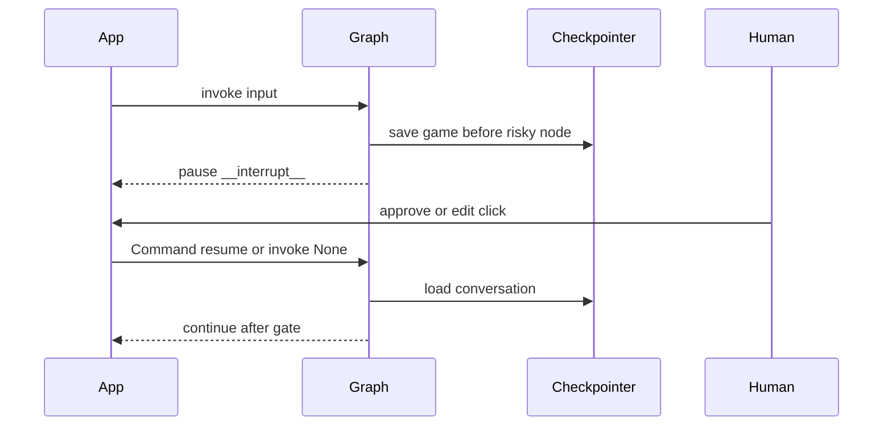

# Human in the Loop

## 30-second answer

HITL means **pause and wait for a human click** before irreversible work. A **checkpointer is required** — without a save game there is nothing to resume hours later. Static pauses: `interrupt_before` / `interrupt_after`; resume with `invoke(None, config)`. Dynamic pauses: `interrupt(payload)` inside a node; resume with `Command(resume=value)`. On resume the node **re-runs from the top**. Put side effects after the interrupt or they double-fire.

## Tiny example

Support refund: amounts under $1000 auto-approve. Larger amounts call `interrupt({...})`. Reviewer clicks approve, reduce, or reject. Graph resumes with `Command(resume=...)`. Money moves only after that click.

## Why it exists

Refunds, customer emails, deletes, and ticket closes must not run unsupervised when being wrong is expensive. HITL pauses the graph, keeps the save game durable, and lets a reviewer decide later from another process. Gate on **consequence**, not model confidence.

## Runtime

1. Static: `interrupt_before=["issue_refund"]` + checkpointer. `invoke` stops before that node.
2. Approve: `invoke(None, config)`.
3. Reject: do not resume; optionally note rejection in state.
4. Edit: `update_state` then `invoke(None)`.
5. Dynamic: if amount ≥ threshold, `interrupt({...payload...})`.
6. Resume dynamic: `Command(resume="approve")` or a dict. That value is what `interrupt()` returns.
7. Re-run rule: whole node restarts. Code before `interrupt()` runs twice — classic double email.
8. Safe pattern: gate node only interrupts; effect node runs after.
9. Approval queue: read `snapshot.tasks[*].interrupts` for UI payloads.
10. Agents: `HumanInTheLoopMiddleware(interrupt_on={...})` on `create_agent`.



*Picture:* pause and wait for a human click; resume loads the save game and continues.

## Objects, fields, and merge rules

| Object | Role |
|---|---|
| `interrupt_before` / `interrupt_after` | Static pause every run. |
| `interrupt(payload)` | Dynamic pause with reviewer data. |
| Checkpointer | Mandatory save game. |
| `invoke(None, config)` | Resume static interrupt. |
| `Command(resume=value)` | Resume dynamic; value becomes `interrupt()` return. |
| `__interrupt__` | Key on result when paused. |
| `snapshot.tasks[*].interrupts` | What the approval inbox lists. |
| `HumanInTheLoopMiddleware` | Gate tools on `create_agent`. |

**Four patterns:** approve/reject tool, edit args, ask a question, rewrite output.

## Control surface

| Knob | Effect |
|---|---|
| Static vs `interrupt()` | Always pause vs only when consequence warrants |
| Payload richness | What the reviewer sees |
| Gate-then-effect split | Prevents double side effects |
| Timeout job | Paused threads wait forever by default |

## Failure anatomy

| Symptom | Cause | Fix |
|---|---|---|
| Cannot resume after restart | No durable checkpointer | Sqlite/Postgres saver |
| Email sent twice | Side effect before `interrupt()` | Interrupt first, or separate effect node |
| Resume restarts whole thread | New input / wrong conversation id | `invoke(None)` or `Command(resume=)` same id |
| UI has nothing to show | Empty interrupt payload | Put action, args, context in payload |

## Keywords

- **HITL** — pause and wait for a human click
- **`interrupt_before` / `interrupt()`** — static vs dynamic pause
- **`Command(resume=)`** — deliver the human answer
- **node re-runs from top** — side effects before interrupt double
- **gate on consequence** — money, deletes, customer-visible actions

## Minimal fragment

```python
from langgraph.types import Command, interrupt
from langgraph.checkpoint.memory import InMemorySaver

def review_node(state):
    if state["amount"] < 1000.0:
        return {"approved": True, "trace": ["auto-approved"]}
    decision = interrupt({
        "kind": "refund_approval",
        "amount": state["amount"],
        "question": f"Approve ${state['amount']:,.2f}?",
    })
    if decision == "approve":
        return {"approved": True, "trace": ["human approved"]}
    return {"approved": False, "trace": ["human rejected"]}

smart = builder.compile(checkpointer=InMemorySaver())
outcome = smart.invoke({...}, large_cfg)  # may contain __interrupt__
smart.invoke(Command(resume="approve"), large_cfg)
```

## Interview traps

**Shallow:** "HITL is just logging for a human to read later."

**Correction:** The graph actually pauses with a durable save game. Resume is a first-class path.

**Shallow:** "On resume, execution continues after `interrupt()` without re-running earlier code."

**Correction:** The node re-runs from the top. Side effects before that call double unless isolated.

**Shallow:** "You can HITL without a checkpointer if the process stays alive."

**Correction:** Production reviewers act from another process hours later. No checkpointer = no resume.

## Lab

[36_human_in_the_loop.ipynb](../../06-langgraph-intermediate/36_human_in_the_loop.ipynb)
