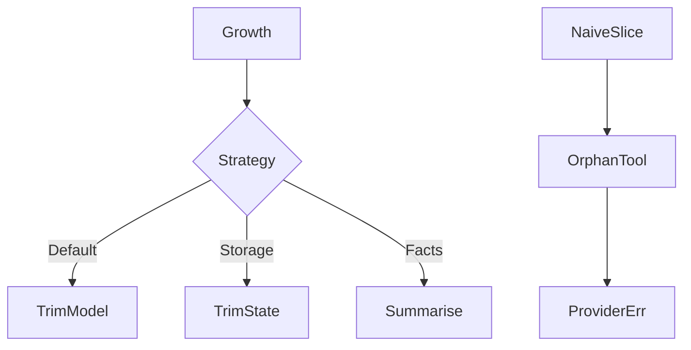

# Message History and Deletion

## 30-second answer

Checkpointed chats grow forever. Turn N resends turns 1…N−1 until cost blows up or the window breaks. Delete with `RemoveMessage` through `add_messages`. Never slice tool transcripts naively: every `AIMessage` with `tool_calls` must keep matching `ToolMessage`s — that is **tool-call pair deletion**. Prefer `trim_messages`. Default: **trim for the model**, keep full state for audit; trim state only for storage/privacy. Summarise when users notice forgetting.

## Tiny example

Support agent with tools: after many turns you "keep last 4 messages" with a Python slice. You orphan a `ToolMessage`. Next model call fails. Provider error looks like a model bug. It is a broken tool-call pair.

## Why it exists

Long threads get expensive then fail. The hard part is structure. Tool calls and results are pairs. Naive "keep last N" is the bug this chapter exists for.

## Runtime

1. Growth demo: message count and tokens rise each turn on one conversation id.
2. Trim state: return `RemoveMessage(id=...)` for excess; keep last N.
3. Clear all: `RemoveMessage(id=REMOVE_ALL_MESSAGES)`.
4. Tool-pair trap: slice breaks pairing; providers reject the next call.
5. Safe trim: `trim_messages(..., strategy="last", include_system=True, start_on="human")`.
6. Trim for model: window for the call; append only the new reply to state.
7. Summarise: older turns → `summary` field; `RemoveMessage` older ids; inject summary next turn.
8. Agents: `SummarizationMiddleware(trigger=..., keep=...)`.
9. Redact: selective delete; old checkpoints may still hold data until `delete_thread`.



*Picture:* trim for model keeps the save game full; naive slice breaks tool-call pairs.

## Objects, fields, and merge rules

| Object | Role |
|---|---|
| `add_messages` | Append; treats `RemoveMessage` as delete-by-id. |
| `RemoveMessage(id=...)` | Delete one message. |
| `REMOVE_ALL_MESSAGES` | Clear the conversation channel. |
| `trim_messages` | Structure-aware window; respects tool pairs. |
| `summary` channel | Compressed prior context. |

**Tool-call pair deletion:** delete the `AIMessage` with `tool_calls` **and** its matching `ToolMessage`s together. Orphans break the next `model.invoke`.

| | Trim for model | Trim state |
|---|---|---|
| What shrinks | Payload to the provider | Checkpointed messages |
| Audit / time travel | Intact | Tip permanently reduced |
| Default? | **Yes** | Only storage/privacy |

## Control surface

| Knob | Effect |
|---|---|
| `keep_last_n` / `RemoveMessage` | Hard bound on stored messages |
| `trim_messages` max_tokens | Bound tokens per call |
| Summarise threshold | When to compress |
| Redaction + `delete_thread` | Privacy for tip and history |

## Failure anatomy

| Symptom | Cause | Fix |
|---|---|---|
| Provider: tool messages must follow tool_calls | Naive slice | `trim_messages` or delete pairs together |
| Context length errors late | Unbounded history | Trim for model and/or summarise |
| "New chat" left old messages | Forgot `REMOVE_ALL_MESSAGES` | Use that sentinel |
| PII still recoverable | Only tip cleaned | `delete_thread` / purge |

## Keywords

- **`RemoveMessage`** — delete-by-id
- **tool-call pair deletion** — AI tool_calls + ToolMessages stay together
- **`trim_messages`** — safe windowing
- **trim for model** — default; keep full state
- **summarisation** — compress older turns into `summary`

## Minimal fragment

```python
from langchain_core.messages import RemoveMessage, trim_messages
from langgraph.graph.message import REMOVE_ALL_MESSAGES

def keep_last_n(n):
    def node(state):
        excess = state["messages"][:-n] if len(state["messages"]) > n else []
        return {"messages": [RemoveMessage(id=m.id) for m in excess]}
    return node

window = trim_messages(
    state["messages"],
    max_tokens=300,
    token_counter=model,
    strategy="last",
    include_system=True,
    start_on="human",
    allow_partial=False,
)
# clear all: {"messages": [RemoveMessage(id=REMOVE_ALL_MESSAGES)]}
```

## Interview traps

**Shallow:** "Just keep the last N messages with a slice."

**Correction:** Slices break tool-call pairs. Use `trim_messages` or delete complete pairs.

**Shallow:** "Trimming state and trimming the model payload are the same."

**Correction:** Trim-for-model keeps the full transcript in the checkpointer.

**Shallow:** "`RemoveMessage` erases past checkpoints too."

**Correction:** It updates the live tip. History can still hold old messages until retention deletes them.

## Lab

[37_message_history_and_deletion.ipynb](../../06-langgraph-intermediate/37_message_history_and_deletion.ipynb)
