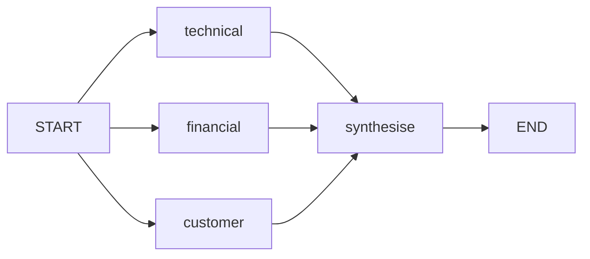

# Parallel Fan-out and Fan-in

## 30-second answer

LangGraph runs in **supersteps**: ready nodes run together, writes merge, then the next step. Fan-out splits work; fan-in waits for **all paths**. Concurrent writes to the same key **need a reducer** (`Annotated[list, operator.add]` — append) or you get `InvalidUpdateError`. Same-superstep nodes **cannot see each other's writes**. Use `Send` for a runtime-sized map. Cap with `max_concurrency`. Isolate flaky branches with `try/except`.

## Tiny example

Research desk: technical, financial, and customer nodes leave START together. Each appends to `findings`. Synthesise waits for all three, then writes the report. Wall time ≈ slowest branch, not the sum.

## Why it exists

Three independent model calls in sequence take ~3× the wall time of a parallel shape. Research agents, multi-retriever RAG, and extractors are embarrassingly parallel. Skills: draw the graph, attach append reducers, and do not let one flaky branch kill the run.

## Runtime

1. Sequential A→B→C vs START→{A,B,C} — parallel finishes in roughly one sleep duration.
2. Research fan-out with `operator.add` on `findings`; synthesise waits.
3. No reducer → concurrent write error.
4. **`Send` map-reduce:** plan produces subtopics; return `[Send("research", {"subtopic": t}) for t in ...]`. Worker receives **only** that arg dict.
5. Uneven paths: merge waits for the long path, not just neighbours.
6. `defer=True` postpones until nothing else is pending.
7. Strict failure: one raise fails the superstep. Resilient: `try/except` writes to `errors`.
8. `RetryPolicy` for transient errors. `max_concurrency` for rate limits.
9. Parallel RAG: dense + sparse + mmr → fuse candidates through the same append pattern.



*Picture:* three researchers in parallel; synthesise waits for all; findings need an append reducer.

## Objects, fields, and merge rules

| Object | Role |
|---|---|
| Superstep | Parallel barrier; merge; advance. |
| Fan-out / fan-in | Split; wait for all paths. |
| Reducer (`operator.add`) | Legal merge for concurrent list writes — **append**. |
| `Send(node, arg)` | Dynamic map; child sees exactly `arg`. |
| `defer=True` | Wait until nothing else pending. |
| `RetryPolicy` | Per-node retries for transient errors. |
| `max_concurrency` | Cap parallel pressure. |

**Same-superstep visibility:** peers see the state from **before** the step. If B must read A's write, sequence them.

**Parallel write needs reducer.** Without it: `InvalidUpdateError`.

## Control surface

| Knob | Effect |
|---|---|
| Topology | Sequential vs parallel wall time |
| `Annotated[..., reducer]` | Enables concurrent appends |
| `Send` vs fixed edges | Data-dependent branch count |
| `try/except` in node | Partial success |
| `max_concurrency` | Rate-limit budget |

## Failure anatomy

| Symptom | Cause | Fix |
|---|---|---|
| `InvalidUpdateError` | Missing reducer | Add `operator.add` (append) |
| Fan-in with empty peer results | Same-superstep read | Put reader in next superstep |
| All research lost on one 500 | Uncaught exception | Isolate in-node |
| Provider 429s | Unbounded fan-out | Set `max_concurrency` |

## Keywords

- **superstep** — parallel barrier
- **fan-out / fan-in** — split; wait for all
- **parallel write needs reducer** — append rule mandatory
- **`Send`** — runtime-sized map; child sees only arg
- **`defer=True`** — wait until idle
- **`max_concurrency`** — bound parallel calls

## Minimal fragment

```python
from typing import Annotated, TypedDict
import operator
from langgraph.types import Send
from langgraph.graph import START, END, StateGraph

class ResearchState(TypedDict):
    findings: Annotated[list[str], operator.add]  # append for parallel writes
    report: str

# Fixed fan-out: START -> technical/financial/customer -> synthesise
# Dynamic: return [Send("research", {"subtopic": t}) for t in state["subtopics"]]
# Cap: graph.invoke(inputs, config={"max_concurrency": 4})
```

## Interview traps

**Shallow:** "Parallel nodes can read each other's outputs in the same step."

**Correction:** Peers see pre-step state. Sequence if one depends on the other.

**Shallow:** "Multiple writers to a list just append automatically."

**Correction:** Parallel write needs a reducer. Without it LangGraph raises.

**Shallow:** "`Send` passes the full parent state."

**Correction:** Worker receives exactly the `arg` dict.

## Lab

[38_parallel_fanout_fanin.ipynb](../../06-langgraph-intermediate/38_parallel_fanout_fanin.ipynb)
