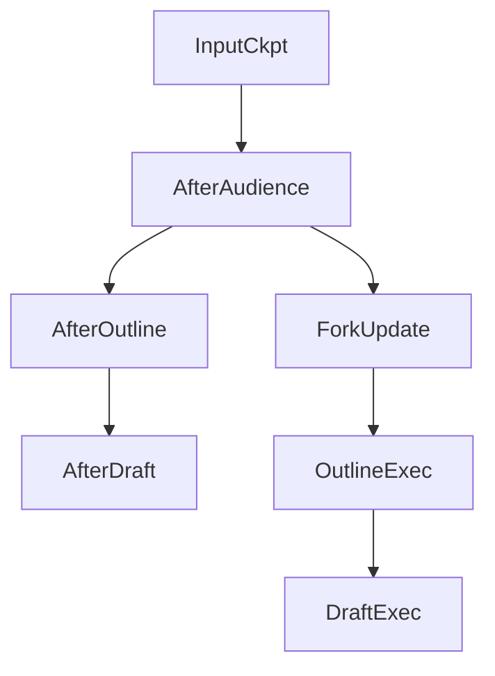

# Time Travel

## 30-second answer

With a checkpointer, every superstep is an addressable **save game**. `get_state_history` lists them newest-first. **Replay:** `invoke(None, past_config)` re-runs from that checkpoint (model calls run again — not a cache). **Fork:** `update_state` on a past `checkpoint_id` creates a new branch. That is regenerate, edit-and-resubmit, and debugging. Side effects re-run on replay — make them idempotent.

## Tiny example

Research desk: audience → outline → draft. Find the save game where `next == ("outline",)`. Change audience to executives. Fork and re-run. Original draft still exists. You now have two futures from one past.

## Why it exists

Logs tell you what happened. Time travel lets you return to the moment before a mistake, change one field, and watch the alternative. Cheapest regenerate and A/B drafts: forks, not full restarts.

## Runtime

1. Run a multi-node pipeline with a checkpointer and stable conversation id.
2. `history = list(graph.get_state_history(config))` — newest first.
3. Find `before_outline` where `next == ("outline",)`.
4. Replay: `invoke(None, before_outline.config)`.
5. Fork: `update_state(before_outline.config, {"audience": "executives"})` then `invoke(None, fork_config)`.
6. Regenerate helper: locate `next == (node,)`, optional overrides, invoke.
7. HITL compose: reject, rewind past bad decision, retry.
8. Idempotent side effects: track `emails_sent`; skip if already sent.



*Picture:* one timeline splits at AfterAudience into original draft and executive fork.

## Objects, fields, and merge rules

| Object | Role |
|---|---|
| `get_state_history` | Newest-first save games. |
| `snapshot.next` | Nodes about to run — "before X". |
| `snapshot.config` | Carries `checkpoint_id`. |
| `parent_config` | Walk the branch tree after forks. |
| Replay | `invoke(None, past.config)` — re-execute. |
| Fork | `update_state(past.config, patch)` — new branch. |

| | Replay | Fork |
|---|---|---|
| Past tip | Re-executes along that lineage | Creates a sibling lineage |
| Overwrites old? | No | No — both remain |

External DBs and emails already sent do **not** rewind with the checkpoint.

## Control surface

| Knob | Effect |
|---|---|
| Which `checkpoint_id` | Where replay/fork starts |
| Overrides in `update_state` | Alternative futures |
| Idempotency keys in state | Safe replay of effectful nodes |

## Failure anatomy

| Symptom | Cause | Fix |
|---|---|---|
| Double email on regenerate | Side effects not idempotent | Track sent ids; skip duplicates |
| Lost original after "edit" | Thought fork overwrites | Forks share conversation id but keep both tips |
| Expensive regenerates | Replay re-runs models | Expect cost; fork from latest shared step |

## Keywords

- **time travel** — addressable save games
- **replay** — `invoke(None, past_config)`
- **fork** — `update_state` on a past checkpoint
- **`snapshot.next`** — find "before node X"
- **idempotent side effects** — safe re-run

## Minimal fragment

```python
def regenerate(graph, config, node_name, overrides=None):
    target = next(
        s for s in graph.get_state_history(config) if s.next == (node_name,)
    )
    start = (
        graph.update_state(target.config, overrides)
        if overrides
        else target.config
    )
    return graph.invoke(None, start)

# Three audiences from the same pre-outline save game:
# regenerate(graph, config, "outline", {"audience": "executives"})
```

## Interview traps

**Shallow:** "Replay loads a cached answer."

**Correction:** It re-executes forward. Model calls run again.

**Shallow:** "Fork overwrites the original timeline."

**Correction:** Both branches remain addressable. UI must track which tip is current.

**Shallow:** "Time travel rewinds emails and DB writes."

**Correction:** Only checkpointed graph state. External effects need idempotency.

## Lab

[39_time_travel.ipynb](../../07-langgraph-advanced/39_time_travel.ipynb)
