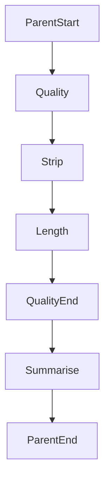

# Subgraphs

## 30-second answer

A compiled graph is a valid node. Subgraphs split big workflows into testable pieces. **Shared state:** overlapping schemas — add the compiled child directly. **Different schemas:** use a **wrapper** that maps parent ↔ child (`input_schema` / `output_schema` help). Subgraphs **inherit the parent's checkpointer** — do not give the child its own. Inspect with `xray=True` and `subgraphs=True`. A child's `interrupt()` bubbles up; resume on the **parent**.

## Tiny example

Research desk parent: quality subgraph (strip → length checks) then summarise. Shared `findings` append across parent and child. Or a review child with its own schema: wrapper maps `content` in and `score` out.

## Why it exists

A thirty-node graph is unmaintainable. Subgraphs are the refactoring tool. The design choice that matters is state wiring — shared keys versus explicit translation.

## Runtime

1. Shared state: add compiled child as a node; keys and reducers flow as if inlined.
2. `get_graph(xray=True)` expands nested nodes in the diagram.
3. Different schemas: child with `input_schema` / `output_schema`; wrapper invokes and maps fields.
4. Default stream collapses the child to one update. `stream(..., subgraphs=True)` yields `(namespace, chunk)`.
5. Compile checkpointer on the **parent** only.
6. Child `interrupt()` → parent sees `__interrupt__`; `Command(resume=...)` on parent config.
7. Reuse the same child twice via wrappers with isolated inputs.
8. Unit-test the child alone without the parent.



*Picture:* quality is a nested graph; parent only sees the quality step unless you turn x-ray on.

## Objects, fields, and merge rules

| Object | Role |
|---|---|
| Compiled graph as node | Direct embed when schemas share keys. |
| Wrapper function | Translate when schemas differ. |
| `input_schema` / `output_schema` | Child's public contract. |
| Inherited checkpointer | Parent's save game covers nested steps. |
| `xray=True` / `subgraphs=True` | See inside children. |

| | Direct node | Wrapper |
|---|---|---|
| Schemas | Must share flowing keys | Independent |
| Coupling | Tight | Loose |
| Reuse | Harder | Easier |

## Control surface

| Knob | Effect |
|---|---|
| Shared vs translated state | Inlining vs reuse boundary |
| `name=` on compile | Readable labels |
| Extract vs inline | Maintainability vs premature abstraction |

## Failure anatomy

| Symptom | Cause | Fix |
|---|---|---|
| Child keys missing on parent | Direct embed, mismatched schemas | Wrapper + schemas |
| Nested steps invisible | Default stream | `subgraphs=True` |
| Lost after restart inside child | Child has own InMemory / parent has none | One checkpointer on parent |
| Resume on child config fails | Interrupt surfaced on parent | Resume parent conversation id |

## Keywords

- **subgraph** — compiled graph as a node
- **shared vs wrapper** — schema wiring choice
- **inherited checkpointer** — parent owns the save game
- **`xray` / `subgraphs=True`** — see inside
- **interrupt bubbles up** — resume on parent

## Minimal fragment

```python
quality_graph = quality_builder.compile()  # no checkpointer
parent = StateGraph(DocState)
parent.add_node("quality", quality_graph)  # shared state
parent.add_node("summarise", summarise_node)
pipeline = parent.compile(checkpointer=InMemorySaver())

# Different schemas: wrapper invokes child with mapped input/output
# Stream deep: pipeline.stream(inputs, stream_mode="updates", subgraphs=True)
# Resume child interrupt on parent: pipeline.invoke(Command(resume="approve"), config)
```

## Interview traps

**Shallow:** "Give every subgraph its own checkpointer."

**Correction:** Child inherits the parent's save game. Dual checkpointers confuse resume.

**Shallow:** "Always add the compiled child directly."

**Correction:** Different schemas need a wrapper and explicit mapping.

**Shallow:** "Resume the child with the child's config."

**Correction:** Interrupt surfaces on the parent. Resume the parent conversation id.

## Lab

[40_subgraphs.ipynb](../../07-langgraph-advanced/40_subgraphs.ipynb)
