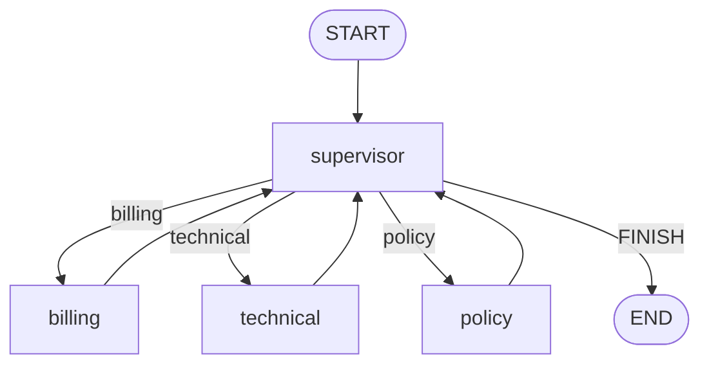

# Multi-agent Handoffs

## 30-second answer

Multi-agent graphs split work across specialists with narrow prompts and short tool lists. Two main shapes: a **supervisor** that always picks the next node, and a **network** where each agent hands off with `Command`. Hierarchy of supervisors past ~six specialists. Cap hops and track visited names to stop ping-pong. Parent sees only a subagent's **final** message — not intermediate tool calls.

## Tiny example

Support desk: supervisor routes to billing, technical, or policy. Each specialist has five tools, not twenty. Workers edge back to the supervisor. Hop cap of 4 forces FINISH. Or a network: billing hands off to technical with `Command(goto=...)` when the ticket shifts.

## Why it exists

One agent with twenty tools picks wrong more often than four agents with five each. Split when you can name a concrete failure — wrong tool from a long list, bloated prompt, different model per domain, different owning teams — not because the diagram looks cleaner. Expect 3–5× cost.

## Runtime



*Picture:* supervisor in the middle; specialists report back. That is central control.

### Supervisor vs network

| | Supervisor | Network |
|---|---|---|
| Who decides next | Central router every hop | Each agent via `Command` |
| Audit | Easy | Harder |
| Extra model call | One per hop | Built into each agent |
| Failure mode | Coordination thrash | Ping-pong handoffs |

**Supervisor:** structured `Routing` → `next_agent`. Workers return one named `AIMessage` + `completed`. Cap `hops`. Conditional edges map FINISH → END.

**Network:** each node returns `Command(update=..., goto=...)`. Track `visited`. Cap hops. Declare `destinations=` so the diagram draws edges.

**Handoff as a tool (swarm):** transfer tools return `Command(goto=..., graph=Command.PARENT, update={ToolMessage(...)})`.

**Shared facts:** dict merge reducer so parallel specialists write verified facts; final node composes the reply.

**Structured output from subagent:** only the final message returns. Use `response_format=` or a shared artifact for typed data.

## Objects, fields, and merge rules

| Field | Merge | Role |
|---|---|---|
| `next_agent` | replace | Supervisor decision |
| `completed` / `visited` / `hops` | append (`operator.add`) | Audit and caps |
| `Command(goto=, update=)` | n/a | Write + route |
| `Command.PARENT` | n/a | Child tool routes parent |
| `facts` | dict merge | Shared scratchpad |

## Control surface

- Default to supervisor; network when agents know who is next; hierarchical past ~6.
- Set `MAX_HOPS`; never consult the same specialist twice.
- Pass full transcripts or shared scratchpads between hops.
- Measure LLM calls vs a single-agent baseline.

## Failure anatomy

| Failure | Fix |
|---|---|
| Ping-pong | `visited` + hop cap |
| $400 bill from one request | `MAX_HOPS` forces FINISH |
| Lost context | Pass messages or shared state |
| Scraping tool calls for typed data | `response_format=` or artifact |

## Keywords

- **supervisor vs network** — central router vs Command handoffs
- **hop cap / visited** — stop ping-pong
- **`Command.PARENT`** — child tool moves parent
- **final message only** — isolation guarantee
- **`destinations=`** — draw Command edges

## Minimal fragment

```python
# Supervisor: route with structured output, workers edge back
builder.add_conditional_edges(
    "supervisor",
    lambda s: s["next_agent"],
    {"billing": "billing", "technical": "technical", "policy": "policy", "FINISH": END},
)

# Network: each agent returns Command(goto=..., update=...)
# builder.add_node("billing", billing_fn, destinations=("technical", "policy", END))

# Handoff tool: Command(goto=target, graph=Command.PARENT, update={ToolMessage(...)})
```

## Interview traps

**Shallow:** "Multi-agent is always better."

**Correction:** Prove a concrete failure and measure cost. Often a single agent or a plain graph wins.

**Shallow:** "Supervisor and network are the same."

**Correction:** Supervisor is central every hop. Network is peer `Command` handoffs. Different failure modes.

**Shallow:** "Parent sees all subagent tool calls."

**Correction:** Isolation returns the final message only.

## Lab

[41_multi_agent_handoffs.ipynb](../../07-langgraph-advanced/41_multi_agent_handoffs.ipynb)
